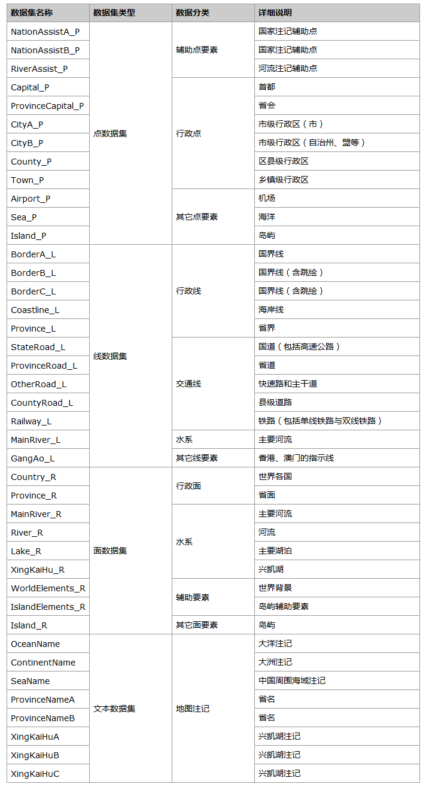
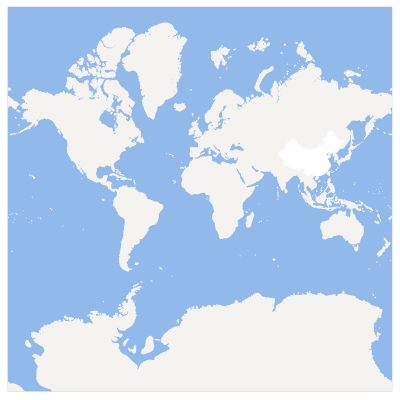
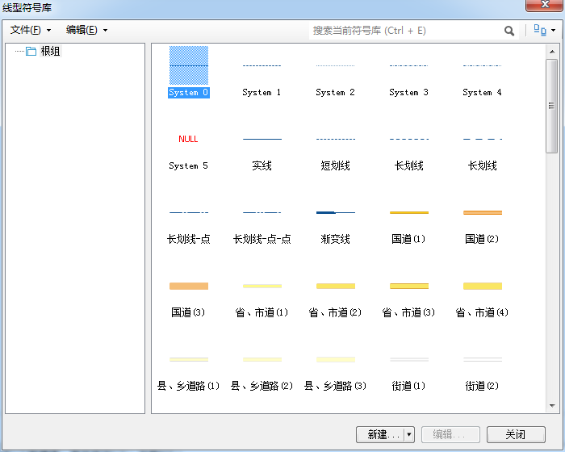
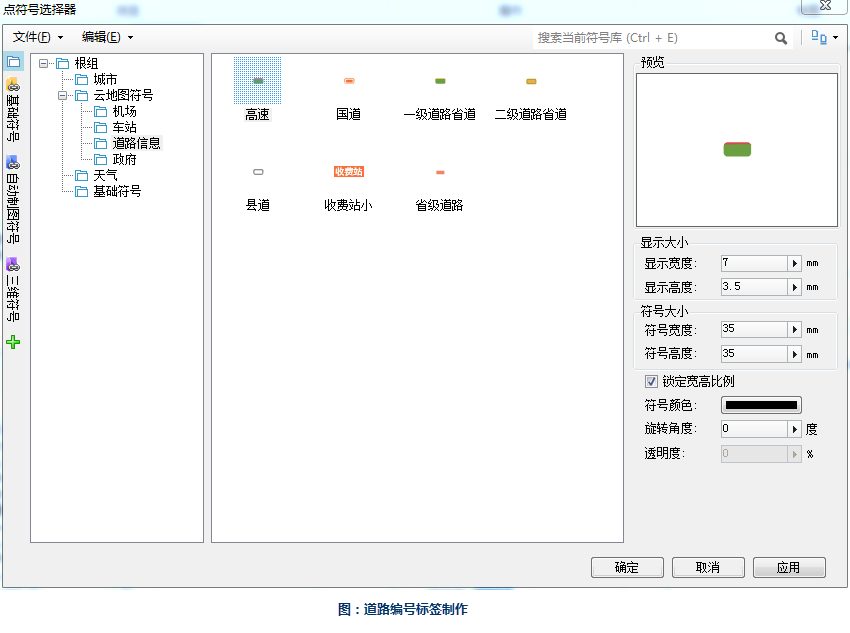
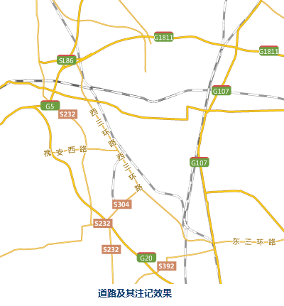
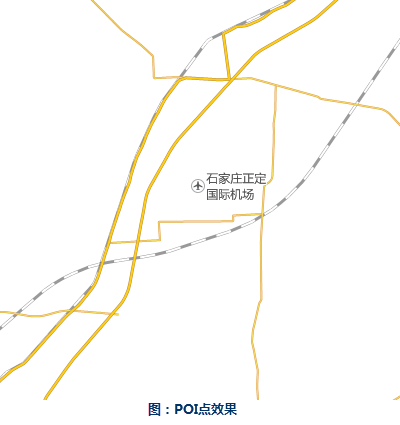
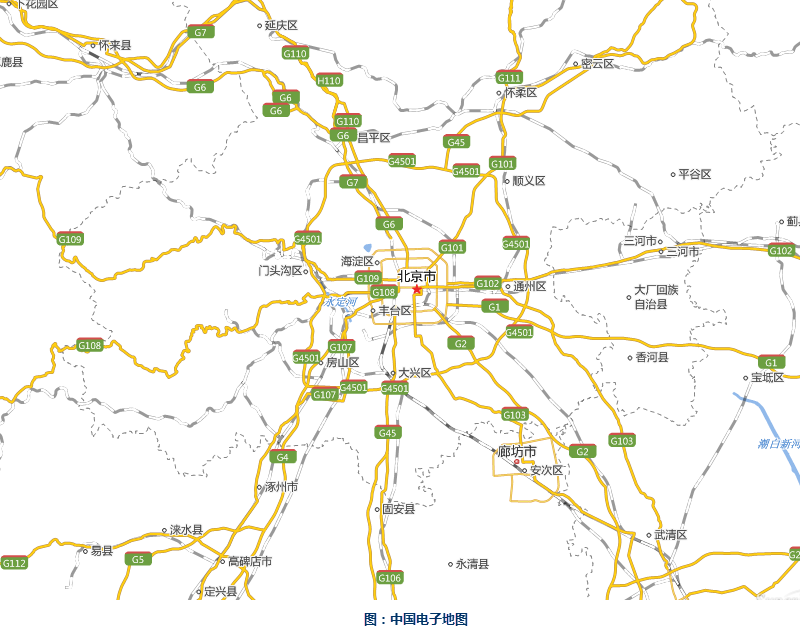
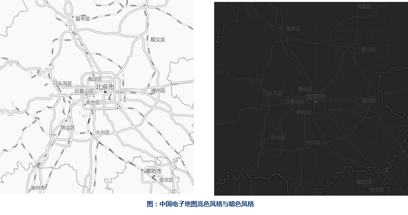

###  数据说明

中国电子地图是使用1:100万比例尺下的数据制作的电子地图，包含了中国范围的行政区划、各级道路、铁路、主要河流和部分POI点，所用功能基本覆盖到制作电子地图涉及的所有功能，有普通电子地图、亮色风格与暗色风格三个不同的风格。

###  数据详细介绍

国家测绘地理信息局制作的公共版中国1：100万比例尺数据。

数据源中的数据内容详细说明如下表。

  
###  制图流程

  1. 设置分级比例尺

使用《CH Z 9011-2011地理信息公共服务平台
电子地图数据规范》中的瓦片金字塔分级规则，截取前面13级比例尺。比例尺层级也可以依照具体的情况灵活设置，总的原则是：最小的比例尺能够显示全图，最大的比例尺图面内容较为丰富，从小比例尺到大比例尺基本以2倍关系递增。

序号 | 比例尺  
---|---  
1 | 1:591658710.91  
2 | 1:295829355.45  
3 | 1:147914677.73  
4 | 1:73957338.86  
5 | 1:36978669.43  
6 | 1:18489334.72  
7 | 1:9244667.36  
8 | 1:4622333.68  
9 | 1:2311166.84  
10 | 1:1155583.42  
11 | 1:577791.71  
12 | 1:288895.85  
13 | 1:144447.93  
  2. 添加面状要素

行政区划面是电子地图中必要的元素之一，为了突出显示其上的道路、河流与POI点等，一般设置为白色，叠加在蓝色的海域之上，而河流与湖泊等面状水域的设色与海洋保持一致。

  

  3. 添加道路要素

(1)添加道路。对道路进行分级，分为国道、省道、主干道和快速路、区县级道路和乡镇小路，不同等级的道路需要采用不同粗细及不同颜色的符号来进行区分，一般来说，级别高的道路采用更宽的线状符号和更浓重的颜色，而级别低的道路采用更细的线型和更浅淡的颜色，这一点也与道路的实际情况相符合。道路的符号可以选用“资源”→“线型符号库”中提供的道路符号，也可以自己制作。

  

  
(2)制作道路注记。道路的名称注记采用普通的标签专题图即可，需要注意的是，高速公路和省道等道路需要将编码注记出来，在标签专题图的“专题图”选项卡下的“背景设置”中，选择点符号作为标签的背景形状，可以设置高速公路编号注记的背景。

  

  

  4. 添加POI点

(1)添加POI点。图中涉及到的POI点主要是各个省会城市的机场，作为电子地图添加POI点的示例，在“资源”→“点符号库”中提供了各类点状符号可以供选择。

(2)制作POI点的注记。

  

  

  5. 添加行政点

(1)添加POI点。最后需要添加包括首都、省会、市、区县、乡镇、村这些行政点，与POI点的符号化方法相同，可以选用“点符号库”中提供的政府符号。

(2)制作POI点的注记。

###  成图展示

  

  
###  其它风格

在不同的应用场景下可能需要不同风格的电子地图，于是除了普通的电子地图风格之外，我们还提供了亮色风格与暗色风格两种不同风格的中国电子地图以供不同的应用环境使用。

 