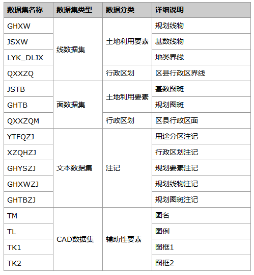
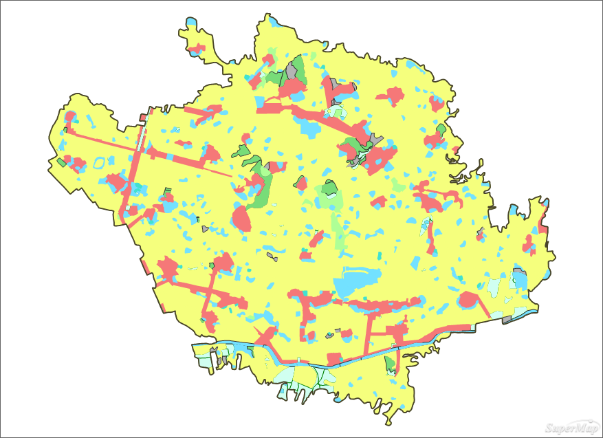
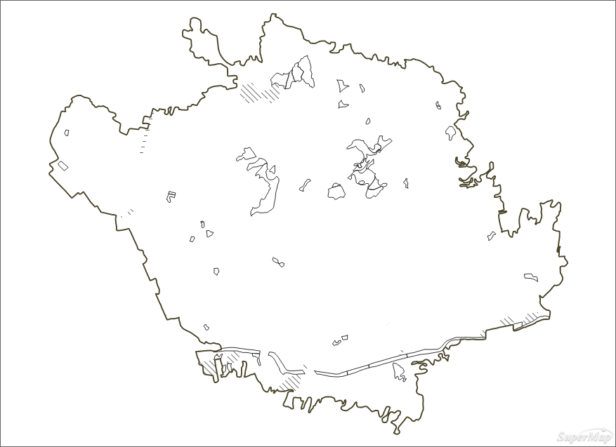
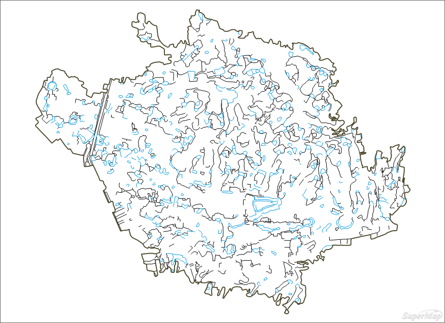
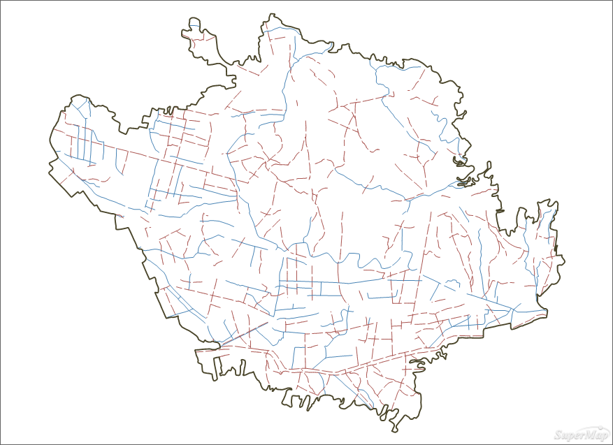
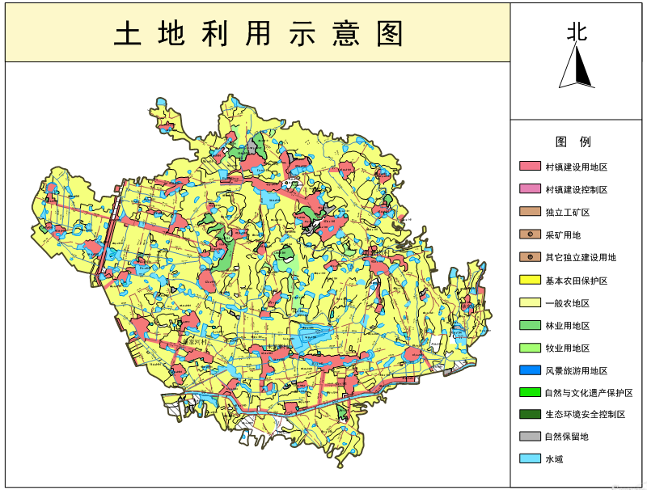

### 数据说明

土地利用图示例数据是参照《中华人民共和国国土行业标准TD/T 1016―2007》制作的标准行业地图，反映区域内土地利用状况。

### 数据详细介绍

土地利用图的数据制作、命名以及属性表结构完全参照行业标准来进行。

数据源中的数据内容详细说明如下表。
  

  
### 制图要点

  * 以地类代码为表达式为土地规划或利用现状制作单值专题图，根据土地利用图设色规范设置不同的颜色与填充符号可以凸显不同图斑之间的土地利用差别；
  * 以地类代码为表达式为土地规划线物或基数线物制作单值专题图，根据土地利用图设色规范设置不同的线型与颜色来区分不同土地界线的类型差异。

### 制图流程

  1. 制作土地规划面状要素

(1)制作土地规划单值专题图。添加土地规划的面状要素图层，以规划地类代码（GHDLDM）为表达式制作单值专题图，根据土地利用图规划用地的设色规范为每一种土地类型设置颜色。

  

  
(2)制作土地现状单值专题图。添加土地利用现状图斑，以地类代码（DLDM）为表达式制作单值专题图，并根据土地利用现状图制作规范为每一类用地设置填充符号。

  

  2. 添加土地规划线状要素

(1)制作地类界线单值专题图。添加地类界线图层，以地类界线类型（DLJXLX）为表达式制作单值专题图，一般而言，地类界线类型区分为水域边界线和普通地类界线，水域边界线设为蓝色，普通地类界线设为黑色。

  

  
(2)制作基数线物单值专题图。基数线物是指土地利用现状中的线状地物，主要包括铁路用地、公路用地、农田水利用地、农村道路和田坎，以地类代码（DLDM）为表达式制作单值专题图。

  

  
(3)制作规划线物单值专题图。制作方法与涉及到的线状地物均与（2）类似，不同的是，规划线物与基数线物的符号及其设色是需要区分的。

  3. 添加注记

添加规划线物注记、规划要素注记、用途分区注记和行政区注记。

  4. 添加其它辅助要素

添加图名、图例、图框等辅助要素，并进行适当的整饰。

### 成图展示

  
