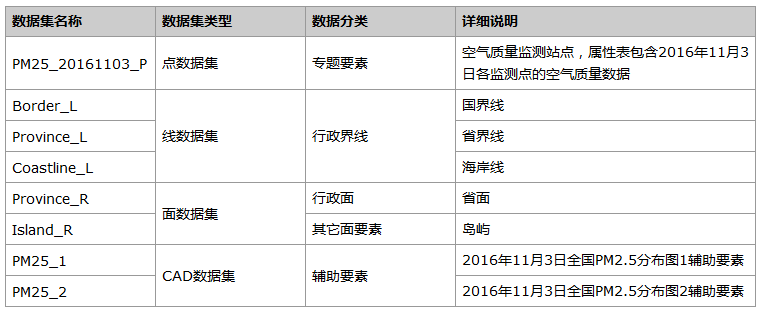
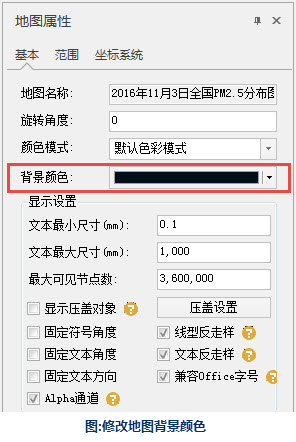
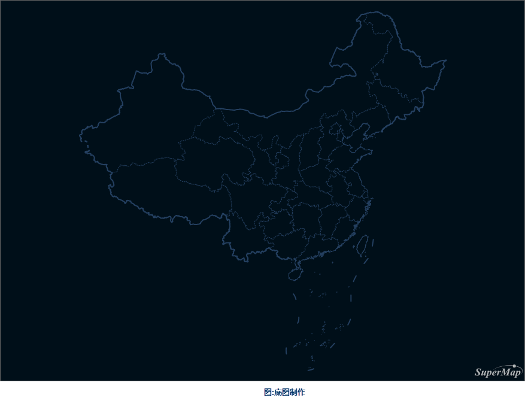
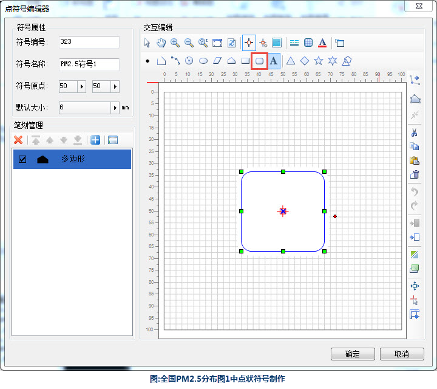
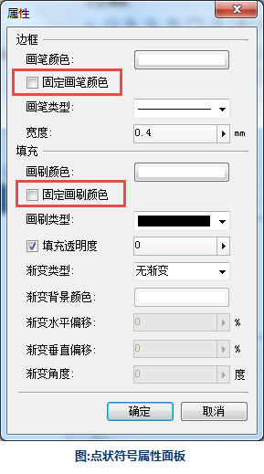
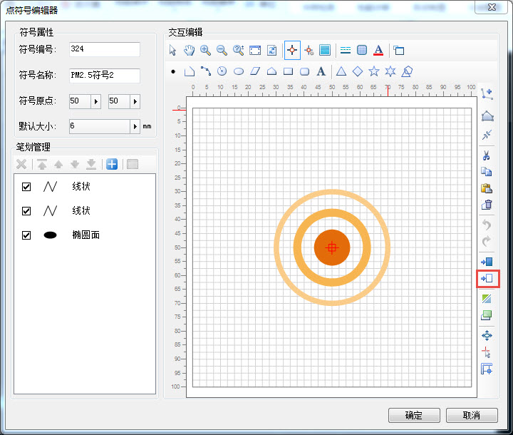
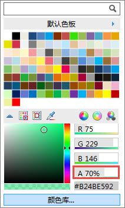
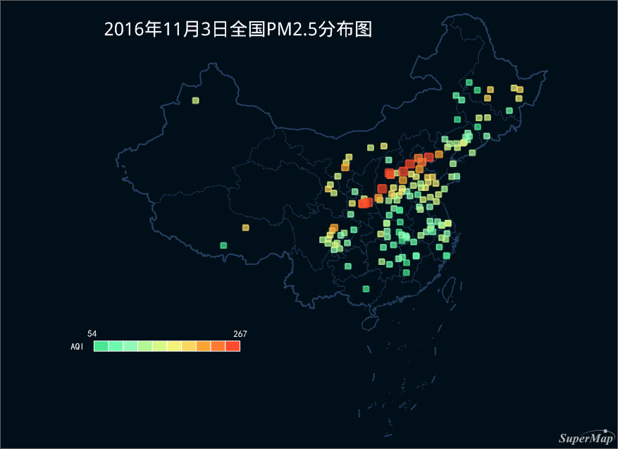
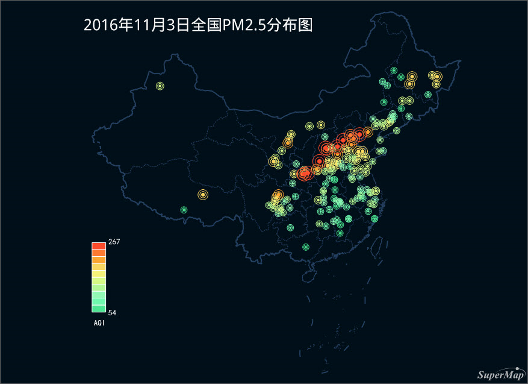

### 数据说明

2016年11月3日全国PM2.5分布图反映当天PM2.5在全国各省的分布情况。

### 数据详细介绍

空气质量点数据从中国环境保护部数据中心（网址为http://datacenter.mep.gov.cn/）下载得到，其余数据为国家测绘地理信息局制作的公共版中国1：100万比例尺数据。

数据源中的数据内容详细说明如下表。
 
  
### 制图要点

  * 设置点状符号时首先在点符号库中查找合适的符号，如果不能满足需求则使用点符号编辑器绘制任意类型的符号，或者导入自己下载及使用其它软件制作的符号； 使用点状符号编辑器制作符号时不需要勾选“固定画笔颜色”与“固定画刷颜色”方便后续范围分段专题图对色带的应用；
  * 为范围分段专题图中不同段内的颜色设置Alpha值使得点状符号呈现半透明效果（推荐设置为70%）；
  * 图名与图例可以增强地图表现力。

### 制图流程

  1. 制作底图

添加国界线、省界线与海岸线，制作底图。本图采用深蓝色地图背景，地图背景颜色可以通过修改“地图属性”→“基本”面板中的“背景颜色”来调整。

  

  

  2. 制作点状符号

(1)全国PM2.5分布图1中带有立体效果的点状符号制作。首先，在“点符号库”中新建符号分组，命名为“PM2.5”，然后，新建二维点状符号，在其中新建圆角矩形。这里需要注意，下一步制作范围分段专题图会为不同的符号赋予不同的颜色，所以圆角矩形符号不需要勾选固定画笔颜色与画刷颜色。

  

  

  
(2)全国PM2.5分布图2中圆形符号制作。首先，在“PM2.5”分组下新建二维点状符号；其次，绘制椭圆形状，与（1）中同理，此处也不需要固定画笔颜色与画刷颜色；最后，绘制两个更大的椭圆，并使用窗口右侧的“转换成折线”工具将两个大椭圆转换成折线。

  

  3. 制作空气质量范围分段专题图

对气象监测站点以空气质量AQI为表达式制作范围分段专题图，选择制作好的符号并在“适用于范围分段专题图”的颜色方案分组中选取合适的色带。PM2.5分布图1中符号的透明效果是统一对符号的填充色设置了70%的透明度。

  

  4. 添加辅助要素

添加图名、图例，使得图面内容更加丰富和完整。

### 成图展示

  
 
  

  
### 注意

在设置点状符号时，用户可以首先在点符号库中寻找合适的符号，点符号库提供了丰富的点状符号。如果点符号库不能满足用户的需求，则可以使用“点符号编辑器”绘制任意类型的自己需要的符号，或者可以导入自己下载以及使用其它软件制作的符号。
