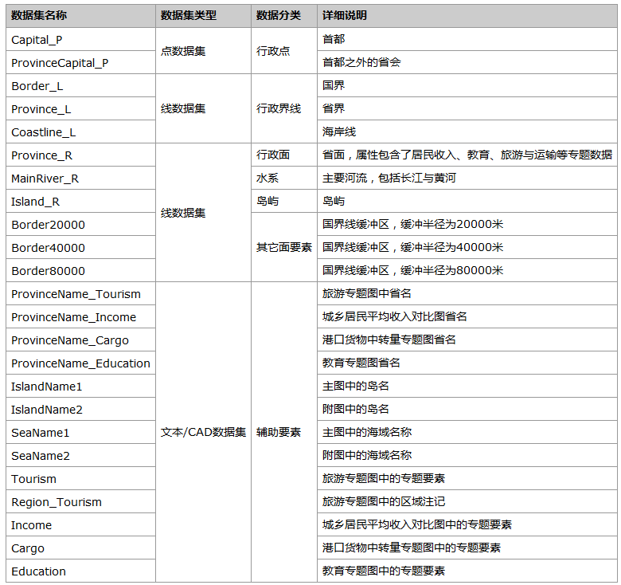
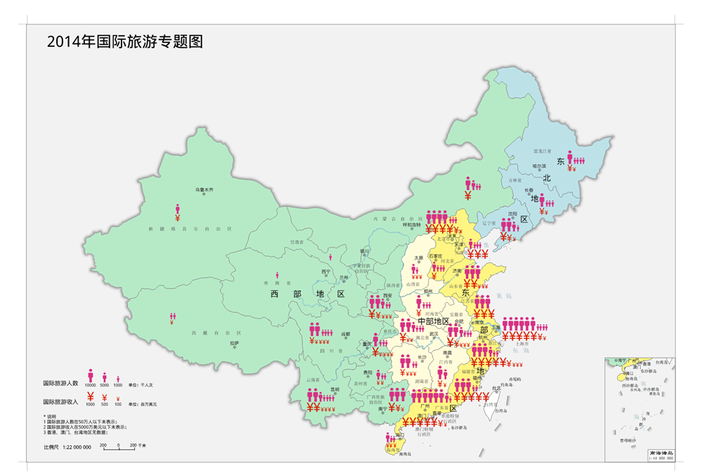
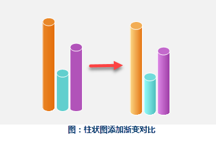
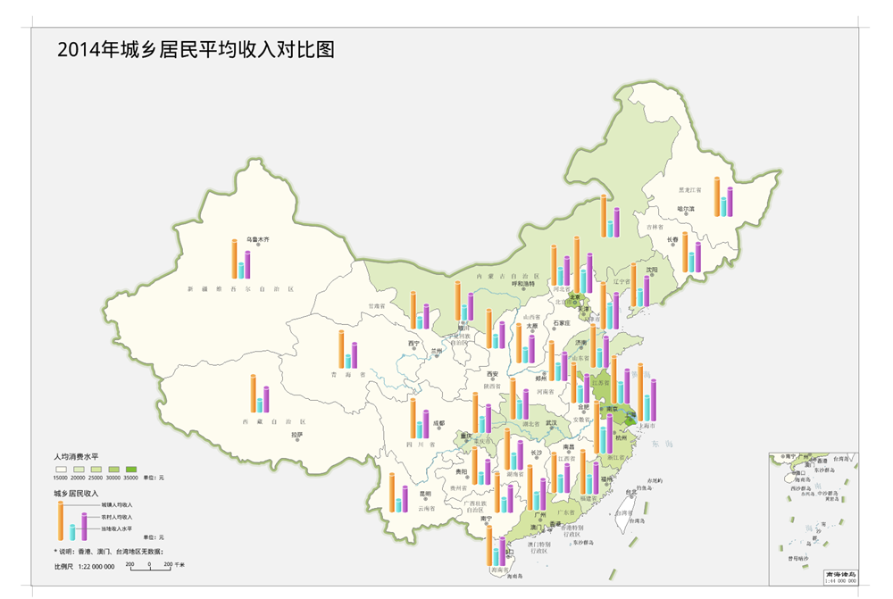
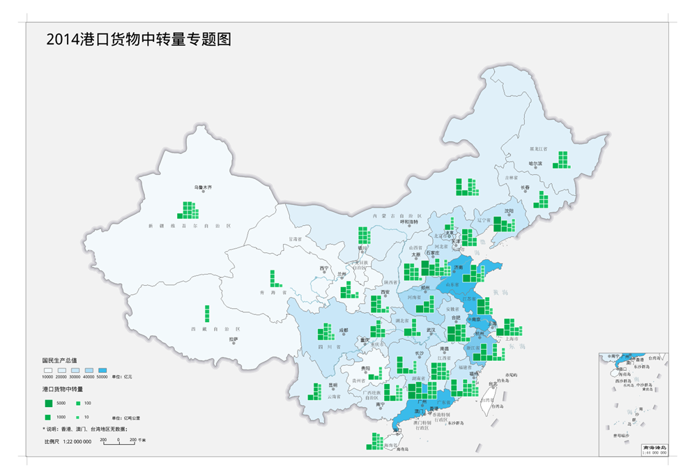

人口与经济系列专题地图包含2014年国际旅游专题图、城乡居民平均收入对比图、港口货物中转量专题图与教育专题图，主题涉及居民收入、教育、旅游与运输几个方面，并且提供了包含图名、图例、比例尺等完整要素的布局，可以直接打印出图，为用户制作出版印刷或屏幕打印的地图提供参考。

###  数据说明

  1. 数据来源

矢量数据来源于国家测绘地理信息局制作的公共版中国1：100万比例尺数据，属性数据是在国家统计局下的国家数据网站下载获得（网址为http://data.stats.gov.cn/index.htm）。

  2. 数据内容
     

###  数据处理

  1. 数据导入

国家数据网站注册登录后，可以下载excel/csv/xml/pdf格式的数据，这里以excel格式为例，其余格式导入方法类似。下载分省“国际旅游（外汇）收入”数据，直接下载到的数据后缀为.xls，在Excel软件中将其另存为.xlsx，并删除表格首尾的说明性文字。新建文件型数据库，导入数据，勾选“首行为字段信息”，导入后的excel表格在数据库中以属性表的形式存储。

  

  
说明：iDesktop只支持导入Excel 2007以后的版本（后缀为.xlsx），如果下载到的数据是Excel
97-2003的版本（后缀为.xls），在导入前需要进行格式另存。

  2. 数据处理

（1）整理导入的属性表

在制图前，需要将导入的数据添加到用于制作专题图的矢量数据属性表中，采用“数据”选项卡中的“数据处理”→“追加列”功能来操作。由于追加列的时候要求两份数据连接字段的字段类型完全一致，所以在追加列操作前，要整理导入的数据表。

属性追加选择各省名称作为连接字段，由于Province_R中的Name是宽字符，长度60，所以首先对“国际旅游（外汇）收入”数据添加字段Name，字段类型设为宽字符，长度设为60，并使用“属性表”选项卡中的“编辑”→“更新列”功能将省份名称更新进来。

（2）属性数据追加

以Name为连接字段，将导入的数据追加到Province_R中。

制作人口与经济系列专题地图所需的数据都可以通过这种方式添加到Province_R的属性表中。

###  2014年国际旅游专题图

  1. 地图说明

2014年国际旅游专题图反映的是2014年各省国际旅游人数与外汇收入。

  2. 制作流程

（1）地图设计

比例尺：中国主图采用1:2200 0000的比例尺，南海诸岛附图采用1:4400 0000的比例尺

地图投影：地理坐标系为China2000，墨卡托投影

（2）制作底图

对省面Province_R按照东部地区、西部地区、中部地区与东北地区制作单值专题图，以区分不同的区域，添加国界、海岸线、省界、主要河流、岛屿及注记、行政点及注记、省名等要素。国界线需要根据国标码GB制作单值专题图来区分已定国界与未定国界，海岸线的颜色略浅于国界线，主要河流包括长江与黄河，采用蓝色细线加浅蓝色填充的方法表示，岛屿需清楚表示钓鱼岛、赤尾屿等岛屿的图形与注记，行政点表示首都与省会的点符号与注记，省名颜色略浅于首都与省会注记。

（3）制作专题符号

专题地图可以采用的符号包括简单符号与象形符号，象形符号由于可以使读者联想到制图对象的特征，且形状和颜色灵活，制图效果丰富有趣，而被广泛采用。用户可以直接使用软件中提供的栅格符号，也可以制作属于自己的符号，然后通过符号导入功能导入符号库中。

  

  
（4）制作专题图层

此图采用符号的堆叠来定量的表示各省的国际旅游人数与外汇收入两大要素，专题图层使用CAD数据集制作。在CAD数据集中，为不同大小的符号指定代表不同的数值，采用符号堆叠的方式，将每个省的旅游人数与旅游收入上下排列在该省的面内。

（5）制作南海诸岛附图

横版的中国范围专题地图，南海诸岛一般作为附图置于图的右下角，且比例尺为主图比例尺的一半。虽然南海诸岛附图的比例尺比较小，但是置于主图旁边时，图上注记需要与主图保持连续，所以南海诸岛附图需要单独制作，而不能把主图的南海部分直接缩小而成。

南海诸岛附图制作方法与主图底图一致，但需要注意两点，一是附图上的文字与主图保持连续，表达要素与主图相同，文字拥挤处适当移位；二是用于制作国界线色彩的国界缓冲区半径需要放大一倍。

（6）添加图名、图例、说明文字等必要内容。

  

###  2014年城乡居民平均收入对比图

  1. 地图说明

2014年城乡居民平均收入对比图反应各省城镇居民与农村居民2014年收入水平与平均收入水平的对比情况，以及这三项指标与该省消费水平的对比。

  2. 制作流程

此图的地图设计、底图制作、南海诸岛附图制作以及整饰与上述第三部分中国际旅游专题图一致，本部分仅就不同部分进行解释。

（1）制作底图

对省面Province_R以各省的人均消费水平为表达式制作分段专题图，从15000元为起始值，每5000元分为一段，共分为5段。

（2）制作专题图层

此图采用柱状图的形式表达各省的城镇人均收入、农村人均收入与当地收入水平，与传统的柱状图不同的是柱状图为圆形柱状图，并且使用轻微的颜色渐变制造了立体效果，具体制作方法为：制作普通的柱状图后，右键保存为CAD数据集，然后在CAD数据集中进行进一步的编辑与加工。

  

  
 

###  2014年港口货物中转量专题图

  1. 数据说明

2014年港口货物中转量专题图反映各省2014年港口货物的中转总量。

  2. 制作流程

此图底图使用2014年国民生产总值作为表达式制作分段专题图，专题要素采用符号堆叠的方法来表达各省的港口货物中转量。堆叠符号法是专题要素的量化表示方法，读者通过图例中不同大小的方块代表的不同数值，可以直接在图上读出各省内专题要素的具体数值。

  

###  2014年教育专题图

  1. 数据说明

2014年教育专题图反映各省人口受教育程度的构成及教育经费构成。

  2. 制作流程

此图采用两个堆叠柱状图的方法来分别对应表示两个主题，左边部分的堆叠图表示教育经费构成，主要表达国家教育经费在总教育经费中的占比，右边部分堆叠图表示各省中教育水平为小学、中学、高中与大学的人数构成。

  

