### 数据说明

气温专题图包含了平均气温分布图与气温距平图，中国1981―2010年1月平均气温分布图反映了30年间全国不同地区在1月份的平均气温分布，而1981―2010年1月平均气温距平图则是各地区1月份平均气温与全国平均气温的差值。

### 数据详细介绍

原始数据包括含气象监测站点经纬度的站点说明数据和含站点气温监测结果的站点监测结果数据，均为Excel格式，下载自中国气象数据网（网址为http://data.cma.cn/site/index）。

数据源中的数据内容详细说明如下表。  

 

  
### 数据处理

  1. 数据导入

新建文件型数据库，将中国气象数据网上下载到的站点说明数据与监测结果数据以属性表的形式导入数据库中，注意勾选“首行为字段信息”。

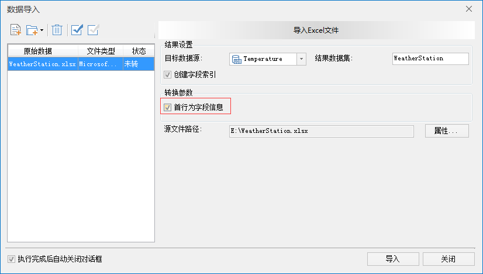  

  2. 数据处理

(1)将站点说明数据转换为点数据。由于下载到的原始数据是Excel表格的形式，以属性表的格式导入数据库之后，需要转换为点数据。使用“数据”选项卡中的“工具”→“类型转换”→“属性数据转点数据”来转换，设置X坐标为经度，Y坐标为纬度。

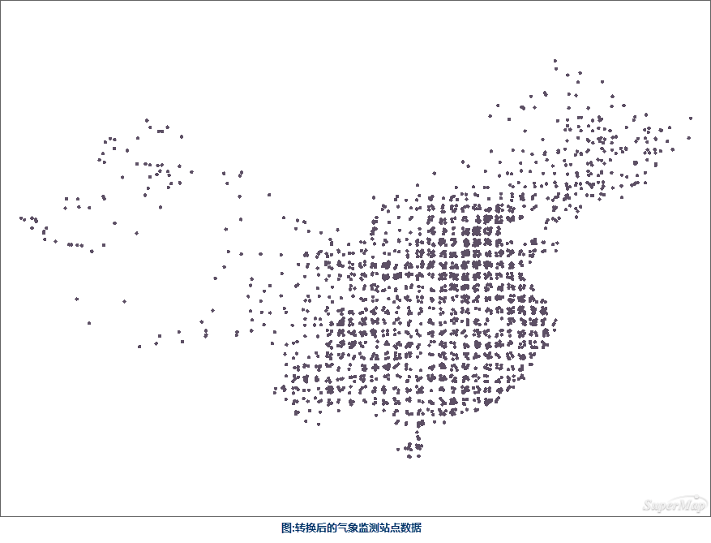  

(2)追加属性数据。将监测结果数据中的一月份平均气温以属性列追加的形式更新到转换后的气象监测站点数据中，采用的是“数据”→“数据处理”→“追加列”的功能。

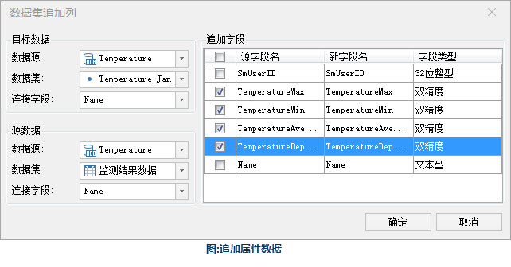  

  
(3)进行栅格插值。由于气象站点的监测数据属于样本监测，所以需要利用插值的方法生成栅格，来得到无监测站点地区的近似数值，采用“分析”选项卡中的“栅格分析”→“插值分析”的功能。

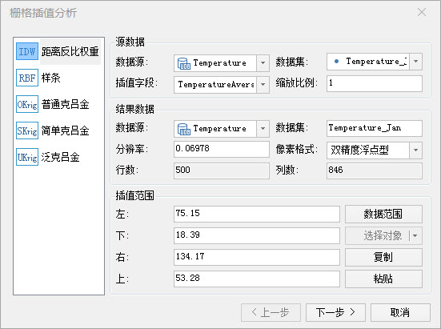  
 
  

  
(4)提取等温面。利用（3）中插值生成的栅格提取区域内的等温面，采用“分析”选项卡中的“栅格分析”→“表面分析”→“提取所有等值面”工具，将等值距设置为8（这里的等值距可以根据使用目的灵活设置）。在栅格分析的结果数据分辨率较高的情况下，等值面的边线可能会有较多棱角，为了制图效果，可以设置合适的光滑系数来对边线进行光滑处理。

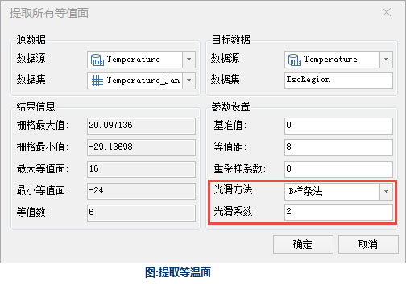  

  
(5)提取等温线。采用“分析”选项卡中的“栅格分析”→“表面分析”→“提取所有等值线”的功能来提取与等温面对应的等温线，为了使等温线边缘与等温面完全套合，需要与生成等温面使用一样的光滑方法与光滑系数。

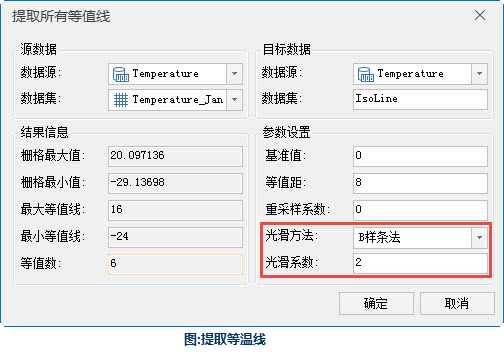  

(6)裁剪等温面与等温线。由于通过插值生成的栅格是取的所有参与插值点的外接矩形，所以生成的等温面与等温线都是矩形轮廓，需要裁剪成制图区域所需的形状，使用“地图”选项卡中的“操作”→“地图裁剪”→“选中对象区域裁剪”功能。

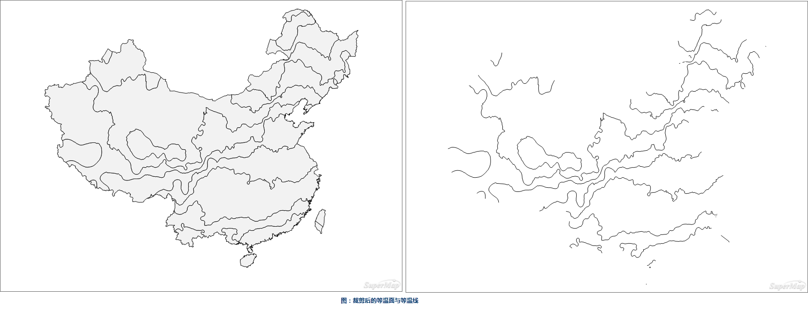 
  
(7)剔除破碎的等温面与等温线。在不影响区域气温分布的前提下，剔除掉一些比较破碎的等温线与等温面。

### 制图流程

  1. 配置行政要素

添加世界范围的国家面，由于其它部分为水域，所以需要将地图的背景色设置为浅蓝色。

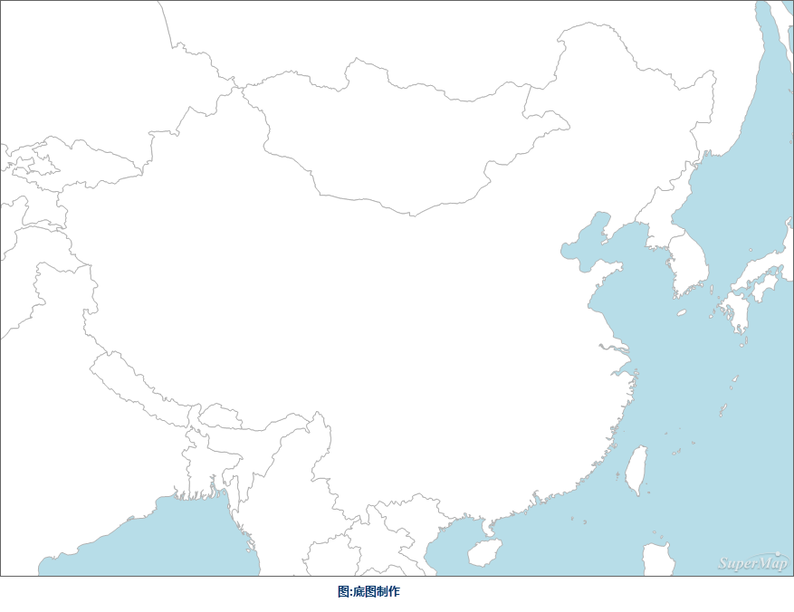  

  2. 制作中国国界的色带

通过制作多重单向缓冲区，并为缓冲区设置同色系不同饱和度的颜色来为地图制作色带，使用“分析”选项卡中的“矢量分析”→“缓冲区”功能来生成缓冲区，经多次调整缓冲区半径，中国范围的地图使用15000m和30000米的缓冲区效果最佳。

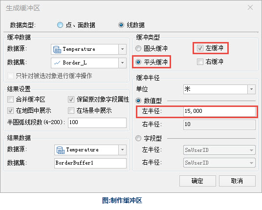  

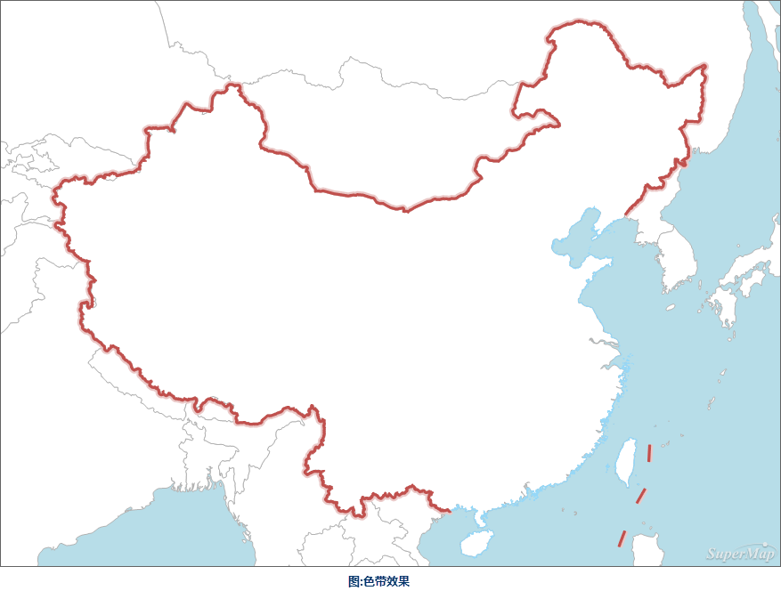  

  3. 添加等温面

对于等温面，需要以平均气温为因素制作单值专题图，一般采用由蓝色到橙黄色的渐变来展现温度从低到高。由于底图添加了省界的要素，所以等温面的图层可以设置一定的透明度，这样可以看到不同省份之间的一月平均气温对比。

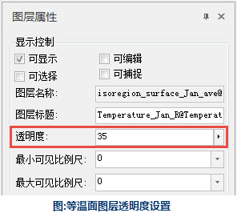  

  4. 添加等温线

为了使图面要素更为全面和丰富，使读者能清晰分辨某地区所在的等温带，需要添加等温线。

  5. 添加辅助要素

添加图名与图例。

  6. 制作地图网格

由于气温的分布与地区所处的经纬度位置息息相关，所以本图需要添加经纬网，使用“地图”选项卡中的“制图”→“地图网格”工具来生成经纬网。

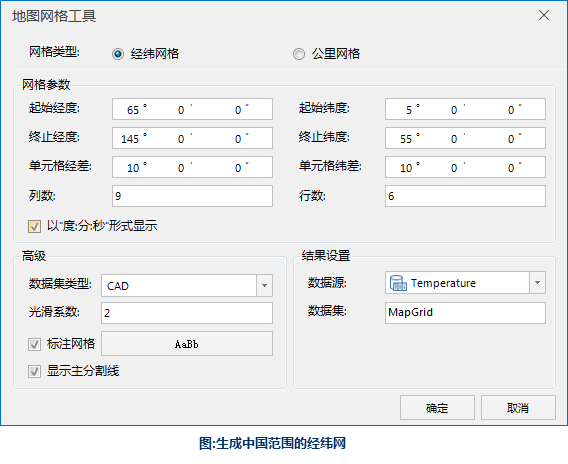  

  7. 设置地图全幅范围

地图配置好后，全幅显示会显示的是世界范围的区域，但在本图中，世界各国只是作为底图，重点是中国的范围。在“地图属性”选项卡中“范围”下边可以勾选“自定义全幅范围”，将中国的部分显示为全幅的范围。

### 成图展示

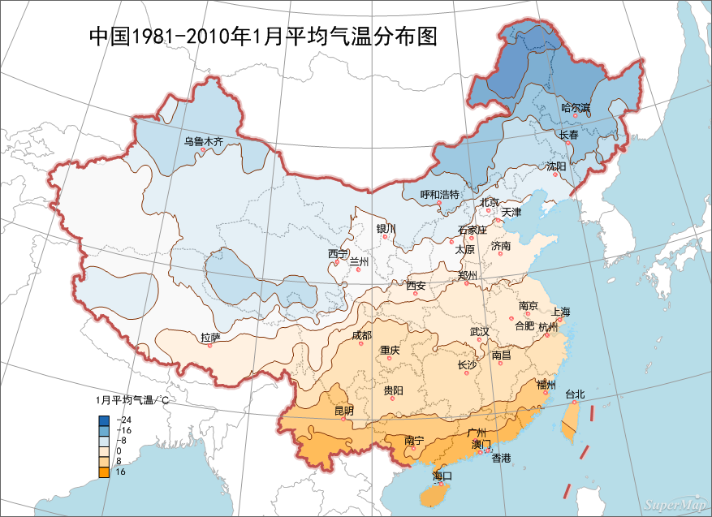  

  
### 气温距平图

气温距平图与平均气温分布图在制图流程上是一致的，只需将上述流程中的原始数据换成一月气温距平的数据即可。

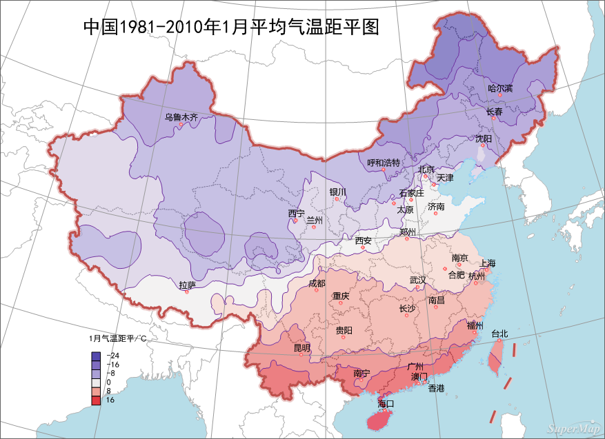  

