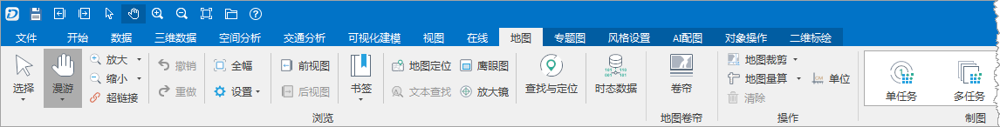
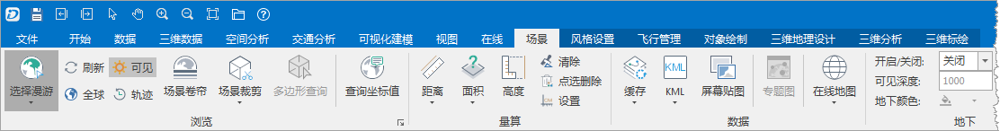
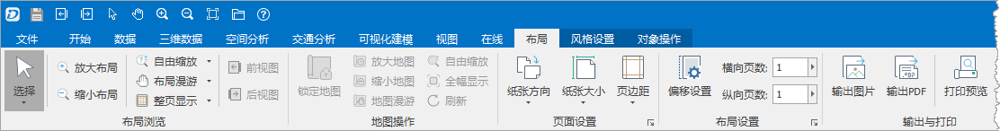
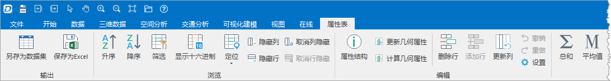

上下文选项卡，是指将选项卡与某对象进行绑定，当此对象在程序中被激活时，该选项卡才会出现在功能区上，例如， “ **地图**
”选项卡是上下文选项卡，与地图窗口绑定，只有当应用程序中当前活动的窗口为地图窗口时，该选项卡才会出现在功能区上。这种上下文选项卡的模式，可以将暂时不需要的功能隐藏起来，待需要时才出现。

应用程序中的上下文选项卡主要分为四类，一类是与地图窗口绑定的选项卡；一类是与场景窗口绑定的选项卡；一类是与布局窗口绑定的选项卡；一类是与属性表窗口绑定的选项卡。

### 与地图窗口绑定的上下文选项卡

与地图窗口绑定的选项卡，只有当应用程序中有地图窗口出现时，并且有任意一个地图窗口被激活时，这些选项卡才会出现在功能区上，如下图所示，应用程序当前活动的窗口为一个名为“世界地图_Day”的地图窗口，此时，与地图窗口绑定的选项卡将出现在功能区上，与地图窗口绑定的选项卡包括“地图”选项卡、“专题图”选项卡、“风格设置”选项卡、“AI配图”选项卡、“对象操作”选项卡和“二维标绘”选项卡。

  

  
### 与场景窗口绑定的上下文选项卡

与场景窗口绑定的选项卡，只有当应用程序中有场景窗口出现时，并且该场景窗口被激活时，这些选项卡才会出现在功能区上，如下图所示，应用程序当前活动的窗口为场景窗口，此时，与场景窗口绑定的选项卡将出现在功能区上，与场景窗口绑定的选项卡包括“场景”选项卡、“风格设置”选项卡、“飞行管理”选项卡、“对象绘制”选项卡和“三维分析”选项卡。

  

  
### 与布局窗口绑定的上下文选项卡

与布局窗口绑定的选项卡，只有当应用程序中有布局窗口出现时，并且有任意一个布局窗口被激活时，这些选项卡才会出现在功能区上，如下图所示，应用程序当前活动的窗口为一个布局窗口，此时，与布局窗口绑定的选项卡将出现在功能区上，与布局窗口绑定的选项卡包括“布局”选项卡、“风格设置”选项卡和“对象绘制”选项卡。

  

  
### 与属性表窗口绑定的上下文选项卡

与属性表窗口绑定的选项卡，只有当应用程序中有属性表窗口出现时，并且有任意一个属性表窗口被激活时，这些选项卡才会出现在功能区上，如下图所示，应用程序当前活动的窗口为一个属性表窗口，此时，与属性表窗口绑定的选项卡将出现在功能区上，与属性表窗口绑定的选项卡包括“属性表”选项卡。

  

