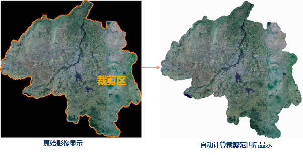
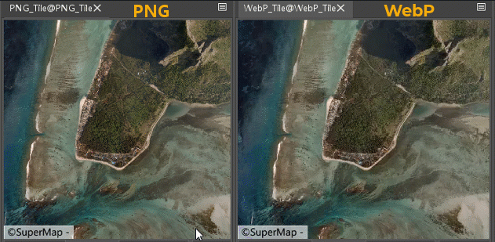
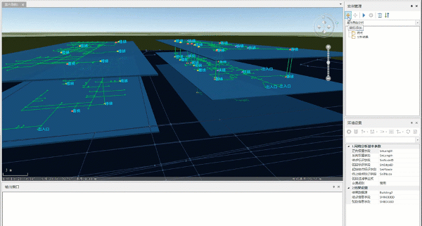

**SuperMap iDesktop 10i(2020) 桌面产品在上一版本基础上，包含以下新增功能和优化之处：**

**数据管理**

  * 新增[导入COGO 文件功能](../../Features/DataProcessing/DataConversion/ImportCOGO.html) ，程序将按照文件记录的坐标、角度、方向等属性信息，绘制成为空间几何对象，常用于将测量外业记录的属性信息自动解译为空间数据，并查看对象之间的相对位置关系。
  * 支持以打开文件型数据源的方式直接[打开地图切片包文件(*.tpk )数据](../../Features/DataProcessing/DataManagement/OpenDatasource.html) ，并在地图中进行浏览、作为底图使用等，无需进行地图切片的任何处理或者转化。
  * 支持通过修改配置文件参数的方式自定义数据库型数据源的功能入口，无需任何编码，可快速增加或者删除 SuperMap iObjects 已支持的各种数据库数据源。
  * 新增波段管理功能，支持将多个单波段数据合成为多波段影像进行管理。
  * 优化影像合成功能，支持将单波段合成为多波段影像。
  * 优化镶嵌数据集功能，[重建裁剪范围新增复杂多边形选项](../../Features/DataProcessing/DataManagement/MosaicDatasetManage.html) ，针对影像的有效值区域形状复杂的情况，支持了自动计算这类影像有效值范围的能力，可通过影像图层的裁剪显示方式，去除影像的无值部分。
  * 支持添加*.PIX 影像文件至镶嵌数据集中进行管理。
  
---  

**数据处理**

  * 优化[计算/更新几何属性功能](../../Features/DataProcessing/EditTabular/AddGeometryAttribute.html)界面，使用户操作更便捷。
  * 优化[栅格拼接功能](../../Features/DataProcessing/Raster/RasterSplice.html)，支持影像数据集和直接添加本地影像文件进行混合拼接，减少数据导入过程，提升数据处理效率。
  * 新增拓扑逻辑图功能，根据网络关系创建拓扑逻辑图，支持树形图、等级图和直角正交图。

**地图制图**

  * 优化河流沿线标注的效果，增加了适用于河流数据的沿线标注模式，改善了河流标注沿线分布不均匀、弯曲较多较大河段不标注、标注文本沿线显示顺序与设置不符、标注文本中文字相互压盖等问题。
  * 重新指定数据集时新增支持搜索，可通过输入关键字快速检索与定位到指定数据集。
  * 优化性能诊断功能，新增支持检测获取数据时间、获取对象个数及其他总耗时等信息，帮助用户更直观的监测地图性能的详细情况。
  * 优化多任务切图功能，支持添加数据库型工作空间中地图执行切图任务。
  * 新增生成[Webp 格式的栅格瓦片功能](../../Features/MapTiles/WEBPTileType.html) ，在保证瓦片质量的同时极大缩小了瓦片的体积，可应用于移动端及 Web 端，提升加载渲染速度。
  
---  
  * 优化矢量重采样功能，支持设置线交点不变，保证了对象之间拓扑关系的正确性。
  * 优化线面光滑功能，支持设置线交点位置不变，保证了线对象之间拓扑关系的正确性。
  * 修复了矢量瓦片生成时，对于岛洞对象，存在对象部分丢失的问题。
  * 修改了矢量瓦片生成时，不支持矢量地图中同一数据集同时存在基于该数据集的专题图和标签专题图的情况。
  * 对于正式许可的用户，在地图生成瓦片、地图输出为图片以及布局输出为图片时，支持设置自定义水印，起到版权申明、防伪等作用。

**空间分析**

  * 优化 NDVI 与 NDWI 功能，支持不同影像数据参与计算，多个单波段及合成波段的影像均可参与。 
  * 优化[室内导航分析功能](../../Features/Network/IndoorNavigation/IndoorNavigation.html)： 
    * 支持多幢建筑物数据同时构建多路网导航模型，实现多幢建筑之间的连贯导航。
    * 支持添加室外道路，构建室内外一体化导航模型，实现室内路线和室外路线的自由过渡。
  
---  
  * 优化叠加分析功能，当两个面数据集进行叠加分析时，结果数据类型新增输出为点数据集，以得到两个数据集的交点数据。

**属性表**

  * 新增自定义错误功能，在属性表浏览时，支持通过SQL表达式构建错误规则，开启错误条件过滤后，即可在属性表中直观查看限定规则的属性错误。

**布局**

  * 优化地图系列打印地图册功能，支持将地图系列页面导出为PNG 、JPG等通用的图片格式文件。

**在线分享**

  * 当发布工作空间、本地瓦片、MongoDB瓦片为 iServer 服务时，新增支持登录 https 协议的 SuperMap iServer 服务地址。

**三维**

  * 数据处理
    * 新增导入IFC功能：支持导入*.ifc格式的BIM模型数据。支持设置模型参考点、投影信息、导入模式等参数。
    * 新增导入CityGML功能：支持导入*.gml格式的BIM模型数据。支持设置目标数据源、投影坐标系、导入模式等参数，导入模式包括无和追加两种方式。
    * 优化批量导入模型功能：常规模式支持以添加文件和添加文件夹两种方式导入模型；点加模型模型仅支持以添加文件夹方式导入模型。
    * 优化生成地图瓦片功能：当瓦片类型为矢量瓦片时，支持设置是否生成索引。
    * 优化地图生成三维缓存功能：支持设置线程参数，不支持修改开始层，默认完全填充缓存图片。
    * 优化场景生成模型缓存功能：纹理压缩格式支持WebP格式和CRN-DXT5(PC设备)，DDS纹理改名为DXT(PC设备)，纹理压缩格式默认为DXT(PC设备)。
    * 优化场景生成缓存功能： 当场景中地形、影像数据以紧凑的方式存储时，支持设置地形影像块存储参数
    * 优化影像生成缓存功能：支持数据以块存储的方式存储, 在全球剖分下支持设置线程参数;图片类型默认为WebP。 
    * 优化地形（DEM）生成缓存功能：支持设数据以块存储的方式存储，在全球剖分下支持设置线程参数。
    * 新增生成栅格缓存功能：可将栅格数据生成栅格缓存，优化数据的显示和浏览效果。支持设置栅格类型（坡度、坡向、属性）、块大小、编码方式等参数。
    * 优化地形（TIN）生成缓存：存储类型支持块存储；支持密码设置，防止数据泄密。
    * 优化生成模型缓存功能：支持设置模型定位点、字段信息、纹理设置等参数；纹理压缩格式支持WebP和CRN-DXT5(PC设备)格式，纹理压缩格式默认CRN-DXT5(PC设备)；支持设置合并根节点参数，默认不合并;顶点权重模式支持设置原始特征值。
    * 新增材质编辑功能：支持编辑普通材质和PBR材质。
  * 三维数据
    * 优化模型批量生成缓存功能：纹理压缩格式支持WebP和CRN-DXT5(PC设备)格式，默认CRN-DXT5(PC设备)。支持设置合并根节点、纹理设置等参数。
    * 优化矢量批量生成缓存功能：支持设置字段信息参数和对象ID字段参数。
    * 优化“点集生成缓存外挂模型”功能：缓存类型仅支持S3MB格式。
    * 优化“面拉伸生成模型缓存”功能：矢量拉伸生成缓存改名为面拉伸生成模型缓存，拉伸高度支持输入数字和选择字段两种拉伸方式，支持设置层高参数，可根据层高和拉伸高度对模型分层；支持设置追加、替换两种文件处理类型；支持设置简化、轮廓线、材质设置等参数。
    * 优化“地形影像块存储”功能：升级成大文件改名为地形影像块存储，支持地形（TIN）、地形（DEM）、影像三种瓦片类型，同时支持批量处理。
    * 新增影像缓存重建金字塔功能：支持重新构建影像金字塔，修改早期版本生成的缓存层级切换出现错位的现象。
    * 新增模型缓存合并根节点功能：将相邻一定空间范围的模型缓存根节点合并为一个根节点，向上抽稀生成了一层更为粗糙的LOD层级。
    * 优化“保存到MongoDB”功能：功能位置调整三维数据的三维瓦片下，支持设置瓦片类型，瓦片类型包括：模型缓存、倾斜摄影、地形（TIN）、地形（DEM）和影像。
    * 优化“压缩并单体化”功能：压缩类型支持设置WebP格式；支持同时对多个模型缓存进行压缩并单体化处理；若勾选模型单体化，支持设置目标字段。
    * 优化“实例化处理”功能：支持批量处理模型数据集。
    * 优化“地形修改模型”功能：支持设置批量更新参数，当批量编辑记录数达到设定数值时程序将提交该数目内的编辑修改。
    * 新增TIN生成法线功能，支持不带法线的TIN地形和栅格数据集，生成法线，用于坡度、坡向分析。
    * 增加TIN细分功能：将TIN缓存细分到目标层级，用于TIN合并。
    * 新增特征点及等值线构建TIN功能：支持点数据集或等值线数据集生成TIN缓存。 
    * 优化“生成配置文件”（倾斜摄影）功能：支持导入元数据，指定根节点。
    * 优化“生成大文件”（模型）功能：支持批量生成大文件。
    * 优化“DEM&DOM;生成OSGB”功能：支持以块存储的方式存储。
    * 优化“倾斜入库”功能：倾斜入库源配置文件仅支持OSGB格式数据；支持设置几何压缩方式，几何压缩方式包括：不压缩、常规压缩、DRACO压缩，默认不压缩；默认合并根节点，默认合并层级2层；纹理压缩格式支持CRN-DXT5(PC设备)；支持设置纹理最大尺寸和纹理重映射等参数。
    * 新增纹理重映射（倾斜摄影）功能：矫正被修饰过的纹理瓦片，提升加载性能。
    * 优化“生成缓存”（点云）功能：优化点云文件分组方式。支持设置开始层、结束层、瓦片剖分类型、几何压缩方式等参数，用户可自定义层级；瓦片类型包括本地剖分和全球剖分；几何压缩方式包括：不压缩、常规压缩、DRACO压缩，默认DRACO压缩。 
    * 废弃点云替换模式功能。
  * 场景
    * 优化量算功能：支持依对象量算距离和面积，支持点选删除量算结果。
    * 优化选择模型点击右键功能：仅显示/隐藏对象功能，支持特效线显示/隐藏。
    * 新增场景定位功能：将相机飞到输入的坐标位置。相机位置由经度、纬度、高程三个参数共同控制。
    * 优化场景属性新增阴影深浅功能：阴影深浅功能使用前，需先选中阴影模式下的“显示选中对象阴影”或“显示所有对象阴影”。
    * 优化导出模型功能：当导出格式为KML且模型格式为S3M时支持设置纹理压缩格式。
    * 新增三维场景特效功能：支持设置海洋特效和天空特效。
    * 场景属性增加裙边高度。
  * 飞行管理
    * 飞行路线站点管理功能，支持设置平滑飞行路线，支持设置平滑系数、采样数等参数。
  * 对象绘制
    * 优化轨迹模型功能：KML上添加轨迹模型时，支持设置平滑飞行路线参数。
  * 三维地理设计
    * 新增面数据布尔运算功能：支持面数据进行求差运算。
    * 优化“模型打散”功能：支持仅对选中模型进行打散处理。
    * 优化“拓扑校正”功能：位置移到三维数据模块下，支持批量校正模型拓扑结构。
    * 新增矢量拉伸功能：支持点数据集拉伸生成线数据集，线数据集拉伸生成面数据集，拉伸方向只能沿Z轴。
    * 新增多边形合并功能：将相邻多边形合并成一个多边形，支持设置边界类型、阈值等参数。
    * 新增材质功能：支持编辑普通材质和PBR材质。
    * 新增重新计算纹理坐标功能：通过设置重复模式、横向大小、纵向大小、映射方式等参数重新计算纹理坐标。
    * 优化“拉伸闭合体”（TIN地形）功能：支持设置层级参数，仅对输入层级进行拉伸处理。
    * 优化线性拉伸功能：支持设置颜色纹理字段，可根据字段值给模型设材质颜色；支持设置是否生成LOD。
    * 优化模型切分功能：支持设置是否合并图层。
  * 图层属性
    * 点云缓存图层新增点云分组信息，支持定位、删除、是否可见等操作。
    * 栅格地形图层右键菜单支持设置是否显示法线效果。
    * 点数据集制作自定义专题图时，布告板模式支持屏幕对齐、Z轴旋转、自由旋转和贴地旋转。
    * 体元栅格支持设置是否接收光照。
    * 模型缓存加载模式支持设置加载全部影像金字塔层级和加载当前影像金字塔层级。
  * 三维分析
    * 新增多重可视域分析功能：支持导出观察点和保存分析结果。
    * 优化“开敞度分析”功能，支持导出障碍点、可视线、观察点。
    * 优化“可视域分析”功能，支持导出障碍点、可视线、观察点，支持修改提示线颜色，支持设置提示线透明度，方位角支持设置任意角度值。
    * 优化视频投放功能，支持*.mp4、*.avi、*.rmvb等格式视频。
    * 淹没分析、等值线分析、坡度坡向分析等功能，支持对栅格数据集和地形缓存进行分析。
  * 对象绘制
    * 支持在KML图层上添加粒子对象。
    * KML粒子支持节点动画。
    * 优化导入静态模型功能：支持gltf2.0。

**示例地图**

  * 中国电子地图工作空间中新增4幅专题图，分别是经济发展统计专题图、人口分布与构成专题图、医疗从业人数专题图、县级人口密度专题图。
  * 新增室内导航场景图。

**交互易用性**

  * 优化启动过程中[插件未成功加载的提示信息](../FAQ_Plugin.html)，输出具体的失败原因，辅助用户定位问题。
