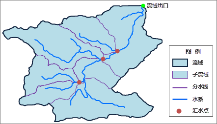

###  水文分析

水与人类的生活息息相关，因此研究水的起源、分布、存在及其运动规律，具有非常重要的意义。水文分析基于高程模型（DEM）建立水系模型，用于研究流域水文特征和模拟地表水文过程，并对未来的地表水文情况作出估计。水文分析能够帮助我们分析洪水的范围，定位地表径流污染源，预测地貌改变对径流的影响等，广泛应用于区域规划、农林、灾害预测、道路设计等行业和领域。

###  基本概念

基于 DEM 栅格进行水文分析时，了解流域相关的概念，对于正确理解和应用水文分析具有十分重要的意义。结合下图，帮助理解相关的概念。

  

**水系** ：指流域内具有同一归宿的水体所构成的水网系统。水系以河流为主，还可以包括湖泊、沼泽、水库等。

**流域** ：每个水系都从一部分陆地区域上获得水量的补给，这部分区域就是水系的流域，也称作集水区或流域盆地。

**子流域** ：水系由若干个河段构成，每个河段都有自己的流域，称为子流域。较大的流域往往还可以继续划分为若干个子流域。

**分水线**
：也称分水岭。两个相邻流域之间的最高点连接成的不规则曲线，就是两条水系的分水线。分水线两边的水分别流入不同的流域。也可以说，分水线包围的区域就是流域。现实世界中，分水线大多为山岭或者高地，也可能是地势微缓起伏的平原或者湖泊。

**汇水点** ：流域内水流的出口。一般是流域边界上的最低点。