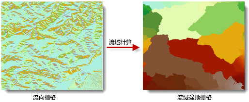

流域盆地即为集水区域，用于描述流域的方式之一。计算流域盆地功能用来创建描述流域盆地的栅格数据集。

### 使用说明

计算流域盆地是依据流向数据为每个像元分配唯一盆地的过程，如下图所示，流域盆地是描述流域的方式之一，展现了那些所有相互连接且处于同一流域盆地的栅格。

  
 
  
通常认为所有流域盆地的汇水点均在栅格的边界上，即水流向边界外，因此，计算流域盆地时，首先确定各个汇水点，然后按照水流方向识别出分水线，从而确定流域的边界，最终确定各个流域盆地。

在创建流向栅格的时候，使用 **强制边界栅格流向向外**
参数，更容易得到最佳结果。关于该参数的介绍，请参见[计算流向](CalFlowDirection)。

### 功能入口

  * 在 **空间分析** 选项卡-> **栅格分析** 组中，单击 **水文分析** 按钮，弹出水文分析流程窗口，选择“计算流域盆地”按钮。(iDesktop)
  * 在 **空间分析** 选项卡-> **栅格分析** 组中，单击 **水文分析** 下拉按钮，在弹出菜单栏中选择“计算流域盆地”。(iDesktopX)
  * **工具箱** -> **栅格分析** ->水文分析工具：计算流域盆地；或者将该工具拖拽到可视化建模窗口中，再双击该功能图形。(iDesktopX) 

### 参数说明

  * **流向数据** ：选择流向栅格所在的数据源以及数据集。
  * **结果数据** ：设置结果要保存的数据源和数据集的名称。
  * 单击“ **准备** ”按钮，表示当前分析功能的相关参数设置已经完成，随时可以执行。准备完毕的流程会置灰，不能修改；如需修改设置的参数，可以单击“取消准备”按钮进行修改。注意：单击“准备”下拉按钮，会弹出下拉菜单。“全部取消”功能，用来取消所有已经准备好的步骤的准备状态。(iDesktop) 
  * 单击“ **执行** ”按钮，执行准备好的分析功能。执行完成后输出窗口中，会提示执行结果是成功还是失败。
