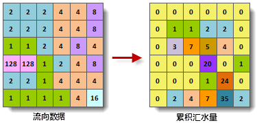

计算汇水量用来根据流向栅格计算每个像元汇水量。可以选择性地使用权重数据计算加权汇水量。

计算汇水量的思路如下：

假定栅格数据中的每个单元格处有一个单位的水量，依据水流方向图顺次计算每个单元格所能累积到的水量（不包括当前单元格的水量）。下图显示了通过水流方向计算汇水量的过程。

  
---  
图：计算汇水量示意图  
  
###  使用说明

  * 计算得到的结果表示了每个像元累积汇水总量，该值由流向当前像元的所有上游的像元的水流累积量总量，不会考虑当前处理像元的汇水量。
  * 在实际应用中，每个像元的水量不一定相同，需要指定权重数据来获取实际的汇水量。使用了权重数据后，汇水量的计算过程中，每个单元格的水量不再是一个单位，而是乘以权重（权重数据集的栅格值）后的值。例如，将某时期的平均降雨量作为权重数据，计算所得的汇水量就是该时期的流经每个单元格的雨量。 
  * 计算的汇水量的结果值可以帮助我们识别河谷和分水岭。像元的汇水量较高，说明该点地势较低，可视为河谷；像元汇水量为0，说明该点地势较高，可能为分水岭。因此，汇水量为提取流域的各种特征参数（如流域面积、周长、排水密度等）提供了参考。

###  功能入口

  * 在 **空间分析** 选项卡-> **栅格分析** 组中，单击 **水文分析** 按钮，弹出水文分析流程窗口，选择“计算汇水量”按钮。(iDesktop)
  * 在 **空间分析** 选项卡-> **栅格分析** 组中，单击 **水文分析** 下拉按钮，在弹出菜单栏中选择“计算汇水量”。(iDesktopX)
  * **工具箱** -> **栅格分析** ->水文分析工具：计算汇水量；或者将该工具拖拽到可视化建模窗口中，再双击该功能图形。(iDesktopX) 

###  参数说明

  * **流向数据** ：选择流向栅格所在的数据源以及数据集。
  * **权重数据** ："权重数据"复选框用于控制是否启用该参数设置。若勾选该复选框，启用"权重数据"参数设置，选择权重栅格所在的数据源和数据集。计算汇水量时，会使用权重栅格对每一个流向数据进行权重计算；若不勾选该复选框，则不启用"权重数据"参数设置，相关设置灰显不可用。
  * **结果数据** ：设置结果要保存的数据源和数据集的名称。
  * 单击“ **准备** ”按钮，表示当前分析功能的相关参数设置已经完成，随时可以执行。准备完毕的流程会置灰，不能修改；如需修改设置的参数，可以单击“取消准备”按钮进行修改。(iDesktop) 

注意：单击“准备”下拉按钮，会弹出下拉菜单。“全部取消”功能，用来取消所有已经准备好的步骤的准备状态。

  * 单击“ **执行** ”按钮，执行准备好的分析功能。执行完成后输出窗口中，会提示执行结果是成功还是失败。
