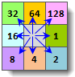
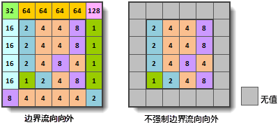
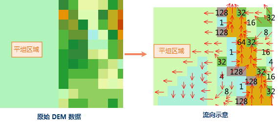

流向，即水文表面水的流向。计算流向是水文分析的关键步骤之一。水文分析的很多功能需要基于流向栅格，如计算累积汇水量、计算流长和流域等。

在 SuperMap 中，对中心栅格的8个邻域栅格进行编码。编码实际是取2的幂值，从中心栅格的正右方栅格开始，按顺时针方向，其编码值分别为2的0、1、2、3、4、5、6、7次幂值，即1、2、4、8、16、32、64、128，分别代表中心栅格单元的水流流向为东、东南、南、西南、西、西北、北、东北八个方向，参考下图。每一个中心栅格的水流方向都由这八个值中的某一个值来确定。例如，若中心栅格的水流方向是西，则其水流方向被赋值16；若流向东，则水流方向被赋值1。

  

  
### 使用说明

**边界水流处理**

位于栅格边界的单元格比较特殊（位于边界且可能的流向不足八个），可以指定其流向为向外，此时边界栅格的流向值下图的左图所示，否则，位于边界上的单元格将赋为无值（如右图所示）。

  
  
**高程变化梯度栅格**

在计算流向时，应用程序使用最大坡降法。这种方法通过计算单元格的最陡下降方向作为水流的方向。中心单元格与相邻单元格的高程差与距离的比值称为高程梯度。

**平坦区域流向处理**

在计算平坦区域流向，即当高程变化梯度为0时，应用程序使用填高操作，让平坦区域没有流向的点通过填高能够流出。填高操作是基于区域周边的高程值进行，填高后的数据再计算最陡下降坡度，取坡度最陡的方向作为流向。

  

###  功能入口

  * 在 **空间分析** 选项卡-> **栅格分析** 组中，单击 **水文分析** 按钮，弹出水文分析流程窗口，选择“计算流向”按钮。(iDesktop)
  * 在 **空间分析** 选项卡-> **栅格分析** 组中，单击 **水文分析** 下拉按钮，在弹出菜单栏中选择“计算流向”。(iDesktopX)
  * **工具箱** -> **栅格分析** ->水文分析工具：计算流向；或者将该工具拖拽到可视化建模窗口中，再双击该功能图形。(iDesktopX) 

### 参数说明

  * **源数据** ：设置要计算流向的 DEM 数据所在的数据源和数据集。
  * **强制边界栅格流向为向外** ：选中此项，则栅格表面边缘所有格网的水的流向均向外。
  * **创建高程变化梯度** ：选中此项，计算流向时，会同时计算每个栅格高程的梯度变化，输出一个梯度栅格。默认不选中该项，即不会创建高程梯度栅格。
  * **结果数据** ：设置结果要保存的数据源、流向栅格、梯度栅格的名称。注意：需要选中"创建高程变化梯度"时，才可以输入梯度栅格名称。
  * 单击“ **准备** ”按钮，表示当前分析功能的相关参数设置已经完成，随时可以执行。准备完毕的流程会置灰，不能修改；如需修改设置的参数，可以单击“取消准备”按钮进行修改。(iDesktop) 

注意：单击“准备”下拉按钮，会弹出下拉菜单。“全部取消”功能，用来取消所有已经准备好的步骤的准备状态。

  * 单击“ **执行** ”按钮，执行准备好的分析功能。执行完成后输出窗口中，会提示执行结果是成功还是失败。
