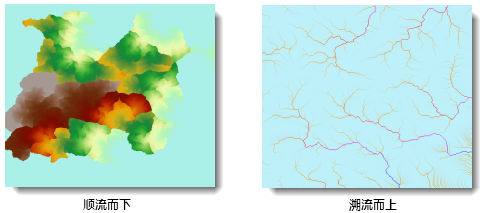

流长是指每个单元格沿着流向到其流向起始点或终止点之间的距离（或者加权距离），包括上游方向和下游方向的长度。水流长度直接影响地面径流的速度，进而影响地表土壤的侵蚀力，在水土保持方面具有重要意义，常作为土壤侵蚀、水土流失的评价因素。

###  使用说明

1. 计算流长必须基于流向数据。关于如何生成流向数据的文档，请参见[计算流向](CalFlowDirection.html)。
2. 计算流长时，需要设置方向，顺流而下或溯流而上。分别为以顺流而下和溯流而上计算得出的流长栅格： 
    * **顺流而下** ：计算每个单元格沿流向到下游流域汇水点之间的最长距离。
    * **溯流而上** ：计算每个单元格沿流向到上游分水线顶点的最长距离。
  
3. 在计算加权距离时，需要指定一个权重数据，参与流长计算。权重数据定义了每个栅格单元间的水流阻力，应用权重所获得的流长为加权距离。例如，将流长分析应用于洪水的计算，洪水流往往会受到诸如坡度、土壤饱和度、植被覆盖等许多因素的阻碍，对这些因素建模，需要提供权重数据集。

###  操作步骤

1. 在“ **分析** ”选项卡的“ **栅格分析** ”组中，单击“ **水文分析** ”按钮，弹出水文分析流程管理窗口。
2. 在左侧的功能列表区中，选择“**计算流长**”按钮。
3. 在右侧的参数设置区中，设置计算流长相关的参数。
    * **流向数据** ：选择流向栅格所在的数据源以及数据集。
    * **权重数据** ：“权重数据”复选框用于控制是否启用该参数设置。若勾选该复选框，启用"权重数据"参数设置，选择权重栅格所在的数据源和数据集。计算权重流长时，会使用权重栅格对每一个流向数据进行加权计算；若不勾选该复选框，则不启用“权重数据”参数设置，相关设置灰显不可用。
    * **计算方式** ：设置流长分析的水流方向，顺流而下或溯流而上。有关流长方向的介绍，请参见使用说明的相关内容。
    * **结果数据** ：设置结果要保存的数据源和数据集的名称。
4. 单击“ **准备** ”按钮，表示当前分析功能的相关参数设置已经完成，随时可以执行。准备完毕的流程会置灰，不能修改；如需修改设置的参数，可以单击“取消准备”按钮进行修改。**注意**：单击“准备”下拉按钮，会弹出下拉菜单。“全部取消”功能，用来取消所有已经准备好的步骤的准备状态。
5. 单击“ **执行** ”按钮，执行准备好的分析功能。执行完成后输出窗口中，会提示执行结果是成功还是失败。