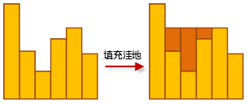

洼地是指流域内被较高高程所包围的局部区域。分为自然洼地和伪洼地。自然洼地是自然界实际存在的洼地，通常出现在地势平坦的冲积平原上，且面积较大，在地势起伏较大的区域非常少见。如冰川或喀斯特地貌、采矿区、坑洞等，这属于正常情况。在 DEM 数据中，由于数据处理的误差和不合适的插值方法所产生的洼地，称为伪洼地。

DEM 数据中绝大多数洼地都是伪洼地。伪洼地会影响水流方向并导致地形分析结果错误，因此，在进行水文分析前，一般先对 DEM 数据进行填充洼地的处理。例如，在确定水流方向时，由于洼地高程低于周围栅格的高程，一定区域内的流向都将指向洼地，导致水流在洼地聚集不能流出，引起汇水网络的中断。填充洼地的剖面示意图如下所示：

  
  
因此在开始任何水文分析之前，建议先进行填洼预处理，填充伪洼地通常是进行合理流向计算的前提。

###  使用说明

**进行填充伪洼地操作时有两种情景** ：

1. 对 DEM 栅格数据填充伪洼地。此种方法会将 DEM 栅格数据中所有洼地（包括真实洼地和伪洼地）都填平，由于真实洼地极少，因此填洼后对后续分析的影响不大。
2. 根据已知的需要排除的洼地数据（点或面数据集）对 DEM 栅格数据填充伪洼地，在填洼结果栅格中这些洼地区域将被赋为无值。此种方法非常适用于分析区域存在真实洼地的情况，使用真实洼地的位置数据（二维点或面数据），将得到更为精确的伪洼地填充结果。

### 操作步骤

1. 在“ **分析** ”选项卡的“ **栅格分析** ”组中，单击“ **水文分析** ”按钮，弹出水文分析“流程管理”窗口。
2. 在左侧的功能列表区中，选择“**填充伪洼地**”按钮。
3. 在右侧的参数设置区中，设置填充伪洼地相关的参数。
   * **源数据** ：设置要进行填充洼地的 DEM 所在的数据源和数据集。
   * **需要排除的洼地数据** ：选择该项时，会排除已知的洼地，不对这些区域进行填充；不选中该项时，表示会将 DEM 中所有洼地进行填充，包括伪洼地和真实洼地。默认不使用排除的洼地，直接对洼地进行填充。  
在填充伪洼地时，可以指定一个点或面数据集，表示真实洼地或需排除的洼地，这些洼地不会被填充。使用准确的该类数据，将获得更为真实的无伪洼地地形，使后续分析更为可靠。如果选择的是点数据集，其中的一个或多个点位于洼地内即可，最理想的情形是点指示该洼地区域的汇水点；如果是面数据集，每个面对象应覆盖一个洼地区域。
   * **结果数据** ：设置结果要保存的数据源和数据集名称。
4. 单击“ **准备** ”按钮，表示当前分析功能的相关参数设置已经完成，随时可以执行。
5. 单击“ **执行** ”按钮，执行当前选中的分析功能。执行完成后输出窗口中，会提示执行结果是成功还是失败。

### 备注

  * 在填充某处洼地后，有可能产生新的洼地，因此，填充洼地是一个不断重复识别洼地、填充洼地的迭代过程，直至所有洼地被填充且不再产生新的洼地。当 DEM 数据量较大或者洼地非常多的时候，填充洼地可能耗费更多时间。