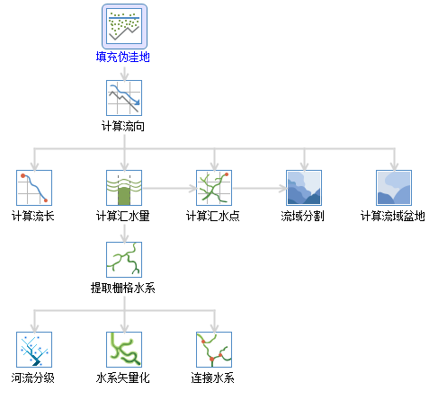

### 水文分析

水文分析基于高程模型（DEM）建立水系模型，用于研究流域水文特征和模拟地表水文过程，并对未来的地表水文情况作出估计。水文分析能够帮助我们分析洪水的范围，定位地表径流污染源，预测地貌改变对径流的影响等，广泛应用于区域规划、农林、灾害预测、道路设计等行业和领域。

地表水的汇流情况很大程度上取决于地表形状，而 DEM 能够很好地表达某区域的地貌形态，在描述流域地形、坡度坡向分析、河网提取等方面具有突出优势，非常适用于水文分析。

SuperMap 的水文分析主要包括填充伪洼地、计算流向、计算流长、计算累积汇水量、河流分级、连接水系和水系矢量化等多个过程。

  

  
### 内容提要：

 [水文分析概述](AboutHydrologyAnalyst)

 [水文分析流程管理窗口介绍](Introduction)

 [填充伪洼地](FillSink)

 [计算流向](CalFlowDirection)

 [计算累积汇水量](CalFlowAcc)

 [计算流长](CalFlowLength)

 [计算流域盆地](CalBasin)

 [流域分割](Watershed)

 [提取栅格水系](RasterStream)

 [河流分级](StreamOrder)

 [连接水系](StreamLink)

 [水系矢量化](StreamToLine)

### 相关主题

流程管理用于对流程化的多个功能模块进行统一管理，按照各个流程的组织顺序自动化执行多个流程，其目的在于帮助用户迅速执行用户定制的操作流程。水文分析模块就采用了流程管理的方式。

 [流程管理窗口介绍](../UIIntroduct/proceduremanage)
