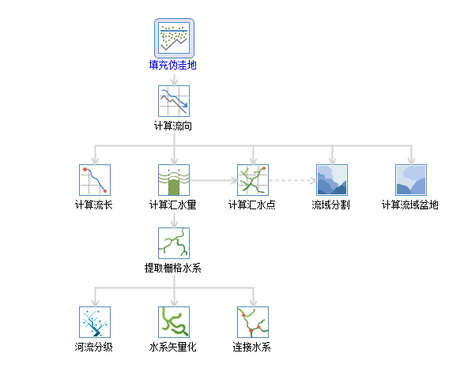
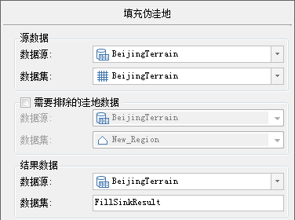
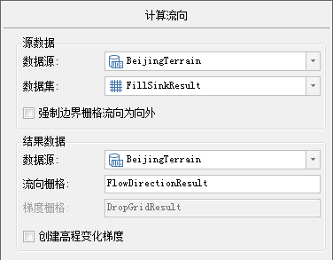
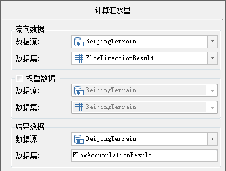
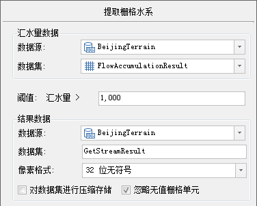
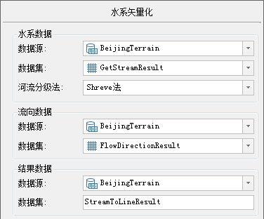
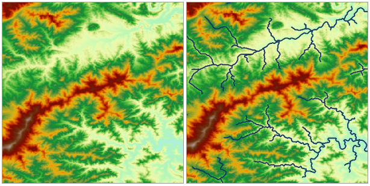

###  使用说明

水文分析基于高程模型（DEM）建立水系模型，用于研究流域水文特征和模拟地表水文过程，并对未来的地表水文情况作出估计。水文分析能够帮助我们分析洪水的范围，定位地表径流污染源，预测地貌改变对径流的影响等，广泛应用于区域规划、农林、灾害预测、道路设计等行业和领域。

SuperMap的水文分析主要包括[填充伪洼地](FillSink.html)、[计算流向](CalFlowDirection.html)、[计算流长](CalFlowLength.html)、[计算汇水量](CalFlowAcc.html)、[河流分级](StreamOrder.html)、[连接水系](StreamLink.html)和[水系矢量化](StreamToLine.html)等操作。

###  操作步骤

1. 打开“ExerciseData/RasterAnalysis”组中的 **BeijingTerrain** 数据源，其中有北京部分地区地形数据，我们用此数据来做示例。
2. 单击“ **分析** ”选项卡中“ **栅格分析** ”组的“ **水文分析** ”按钮，进入水文分析“ **流程管理** ”，如下：  
  
3. 此处以水系矢量化为例来示意水文分析流程管理的使用方法。
4. 单击“ **填充伪洼地** ”图标，出现“ **填充伪洼地** ”对话框，如果有已经确定是洼地的地区，可以勾选“ **需要排除的洼地数据** ”，然后选择洼地数据集，则在进行填充伪洼地时不会填充选中区域。选择完毕后，单击“ **准备** ”，进入准备执行状态。  
  
5. 单击“ **计算流向** ”图标，出现“ **计算流向** ”对话框，根据需要选择是否勾选“ **强制边界栅格流向为向外** ”和“ **创建高程变化梯度** ”，具体含义请参看SuperMap iDesktop .NET 帮助文档中 **计算流向** 的部分。选择完毕后，单击“ **准备** ”，进入准备执行状态。  
  
6. 单击“ **计算汇水量** ”图标，出现“ **计算汇水量** ”对话框。如果有已知的权重数据，则可以勾选“ **权重数据** ”，计算时会使用权重栅格对每一个流向数据进行权重计算。选择完毕后，单击“ **准备** ”，进入准备执行状态。  
  
7. 单击“ **提取栅格水系** ”图标，出现“ **提取栅格水系** ”对话框。设置合理的汇水量阈值，则会提取汇水量大于该阈值的像元，从而得到栅格水系，阈值设置的是否合理很大程度决定提取水系的准确程度。选择结果栅格的像素格式，以及是否勾选“ **对数据集进行压缩存储** ”与“ **忽略无值栅格单元** ”，选择完毕后，单击“ **准备** ”，进入准备执行状态。  
  
8. 单击“ **水系矢量化** ”图标，出现“ **水系矢量化** ”对话框。选择河流分级方法，可以选择 Shreve 法与 Strahler 法，两种分级方法的原理与区别可以参看联机帮助中 **河流分级方法** 的部分，一般选用Shreve 法，选择完毕后，单击“ **准备** ”，进入准备执行状态。  
  
9. 此时，全部流程已经准备完毕，单击“ **水系矢量化** ”面板中的“ **执行** ”按钮，执行水系矢量化过程。
 

###  备注

在水文分析的流程管理里边，应用程序在进行某一步计算时，会自动推荐之前生成的对应的数据集，无需自己选择。