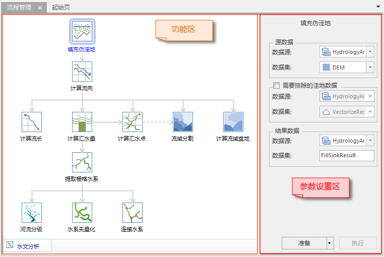
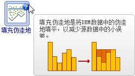

水文分析是一个流程化的操作，包含了多个关联性高的功能。针对这种特点，桌面应用程序创新了其操作方式和流程，让用户的使用过程更加连贯和快捷。

在“ **分析** ”选项卡的“ **栅格分析** ”组中，单击“ **水文分析**
”按钮，可以直接打开水文分析窗口，如下图所示。这种窗口模式不同于传统的窗口模式，具有更大的优势。

### 水文分析流程管理窗口

   
  
水文分析流程管理窗口由两部分组成，左侧是功能区，用来显示水文分析的所有步骤，以及它们之间的相互关系。单击任一步骤按钮，可以对该步骤进行操作。右侧是参数设置区，当在功能区中选中任意一个功能按钮时，右侧会自动切换到该功能对应的参数设置页面，并提供了准备和执行该功能的按钮。

**功能区**

功能区组织了水文分析的所有功能，包括填充伪洼地、计算流向、计算流长、计算累积汇水量、提取栅格水系、河流分级等多个功能按钮。这些功能按钮按照操作流程上的依赖关系，通过直线相连，形成一个整体。例如计算流长、计算累积汇水量、计算汇水点、流域分割、计算流域盆地功能必须基于流向栅格数据进行操作；栅格水系的提取必须依据累积汇水量栅格的结果，而河流分级、水系矢量化、连接水系功能必须依赖于提取的栅格水系数据进行。直线和箭头就表示这些功能之间的相互关系。

按住鼠标中键（鼠标滚轴），鼠标状态变改变，拖动鼠标 ，此时可以在功能区中将功能按钮作为一个整体在任意位置拖动。

在功能区中选中一个功能按钮或者鼠标滑过某一个按钮时，图标的右上方会出现提示图标
，单击该图标会显示与该功能相关的简单帮助说明。

  

**参数设置区**

参数设置区用来设置水文分析各个功能的参数，包括输入的源数据、输出的结果数据以及其他重要参数。所有参数设置完成后，单击“准备”按钮，表示该功能的参数设置完毕，随时可以执行。单击“执行”按钮，执行已经准备好的功能。

对准备和执行功能的特别说明：

1. “准备”功能，用来使参数设置完毕的流程处于准备状态，方便随时执行。
2. 当且仅当该功能处于准备状态时，执行按钮才可用。
3. 在当前水文分析窗口中，仅存在一个准备好的功能（当前流程），单击“执行”按钮，执行当前功能。如果有多个功能处于准备状态，则单击“执行”按钮，执行所有已经准备完毕的功能。
4. 同时执行多个功能时，默认使用上一功能生成的结果数据作为输入数据，如果用户想使用别的数据源下的数据，重新设置即可。