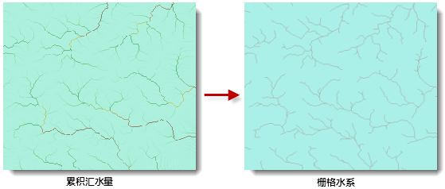

### 使用说明

提取栅格水系是提取水系网络的第一步，后面的河流分级、连接水系和水系矢量化都是基于栅格水系进行操作的。

我们知道，累积汇水量较高的像元可视为河谷，通过给汇水量设定一个阈值，提取累积汇水量大于该阈值的像元，从而得到栅格水系。实际操作过程中，对于不同级别的河谷、不同区域的相同级别的河谷，该阈值可能不同，因此在确定该阈值的时候需要根据研究区域的实际地形地貌并通过不断的实验来确定。

根据前面的介绍，栅格水系可以通过对累积汇水量栅格进行代数运算来提取。假设经过调研确定某区域的累积汇水量超过2000的区域为汇水区域，则提取栅格水系的表达式为：

     [数据源.累积汇水量栅格] > 2000

经过计算获得栅格水系，它是一个二值栅格。其中累积汇水量大于2000的像元赋值为1，其他像元赋值为0。数值0表示无值。

如下图所示，为提取的栅格水系：

  
  
### 功能入口

  * 在“ **空间分析** ”选项卡->“ **栅格分析** ”组中，单击“ **水文分析** ”按钮，弹出水文分析流程窗口，选择“提取栅格水系”按钮。(iDesktop)
  * 在“ **空间分析** ”选项卡->“ **栅格分析** ”组中，单击“ **水文分析** ”下拉按钮，在弹出菜单栏中选择“提取栅格水系”。(iDesktopX)
  * **工具箱** -> **栅格分析** ->水文分析工具：提取栅格水系；或者将该工具拖拽到可视化建模窗口中，再双击该功能图形。(iDesktopX) 

### 参数说明

  * **汇水量数据** ：选择汇水量栅格所在的数据源以及数据集。
  * **阈值** ：输入要提取的累积汇水量阈值。
  * **结果数据** ：设置结果要保存的数据源和数据集的名称以及结果栅格数据的像素格式。应用提供了1位、4位、单字节、双字节、整型、长整型、单精度浮点型和双精度浮点型等8种像素格式，各种格式的具体说明请参见[栅格数据集像素格式](../Analyst/VectorRasterConvert/PixelFormat)。
  * **对数据集进行压缩存储** ：勾选该复选框以后，应用程序会对结果数据集进行压缩存储，否则将不进行压缩存储。默认不进行压缩。
  * **忽略无值栅格单元** ：勾选该复选框以后，输入栅格数据集中的无值栅格单元将不参与代数运算，结果数据集中相应位置的像元值仍为空值（通常为-9999）；若不勾选该项，则应用程序会将无值栅格单元的像元值作为普通像元值参与运算，此时会导致结果栅格数据集的极小值（或极大值）发生改变。默认忽略无值。 
  * 单击“ **准备** ”按钮，表示当前分析功能的相关参数设置已经完成，随时可以执行。准备完毕的流程会置灰，不能修改；如需修改设置的参数，可以单击“取消准备”按钮进行修改。注意：单击“准备”下拉按钮，会弹出下拉菜单。“全部取消”功能，用来取消所有已经准备好的步骤的准备状态。(iDesktop) 

  * 单击“ **执行** ”按钮，执行准备好的分析功能。执行完成后输出窗口中，会提示执行结果是成功还是失败。