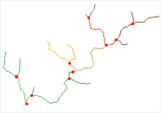
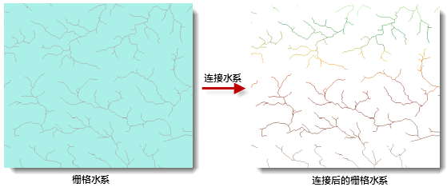

### 使用说明

连接水系是基于栅格水系和流向栅格，为水系中的每条河流赋予唯一值的过程。

连接后的水系网络记录了水系节点的连接信息，体现了水系的网路结构。连接成功后，每条河段都有唯一的栅格值。如下图所示，图中红色的点为交汇点，即河段与河段相交的位置。河段是河流的一部分，它连接了两个相邻交汇点，或者一个交汇点和汇水点，或连接一个交汇点和分水岭。

  
  
最终得到的连接水系结果中，河流栅格线状网络应为大于或等于1的值，如下图所示。

  
  
### 操作步骤

1. 在“ **分析** ”选项卡的“ **栅格分析** ”组中，单击“ **水文分析** ”按钮，弹出水文分析流程管理窗口。
2. 在左侧的功能列表区中，选择“**连接水系**”按钮。
3. 在右侧的参数设置区中，设置连接相关的参数。 
    * **水系数据** ：选择栅格水系所在的数据源以及数据集。
    * **流向数据** ：选择流向数据所在的数据源以及数据集。关于如何生成流向数据，请参见[计算流向](CalFlowDirection.html)。
    * **结果数据** ：设置结果要保存的数据源和数据集的名称。
4. 单击“ **准备** ”按钮，表示当前分析功能的相关参数设置已经完成，随时可以执行。准备完毕的流程会置灰，不能修改；如需修改设置的参数，可以单击“取消准备”按钮进行修改。**注意**：单击“准备”下拉按钮，会弹出下拉菜单。“全部取消”功能，用来取消所有已经准备好的步骤的准备状态。
5. 单击“ **执行** ”按钮，执行准备好的分析功能。执行完成后输出窗口中，会提示执行结果是成功还是失败。