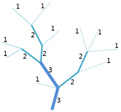
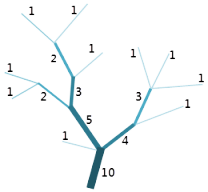

河流分级功能用来对河流进行分级，根据河流等级为提取的栅格水系编号。SuperMap 目前支持两种分级方法：Strahler 法和 Shreve 法。

### **Strahler 河流分级法**

Strahler 河流分级法由 Strahler 于 1957 年提出。其规则定义为：直接发源于河源的河流为 1 级河流；同级的两条河流交汇形成的河流的等级比原来增加 1 级；不同等级的两条河流交汇形成的河流的等级等于原来河流中等级较高者。

Strahler 法是最常见的河网分级方法。但是由于此方法只在同级相交时才会提高级别，因此此种方法仅保留了最高级别连接线的级别，并没有考虑所有水系网络的连接线。Strahler 分级法如下：

  
  
### **Shreve 河流分级法**

Shreve 河流分级法由 Shreve 于 1966 年提出。其规则定义为：直接发源于河源的河流等级为 1 级，两条河流交汇形成的河流的等级为两条河流等级的和。例如，两条 1 级河流交汇形成 2 级河流，一条 2 级河流和一条 3 级河流交汇形成一条 5 级河流。

Shreve 法考虑了水系网络中的所有连接线，连接线的量级实际上代表了上游连接线的数量。Shreve 分级法如下：  

  
