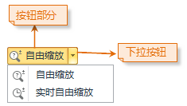

### 放大布局

“放大布局”按钮，用来实现放大浏览当前布局窗口的功能。

单击“ **布局** ”选项卡中“ **布局浏览** ”组的“ **放大布局**
”按钮，当前布局窗口的操作状态变为放大显示布局的状态。

  * **单击放大：** 在布局窗口中单击鼠标，当前布局就会以鼠标单击的位置为中心点放大显示，放大倍数为2倍。
  * **矩形框选放大：** 单击鼠标左键并按住不放，沿对角线拖动鼠标，可以看到一个临时矩形框，其大小随着鼠标移动而变化。在适当位置松开鼠标 左键，当前布局可按临时矩形区域确定的范围放大。放大后的显示效果为：以临时矩形的中心点所在位置为布局放大显示的中心点，放大倍数为当前布局窗口的宽度和高度分别与临时矩形框的宽度和高度的比值中较小的一个值。

此外，按下键盘中的字母 “Z” 键也可将当前布局窗口的状态切换为放大显示布局窗口的操作状态。

### 缩小布局

"缩小布局"按钮，用来实现缩小浏览当前布局窗口的功能。

单击" **布局** "选项卡中的" **布局浏览** "组的" **缩小布局**
"按钮，当前布局窗口的操作状态变为缩小显示布局的状态。

  * **单击缩小：** 在布局窗口中单击鼠标，当前布局就会以鼠标单击的位置为中心点缩小显示，缩小倍数为2倍。
  * **矩形框选缩小：** 单击鼠标左键并按住不放，沿对角线拖动鼠标，可以看到一个临时矩形框，并且其大小随着鼠标移动而变化。在适当位置松开鼠标 左键，可按临时矩形区域确定的范围缩小布局。缩小后的显示效果为，以临时矩形的中心点所所在位置为布局缩小显示的中心点，缩小倍数为当前布局窗口的宽度和高度分别与临时矩形框的宽度和高度的比值中较小的一个值。

此外，按下键盘中的字母 "X" 键也可将当前布局窗口的状态切换为缩小显示布局窗口的操作状态。

### 自由缩放布局

"自由缩放"下拉按钮供了在当前布局窗口中进行布局放大或缩小的功能。该按钮包含两个部分（如下图所示），一是按钮部分，单击该部分可以直接执行相应的功能，二是下拉按钮部分，单击该部分将弹出下拉菜单，通过选择下拉菜单中的项可进一步实现相应的功能。

  
  
### 自由缩放

单击该下拉按钮的按钮部分；或者单击下拉按钮部分，在弹出的下拉菜单中单击"自由缩放"项，当前
布局窗口中的操作状态变为自由缩放状态。

  * 在当前布局窗口中按住鼠标左键 进行拖动即可放大或缩小布局；松开鼠标左键即停止自由缩放操作，并且当前布局窗口进行一次刷新。
  * 由于在按住鼠标左键自由缩放布局的过程中，布局窗口并没有进行实时刷新，因此，当前布局窗口中会出 现空白部分。只有当松开鼠标左键停止自由缩放操作之后，布局才会进行刷新。
  * 如果需要在布局自由缩放的过程中进行实时刷新，可使用"实时自由缩放"功能。

### 实时自由缩放

单击下拉按钮部分，在弹出的下拉菜单中单击"实时自由缩放"项，当前 布局窗口中的操作状态变为自由缩放状态 。

  * 在当前布局窗口中按住鼠标左键 进行拖动即可放大或缩小布局，当松开鼠标左键即停止实时自由缩放操作。在按住鼠标左键自由缩放布局的过程中，布局窗口进行实时刷新，从而使布局的缩放过程显得十分流畅。

