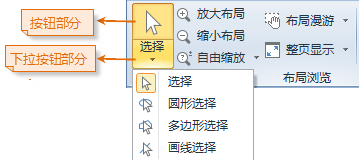

“选择”下拉按钮提供了在当前布局窗口中，通过某种方式选择地图元素、几何对象或文本的功能。“选择”下拉按钮包含两个部分（如下图所示）：一是按钮部分，单击该部分可以直接执行相应的功能；二是下拉按钮部分，单击该部分将弹出下拉菜单，通过选择下拉菜单中的项可进一步实现相应的功能。

  

  
在布局窗口中可以选择的对象包括：点、线、面等几何对象；文本对象；地图、比例尺、图例、指北针等地图元素。“选择”下拉按钮提供了点选、圆形选择、多边形选择、画线选择4种对象选择方式。

### 点选和矩形框选择

单击“ **布局** ”选项卡中“ **布局浏览** ”组中的“ **选择** ”下拉按钮的按钮部分，即可使用点选或者拖框选择的方式选择布局中的对象。

单击“选择”按钮后，当前布局窗口的操作状态变为点选状态，并且鼠标在当前布局窗口中的状态变为  。

  * 点选：用户可通过鼠标单击选择对象。当选择另一个对象后，之前已选中对象的选择状态被撤销；选择一个对象后，按住 Shift 键，再次选择其他对象时，可同时选中多个对象。
  * 框选：用户可通过单击鼠标左键并按住不放，沿对角线拖动鼠标，出现一个大小随着鼠标移动而变化的临时矩形。在适当位置松开鼠标左键，确定用于选择的矩形区域，则质心在矩形区域内的所有对象都被选中。用户可通过按住 Shift 键继续进行矩形框选择，在原有基础上增加选中的对象。

### 圆形选择

在布局窗口中，通过绘制一个临时圆形区域，选中圆形区域内符合选择模式的对象。单击下拉按钮部分，在弹出的下拉菜单中单击“圆形选择”项，当前布局窗口的操作状态变为圆形选择状态。

  * 在布局窗口中某个位置，单击鼠标左键，该位置即为绘制的临时圆形区域的圆心。拖动鼠标，在拖动鼠标的过程中可看到半径不断变化的临时圆。
  * 在适当位置再次单击鼠标左键，即可通过确定临时圆的半径确定用于选择的圆形区域，则质心在圆形区域内的所有对象被选中。
  * 用户可通过按住 Shift 键继续进行圆形选择，在原有基础上增加选中的对象。

### 多边形选择

在布局窗口中，通过绘制一个临时多边形区域，选中多边形区域内符合选择模式的对象。单击下拉按钮部分，在弹出的下拉菜单中单击“多边形选择”项。当前布局窗口的操作状态变为多边形选择状态。

  * 在布局窗口中连续单击鼠标左键，绘制一个临时多边形，完成绘制时单击鼠标右键结束绘制，则质心在该多边形区域内的所有对象被选中。
  * 用户可通过按住 Shift 键继续进行多边形选择，在原有基础上增加选中的对象。

### 画线选择

在布局窗口中，通过绘制一条临时折线段，选中与折线段相交的对象。单击下拉按钮部分，在弹出的下拉菜单中选择“画线选择”项。当前布局窗口的操作状态变为画线选择状态。

  * 在布局窗口中连续单击鼠标左键，绘制一条临时的折线，单击鼠标右键完成折线的绘制，则与折线相交的所有对象将被选中。
  * 用户可通过按住 Shift 键继续进行画线选择，在原有基础上增加选中的对象。

以上几种选择方式可以混合使用，只要在选择对象时按住 shift
键，就可以在原有基础上增加选中的对象。在布局窗口中，所有被选择的对象都以特殊的状态（选择状态）显示出来。

