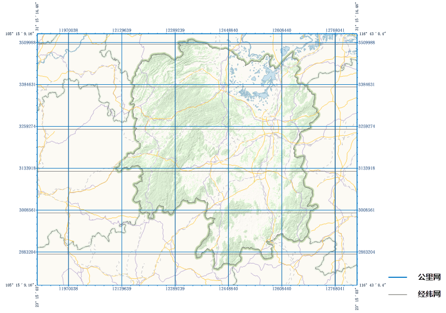
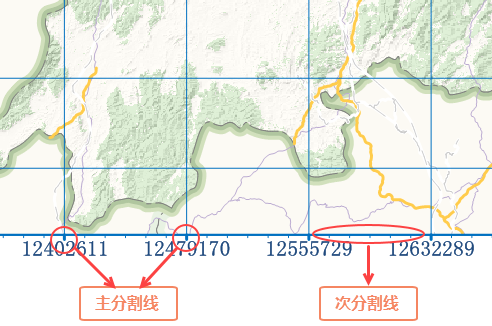
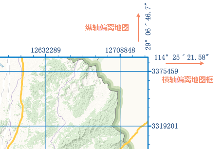

地图格网是由间隔均匀的横向线和纵向线组成的网络，用于在地图上识别各个位置，SuperMap iDesktop
提供经纬网、公里网两种类型。经纬网通过在地图上描绘纬度和经度格网，用于表示地图的地理坐标；公里网是间隔均匀的水平和垂直线，用于描绘地图的投影坐标。

同一幅地图支持添加多个格网，不同坐标系的地图，支持添加的地图格网类型有所不同，具体情况如下：

  * **地理坐标系地图** ：支持添加经纬网和公里网；
  * **投影坐标系地图** ：支持添加经纬网和公里网；
  * **平面坐标系地图** ：支持添加公里网，不支持经纬网。

  

###  应用场景

  * 生产地图时，按照制图规范和要求，为地图设置格网、坐标标注、地图边框等要素，生产符合要求的地图产品。
  * 当地图范围跨了多个 UTM 带，需通过多个的格网来标识对应的UTM带坐标，可为地图创建多个不同分带坐标系的公里网，使得不同分带地区标注的位置信息更为准确。

###  创建格网

SuperMap iDesktop 支持基于模板创建地图格网，提供基于预定义模板和模板文件两种创建方式:

  * **预定义模板** ：可基于模板的风格、设置格网相关参数创建地图格网。 

**功能入口** ：

  * **选项卡** ： **对象操作** -> **对象绘制** -> **格网** 下拉按钮；
  * **布局地图属性** ： **地图格网** -> **工具栏** 中的 **添加** 按钮。

**格网参数设置** ：

  * **格网类型** ：设置格网类型为经纬网或公里网。
  * **坐标系** ：若格网类型为公里网，可设置公里网的坐标系为投影坐标系；若格网类型为经纬网，则格网默认为地图的地理坐标系，不支持修改。
  * **横向间隔** ：用于调整两个相邻的横向网格线之间的距离。当网格类型为经纬网时，间隔的单位为度；当网格类型为公里网时，间隔的单位为米。
  * **纵向间隔** ：用于调整两个相邻的纵向网格线之间的距离。当网格类型为经纬网时，间隔的单位为度；当网格类型为公里网时，间隔的单位为米。
  * **行数/列数** ：可根据设置的横向/纵向间隔，动态计算得出的格网的行数和列数，默认将地图分为10行10列，修改行列数后，格网间隔也会动态改变。
  * **模板文件** ：在地图格网的工具栏中，单击 **导入** 按钮，在弹出的 **选择** 对话框中选中格网模板文件(*.xml)，即可基于格网模板文件创建地图格网。

###  管理格网

  * **格网设置** ：单击工具栏中的设置按钮，可修改格网的坐标系（公里网）、间隔或行列数等参数。
  * **格网模板** ：支持导入的格网模板创建地图格网，也可将当前选中的格网导出为模板，便于地图格网的重复利用与分享。
  * **上移下移** ：支持调整地图格网的显示顺序。
  * **删除** ：用于删除列表中选中的格网，删除后将无法恢复格网。
  * **可见性** ：可用于设置格网是否显示。
  * **重命名** ：在列表中选中指定的格网后，双击名称单元格，即可修改地图格网的名称。

###  格网风格

  * **外框风格** ：单击按钮，可在线符号选择器中设置格网外框线风格，详细说明请参见[线符号风格设置](../../Visualization/LayerStyle/LineSymStyle)页面。
  * **格网类型** ：单击右侧下拉按钮，可设置地图格网线的显示类型，支持实线、十字丝、无网格三种类型。 

  * **网格风格** ：当格网类型为实线或十字丝时，可单击格网风格标签右侧按钮，在弹出的“线型符号选择器”对话框中，设置地图格网的线型风格，可选择网格线类型，且支持调节线宽度和线颜色。
  * **主分割线** ：主分割线是指每条纵横交错的网格线与地图外框交点处，显示在地图边框上的分割线。“主分割线”复选框用于设置布局中是否显示主分割线。单击标签控件右侧的按钮，可在弹出的“线型符号选择器”对话框中，设置主分割线的线型、线宽和颜色。 
  * **次分割线** ：次分割线是指按照“次分割线个数”中设置的个数，将相邻两个主分割线之间的距离平均分成几等分，显示在地图边框上的刻度线。如下图所示，当次分割线个数设为5时，相邻两个主分割线会被平均分成6等分，两个相邻主分割线之间会显示5条次分割线。当“网格类型”设置为公立网时，“次分割线”复选框用于设置布局中是否显示次分割线。单击标签控件右侧的按钮，可在弹出的“线型符号选择器”对话框中，设置次分割线的线型、线宽和颜色。 **注意** ：仅公里网支持设置次分割线。

###  标注风格

标注是用于显示主刻度线的坐标，经纬网表示的是经度和纬度坐标，公里网表示的是 X 和 Y
轴坐标。标注有四周标注和拐角标注两种方式，用户可根据需要选择相应的标注方式。

  * **四周标注** ：在格网四周主分割线处标注相应的坐标。勾选四周标注复选框，则地图框四周会显示格网的坐标；未勾选改复选框，则表示不显示标注。四周标注的相关参数说明如下： 
     * **横向位置** ：用于调整地图框上、下两侧标注与主分割线的位置关系，提供正对端点、端点左侧、端点右侧三种方式。 
        * 正对端点：表示标签中心点与主分割线中心点对齐；
        * 端点左侧：表示标签位于主刻度线的左侧；
        * 端点右侧：表示标签位于主刻度线的右侧；

   * **纵向位置** ：用于调整地图框左、右两侧标注与主分割线的位置关系，提供正对端点、端点上侧、端点下侧三种方式。 
      * 正对端点：表示标签中心点与主分割线中心点对齐；
      * 端点上侧：表示标签位于主刻度线的上侧；
      * 端点下侧：表示标签位于主刻度线的下侧；

  * **偏移量** ：用与设置标注偏离地图框的距离，单位为：0.1mm。
  * **垂直显示** ：用于设置上下左右的标注是否垂直方向显示，默认标注为水平方向显示。 

  * **可见** ：用于设置上、下、左、右侧标注的可见性，勾选表示可见，为勾选表示隐藏指定方向的标注。
  * **拐角标注** ：在矩形地图框的拐角处，标注该点的坐标。勾选拐角标注复选框，则矩形地图框拐角会显示格网的坐标；未勾选改复选框，则表示不显示标注。拐角标注的相关参数说明如下： 
    * **横轴偏移** ：用于设置横向坐标标注的水平方向上偏移地图框的偏移量，单位为0.1mm；
    * **纵轴偏移** ：用于设置纵向坐标标注的垂直方向上偏移地图框的偏移量，单位为0.1mm；

  * **标注位置** ：用于设置拐角标注与延长线的显示方式，提供延长线上和延长线外两种方式： 
    * 延长线上：表示拐角标注显示在格网边框延长线，标注中心位于延长线上；
    * 延长线外：表示拐角标注显示在格网线一侧。
  * **标注位数设置** ：当地图比例尺较大，格网标注的数值前几位一致，只有后几位数值有变化时，可通过调整标注显示位数的方式，使标注更简洁，SuperMap iDesktop 提供设置整数位数和小数位数两种方式。 **注意** ：适用于公里网，经纬网不建议设置。 
    * **整数位数** ：设置格网标注整数部分的显示位数，从个位数开始往前计算位数，例如：公里网标注为243547，设置整数位数为4时，则标注只显示后4位整数，即3547。
    * **小数位数** ：设置格网标注小数的显示位数，即显示小数点后的位数，例如：标注为3698.1826，小数位数设置为2时，则标注显示为3698.18。
  * **其他文本设置** ：标注的字体、字号、颜色、显示效果等其他参数，与普通文本设置方式一致，详细说明请参见[文本对象属性](../../Visualization/Interaction/TextPropertyDia)页面。
