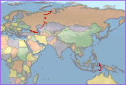

### 使用说明

“地图”下拉按钮提供了在当前布局窗口中绘制地图的功能。单击该按钮将弹出下拉菜单，通过选择下拉菜单中的项来进一步实现相应的功能。下拉按钮菜单中提供了包括矩形、圆角矩形、多边形、椭圆、斜椭圆、圆6种地图填充形状。

### 操作方式

  1. 单击“地图”下拉按钮，在弹出的下拉菜单中选择“矩形”项，鼠标在当前布局窗口中的状态变为绘制状态 。（用户也可以单击下拉列表中其它类型填充形状对应的按钮，即可以选中的填充形状绘制地图。）
  2. 在待绘制地图的位置，单击并拖拽鼠标，即可按照绘制矩形的方式在当前布局窗口中绘制一个用于填充地图的矩形框。
  3. 矩形框绘制完成后，此时会弹出“选择填充地图”对话框，要求用户选择一幅地图。
  4. 用户可单击“选择地图:”标签右侧的下拉按钮，在弹出的下拉列表中选择当前工作空间中已经存在的某个地图进行填充。
  5. 单击“确认”按钮后，即可按矩形填充方式绘制所选地图。
  6. 除了绘制矩形填充框，用户还可以在“地图”下拉按钮的下拉列表中选择其它地图填充形状，如圆角矩形、多边形、椭圆、斜椭圆、圆等，即可用其它的填充形状在布局窗口绘制地图。以不同形状填充地图的效果如下图所示。  
    
  7. **修改地图的属性：** 双击待修改属性的地图对象；或者选中地图对象，单击右键，在弹出的右键菜单中选择“属性”项，即可弹出“布局地图属性”窗口。 
      * **指定关联地图：** “布局地图属性”窗口中的“地图”标签右侧的下拉按钮用于显示和设置当前填充框的关联地图。单击该标签右侧的下拉按钮，即可在下拉菜单中选择当前工作空间中存在的任一幅地图作为当前填充框的关联地图。选择任何一幅地图作为当前填充框的关联地图后，填充框显示的地图也会相应变为指定的地图。
      * **比例尺:** 布局中的当前地图的显示比例尺。用户可以根据显示的需要，设置合适的比例尺。设置完成后，单击“锁定地图”，即可显示为设置的比例尺大小。
      * **角度:** 可以通过指定一定的角度，对布局中的当前地图进行旋转。设置完成后，单击“锁定地图”，即可将地图按照指定角度进行旋转。
      * **地图中心点** ：X、Y 标签右侧显示当前地图区域的中心点坐标，支持对地图布局中心点进行复制和粘贴。
      * **网格设置:** 可为布局中的地图添加均匀大小的格网，提供经纬网和公里网两种类型，支持格网添加、风格设置、标注设置等功能，地图网格详细说明请参见:[地图网格设置](Gride)。 
      * **边框设置：** 与地图对象关联的“布局地图属性”窗口可用于设置地图边框的属性。具体设置方法参考：[边框设置](MapOutline)。 

### 注意事项

  1. 在布局窗口中绘制地图，并基于该地图绘制图例、指北针、图例等布局元素后，若修改原地图，已绘制的与地图相关联的图例、指北针和比例尺等不会相应发生改变。 
  2. 绘制地图填充形状的方法与在地图窗口和布局窗口绘制面对象的方法完全相同。
  3. 若用户需要用其它的地图替换已经绘制的地图，可选中要修改的地图，在“布局风格”选项卡的“地图”组中重新指定地图。

###  相关主题

[如何在布局窗口中绘制地图填充形状？](../DrawingObjects/DrawingObjects)

