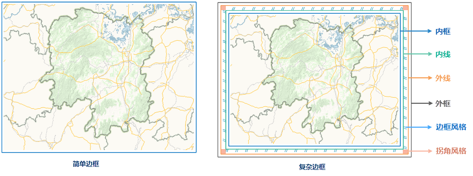

用户在地图的 **布局地图属性** 窗口中可以对地图边框是否显示以及边框的显示风格进行设置。

**显示边框** 复选框用于控制当前布局窗口已选中的地图是否显示边框。提供了 **单线边框** 和 **复杂边框**
两种边框类型，设置边框类型之后，设置单线边框或复线边框的风格参数。

   

  * **绘制拐角延长线** ：勾选该复选框，地图格网外框线即可延长至地图边框，若为复杂边框，则延长至边框的内框。若格网标注设置了拐角标注，则拐角延长线和拐角标注会自动避让，默认不压盖显示。拐角延长线如下图所示： 

  * **单线边框：** 设置所选地图对象的边框类型为单线边框。
    * **线型：** 单击“选择线型”下拉按钮，弹出线型符号库资源列表，用户可根据需要选择符号列表中的符号，或单击线符号资源列表底部的“符号设计...”按钮，在弹出的“符号库”窗口中，添加其它符号库文件，作为当前单线边框的线型。
    * **线宽：** 该标签右侧的数字显示框用于设置但线边框的线宽度，默认为0.1毫米。
    * **颜色：** 设置单线边框的颜色，单击该标签右侧的下拉按钮，弹出颜色面板，用户可选择一种系统预定义的颜色或自定义一种颜色，设置为单线边框的颜色。
    * **距离：** 表示当前边框距里层地图的距离。当用户选择单线边框时，“距离”标签右侧的数字显示框显灰，为不可用状态。
  * **复杂边框：** 地图几何对象的边框类型为复杂边框时，边框的结构分为外框、内框、外线、内线、边框转角区域以及边框填充区域，可以通过设置各种线框的线型、颜色、粗细以及进行区域部分的填充来修饰地图几何对象的边框可基本满足用户的需求。
    * **内框/内线/外线/外框：** 当地理边框选择为复杂边框时，使用内框/内线/外线/外框来为复杂边框设置0-4个框线，并设置其线型、宽度、颜色和间距。各类框线的设置方法相同，参照单线边框的设置方法即可。如果设置某一个框线的宽度为0，则该框线将不显示。距离表示当前线框与里层线框间的距离，内框则表示其与里层地图边界之间的距离。 
    * **边框风格：** “布局地图属性”窗口下方的边框风格选项卡用于设置复杂边框中内线至外线之间区域的填充内容和填充方向。 

**填充方向：**
系统为填充图案提供了2种旋转基点：从外向内（默认设置）和从内向外。从外向内表示填充图案是从外线向内线填充；而从内向外正好相反，如上图所示。

**填充设置：** 填充设置区域用于设置内线至外线其间填充图案。系统提供了三种填充方式：无填充、文本填充和图片填充，默认为无填充。

**(1)无填充：** 内线至外线其间填充图案之间无任何填充内容。

**(2)文本填充：**
内线至外线其间填充图案之间以文本进行填充。用户可在“文本内容:”标签右侧的文本框中输入文字、数字或符号，可以选择字体、颜色，字样内容可以选择也可以自行输入，但实际只能最多显示2个字符。用户可单击“文本风格:”右侧的下拉按钮，弹出字体风格设置的下拉对话框，用户可在该对话框中设置填充文本的风格。具体设置方法参考：[修改统一风格标签专题图的风格](../../Mapping/LabelMap/UniformLabelMapDia)页面中的“风格”选项卡。

**(3)图片填充：** 内线至外线其间填充图案之间以图片进行填充。选择“图片填充”，该标签下方按钮为可用状态，单击该按钮，用户可在弹出的“打开”对话框中，选择一个用于填充的图片即可。导入图片的格式可为：*.bmp、*.jpg、*.png、*.gif。

 * **拐角风格：** “属性”窗口下方的拐角风格选项卡用于设置复杂边框中内线至外线之间区域的四个拐角处填充内容和填充方向。 

**起始模式：**
系统为转角填充图案提供了4种旋转基点：左下、左上、右上和右下。系统默认的起始模式为右上，表示边框右上转角处的图案为正常视图，其他三个转角处图案为其依次旋转90度的结果，如上图所示。

**填充设置：** 拐角风格的填充设置区域与边框风格的设置完全相同，具体参考以上的设置方法即可。

