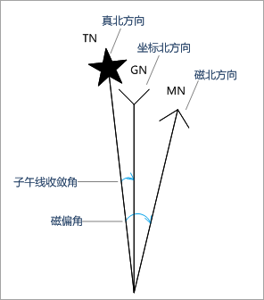
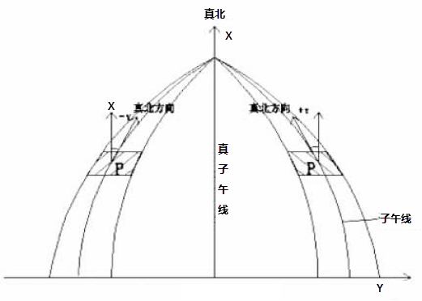
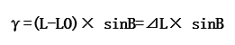
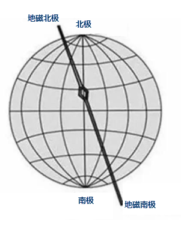

### 功能说明

在测绘中常用的标准方向有真子午线方向、磁子午线方向和坐标纵轴方向，简称为真北方向、磁北方向和坐标北方向，即三北方向，如图1所示。在中小比例尺地形图上，通常要求绘制三北方向。

  

**坐标北方向**

坐标北方向也叫地图北、网格北，是指在某张地图上纵向方格线指示的"上"方。在高斯平面直角坐标系中，纵坐标轴所指的方向或与纵坐标轴平行的方向，就是坐标北方向。

**真北方向**

过地面上的任意一点，指向北极的方向叫真北，对一幅图而言，通常把图幅的中央经线的北方向作为该图幅的真北方向。在高斯-克吕格投影中，除中央经线投影成直线以外，其他所有的经线都投影成向极点收敛的弧线。因此，除中央经线以外，其他所有经线的投影同坐标纵线都有一个夹角，这个夹角即为子午线收敛角。

  
  
**子午线收敛角**

子午线收敛角是地球椭球体面上一点的真子午线与位于此点所在的投影带的中央子午线之间的夹角，即高斯平面直角坐标系的坐标北向与真北方向的夹角。相对真北方向而言，当坐标纵轴线北端位于以东时称东偏，其角值为正；位于以西时称西偏，其角值为负。

目前可通过公式法和查表法计算子午线收敛角，应用程序中通过以下公式利用地图中心点坐标自动计算子午线收敛角。

**公式法**

已知地理坐标（B，L）计算子午线收敛角。根据中国矿业大学出版社出版的《数字测图原理与方法》中计算子午线收敛角近似公式：

L：地理坐标经度；LO：为中央子午线经度；△L：为经差，即某点与中央子午线的经度差；B：地理坐标纬度。

例如：布局中地图中心点P的地理坐标为：B=18°18′32.82820″，L=109°18′36.94903″，求P点在6度带第19带中的子午线收敛角。LO=6°×19-3°=111°γ=（109°18′-111°）×
sin18°18′32.82820″=-0°31′50.59″

**磁北方向**

磁北方向是指南针所指示的北，这主要是由于地球的磁场两极与地理上的南北两极不重合，因此指南针指示的北为磁北而非真北，磁北的具体位置随着时间而改变。地磁极是接近南极和北极的，但并不和南极、北极重合，一个约在北纬72°、西经96°处；一个约在南纬70°、东经150°处。

地磁北极是地球表面地球磁场方向垂直向下的点。它与地理北极并不相同，并且正在不断的改变，以每天20.5米的速度移动。磁北极距地理北极大约相差1500km.
在一天中磁北极的位置也是不停的变动，它的轨迹大致为一椭圆形，磁北极平均每天向北以40m。在日常绘图中想要绘制磁北方向，可通过确定磁偏角的大小，标定磁北方向。

  
---  
图：磁北方向示意  
  
**磁偏角**

磁偏角是磁北与真北之间的夹角。即磁子午线与中央子午线之间的夹角。相对磁北方向而言，偏向真北方向以东称东偏，其角度为正，偏向真北方向以西称西偏，其角度为负。

磁偏角是通过磁偏测量仪测量而来，目前磁偏角测量主要采用两种方式：一是固定地磁台站的长期连续跟踪观测，二是野外流动测点的不定期测量。由于固定地磁台站选址和基建标准很高，不适宜建设太多，所以少量地磁台站和大量野外测点相结合，是地磁场测量的最佳模式。

一般情况下在绘图时，会将磁偏角的实际测量值标在地图中，所以在标注磁北方向时，用户输入测图时得到的磁偏角，即可标注出精确的磁北方向。

您也可以通过世界地磁模型提供（WMM）的数据，输入时间和具体经纬度，基于模型监测站得到的一个磁偏角数值。 WMM 由国家地球物理数据中心 (NGDC,
Boulder CO, USA) (现为国家环境信息中心 (NCEI)) 和英国地质调查局 (BGS, 爱丁堡, 苏格兰) 联合开发。模型每隔5年生产一次,
目前的模型将于2019年12月31日到期，有关详细信息请参考[世界地磁模型](http://www.ngdc.noaa.gov/geomag/WMM/DoDWMM.shtml)。

### 操作步骤

  1. 选中布局窗口中的一个需要绘制指北针的地图。
  2. 单击 **对象操作** 选项卡-> **对象绘制** 组-> **指北针** -> **三北指北针** 。 
  3. 在当前布局窗口中需要绘制三北指北针的位置，单击并拖拽鼠标，即可得到基于选中地图的绘制的三北指北针，程序会根据地图中心点坐标自动计算子午线收敛角并根据子午线收敛角标注真北方向，磁北方向需要由用户指定磁偏角才能生效，否则磁偏角将于真北方向重合。 

**注意** ：平面坐标系不支持绘制三北针，当地图坐标为平面坐标系时，三北指北针按钮不可用。

  4. 双击三北指北针对象；或者选中指北针对象，单击右键，在弹出的右键菜单中选择“属性”项，即可弹出“指北针属性”窗口。属性窗口显示如下参数:磁偏角、旋转角度、宽度、高度等各项参数。 
    * **子午线收敛角**：该角度是程序基于地图坐标系，使用地图中心点坐标自动计算，不可编辑的。当子午线收敛角为0时，是由于当前地图坐标系无中央经线，真北方向与地图北方向重合。
    * **磁偏角**：默认值为0，单位为度，需要用户手动输入当前地图的磁偏角，程序根据输入的磁偏角角度，基于真北方向进行偏转以表示磁北方向。偏向真北方向以东角度为正，偏向真北方向以西角度为负。 
    * 用户可通过设置旋转角度、高度、宽度，改变三北指北针的大小，有关参数的描述可参看“[绘制指北针](NorthArrow)”。

