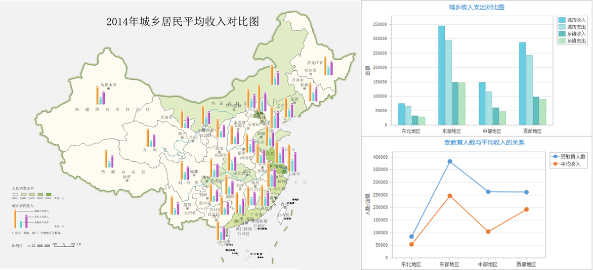

###  使用说明

统计图表是数字、表格的图形化、可视化表达，通过统计图表可直观的展示数据之间的关系、分布情况、趋势和模式等。SuperMap iDesktop
支持将当前工作空间中已保存的统计图表，以图片的形式插入到布局中，丰富布局中的数据信息，通过多元化的方式展示数据。

###  功能入口

**布局窗口->对象操作->对象绘制->统计图表** 按钮。

###  操作说明

    1. 在布局窗口中，单击 **统计图表** 按钮，将鼠标移至布局中，绘制统计图表的插入范围。
    2. 在弹出的对话框中，选择填充到指定范围中的统计图表，下拉选项列出了当前工作空间所有已保存的统计图表，单击 **确定** 按钮即可将指定的统计图表以图片方式插入到布局中。
    3. 插入后可调整统计图表的长宽大小、比例以及位置，插入后结果图如下所示：
  

  
### 相关内容

    * [制作统计图表](../DataMining/Diagrams/CreateDiagram.htm)

