在“ **对象操作** ”选项卡上的“ **对象绘制**
”组可用于在布局窗口中绘制点、线、面等几何对象，基本操作方式与在地图窗口中绘制几何对象类似。但是目前布局中的绘制不支持输入坐标或者输入参数的绘制方式。同时还支持在布局中添加文本和图片对象。在绘制对象时，支持设置捕捉，提高了用户在对象编辑时的精度和效率。

应用程序可以通过“ **对象绘制** ”组中提供的工具，在布局窗口中绘制各种可直接创建的点、线、面几何对象类型，共提供了20种可直接绘制的几何对象类型。

### 点

“ **对象操作** ”选项卡的“ **对象绘制** ”组中，组织了在布局窗口中绘制点对象的工具。

点对象绘制  
---  
  
按钮| 说明| 功能及操作方法|示意图  
--|--|--|-- 
 | 绘制点 | 单击“点”按钮，出现点光标；在布局窗口中待绘制位置单击鼠标左键，绘制一个点对象。每次单击鼠标左键可创建一个点对象，单击鼠标右键可结束点对象绘制。 |   
  
**备注**

结束点对象绘制有以下两种方式：

* 在布局窗口中任意非点对象所在位置单击鼠标右键。
* 再次点击“ **对象操作** ”选项卡“ **对象绘制** ”组中点对象绘制的按钮。

### 线

“ **对象操作** ”选项卡的“ **对象绘制** ”组中，组织了在布局窗口中绘制线对象的工具，应用程序提供了常用的几种可直接在布局窗口中绘制的线对象。

线对象绘制  
 
  
按钮|说明|功能及操作方法|示意图  
 --|--|--|--  
 | 绘制直线 | 单击“直线”按钮，出现直线光标；将直线光标移至布局窗口中创建直线的位置，单击鼠标左键，绘制直线的一个端点；移动光标到合适的位置再次单击鼠标左键，完成一条直线的绘制。 |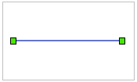  
 | 绘制折线 | 单击“折线”按钮，出现折线光标；将折线光标移至布局窗口中创建折线的位置，单击鼠标左键，绘制折线的第一个节点；继续移动光标到合适的位置再次单击鼠标左键，绘制折线的第一段边线；按同样方式继续绘制折线的各个节点，最后单击鼠标右键完成折线的绘制。| 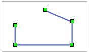  
 | 绘制平行线 | 创建只有两个子对象的平行线。单击“折线”按钮的下拉按钮，在弹出的下拉菜单中选择“平行线”，出现平行线光标；在创建平行线的位置单击鼠标左键，确定平行线的起始位置；移动鼠标，在可以确定平行线宽度的位置再次单击鼠标左键，确定平行线的宽度；移动鼠标，可以看到平行线的宽度已经确定，其长度随着鼠标指针的移动而变化，到合适的位置点击鼠标左键，确定平行线的长度。其后绘制平行线其他段的操作步骤与绘制折线类似。单击鼠标右键结束平行线的绘制。| 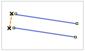  
 | 绘制椭圆弧 | 单击“圆弧”按钮，出现弧光标；将弧光标移到创建弧的位置（即弧外接矩形的一个对角线位置），单击鼠标左键确定弧的位置；移动鼠标，可以看到蓝色的临时椭圆随着鼠标移动而变化大小，在确定椭圆大小的地方，单击鼠标左键确定椭圆的大小；移动鼠标，可以看到一个绿色小方块随着鼠标移动而在临时椭圆上移动，在弧的起始位置单击鼠标左键，确定弧的起点；移动鼠标，在弧的终止位置再次单击鼠标左键，确定弧的形状与大小。 | 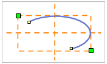  
 | 绘制三点弧 | 通过连续三点创建三点圆弧。单击“圆弧”按钮的下拉按钮，在弹出的下拉菜单中选择“三点弧”，出现三点弧光标；在创建三点弧的位置，单击鼠标左键，确定弧的第一个点；在适当位置，再单击鼠标左键，确定弧的第二个点，移动鼠标，可以看到蓝色的临时圆随着鼠标移动而变化大小。在三点弧的终止位置再次单击鼠标左键，最终确定三点弧的形状与大小。 | 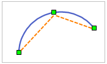  
 | 绘制 B 样条曲线 |通过确定曲线的首尾两个控制点，以及不在曲线上的各中间控制点绘制曲线，曲线的中间点都根据曲线上的中间控制点拟合而成。单击“曲线”按钮的下拉按钮，在弹出的下拉菜单中选择“B样条曲线”，出现 B 样条曲线光标；在创建 B 样条曲线的地方，单击鼠标左键，确定曲线的第一个控制点；在适当位置，再次单击鼠标左键，确定曲线的第二个控制点；移动鼠标，可以看到蓝色的临时曲线随着鼠标移动而变化平滑度；在合适的位置再次单击鼠标左键，确定曲线的其它控制点。 |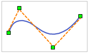  
 | 绘制贝兹曲线 |由不在曲线上的两个起始结点和两个终止结点控制曲线的走向，通过在曲线上的其他控制点拟合出曲线的各中间点。至少需要6个控制点完成一段贝兹曲线的绘制。  单击“曲线”按钮的下拉按钮，在弹出的下拉菜单中选择“贝兹曲线”，出现贝兹曲线光标；单击鼠标左键，确定曲线的第一个控制点；在适当位置，再次单击鼠标左键，确定曲线的第二个控制点，两点间形成一条蓝色虚线；在创建曲线的位置，持续单击鼠标左键，可看见从第三个控制点起在两个控制点间形成弧段，最终单击鼠标右键结束贝兹曲线的绘制。| 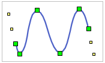  
 | 绘制 Cardinal 曲线 |通过确定曲线上的各控制点绘制曲线，曲线的中间点是根据所有控制点拟合而成。  单击“曲线”按钮的下拉按钮，在弹出的下拉菜单中选择“Cardinal曲线”，出现 Cardinal 曲线光标；单击鼠标左键，确定曲线的第一个控制点；在适当位置，再次单击鼠标左键，确定曲线的第二个控制点，可以看到两点间出现一条蓝色虚线；移动鼠标，可以看到从第二个控制点引出另一条蓝色虚线，并随着光标改变方向和长度；在合适的位置再次单击鼠标左键，确定曲线的第三个控制点，同时在三个控制点间创建出一段Cardinal曲线；移动鼠标，可以看到第二、三个控制点间的蓝色临时曲线随着鼠标移动而变化平滑度；在合适的位置再次单击鼠标左键，确定曲线的其它控制点。绘制完所有的控制点后，单击鼠标右键结束操作。|   
 | 绘制自由曲线 |单击“曲线”按钮的下拉按钮，在弹出的下拉菜单中选择“自由曲线”，出现自由曲线光标；将光标移至创建自由曲线的位置，单击鼠标左键，并按住鼠标左键不放，移动鼠标，可以在布局窗口中画出与光标移动轨迹一致的曲线；如果想绘制折线，可以松开鼠标左键，移动鼠标，在折线的下一节点处单击鼠标左键；完成绘制后，单击鼠标右键结束操作。 |   
  
### 备注

    1. 绘制线对象时，支持以快捷键 Ctrl+R 反向，绘制方向将自动跳转至线对象的另一端，继续该线对象的绘制。反向绘制功能，可随时调整绘制方向，提高较长线对象的绘制效率。
    2. 结束线对象绘制有以下两种方式： 
* 在布局窗口中任意非线对象所在位置单击鼠标右键。
* 再次点击“ **对象绘制** ”选项卡“ **几何对象** ”组中对应线对象绘制的按钮。

### 面

“ **对象操作** ”选项卡的“ **对象绘制** ”组中,组织了在布局窗口中绘制面对象的工具，应用程序提供了10种可直接在布局窗口中绘制的面对象。

面对象绘制  
 
  
按钮|说明|操作方法|操作步骤示意图  
--|--|--|--   
 | 绘制多边形 | 单击“多边形”按钮，出现多边形光标；将多边形光标移至想要创建多边形的位置。单击鼠标左键，绘制出多边形的第一个节点。移动光标到合适的位置再次单击鼠标左键，完成第一段边线的绘制。重复以上步骤；最后单击鼠标右键结束绘制多边形操作。系统会自动连接第一个节点和最后一个节点，绘制成最后一段边线。| 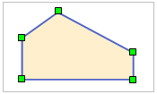  
 | 绘制圆心圆 | 通过圆心和半径创建圆。 单击“圆”按钮，出现圆心圆光标；在创建圆的位置，单击鼠标左键，确定圆心。在确定圆形状大小的位置再次点击鼠标左键，完成圆的操作。| 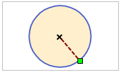  
 | 绘制两点圆 | 通过两点定义直径创建圆。单击“圆”按钮的下拉按钮，在弹出的下拉菜单中选择“两点圆”，出现斜椭圆光标；在创建圆的位置，单击鼠标左键，确定圆直径的一端点。在适当位置，再单击鼠标左键，确定圆直径的另一端点及圆直径的长度，从而创建圆对象。 | 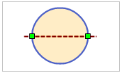  
 | 绘制三点圆 | 通过三点定义圆周创建圆。  单击“圆”按钮，在弹出的下拉菜单中选择“三点圆”，出现三点圆光标；在创建圆的位置，单击鼠标左键，确定圆内接三角形的第一个点。在适当位置，再单击鼠标左键，确定第二个点，从而确定内接三角形的一边。可以看到一个临时圆对象的大小随鼠标移动而变化。重复上一步骤，确定最后一个点，完成三点绘圆的操作。| 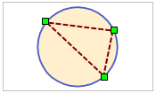  
 | 绘制矩形 | 单击“矩形”按钮，出现矩形光标；将矩形光标移至创建矩形的位置。单击鼠标左键，并沿矩形对角线方向移动鼠标，可以看到一个蓝色矩形框随着鼠标的移动而变化大小和宽高比例。在合适位置再次单击鼠标左键，确定矩形的大小，完成绘制矩形操作。| 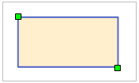  | 绘制圆角矩形 |单击“矩形”按钮的下拉按钮，在弹出的下拉菜单中选择“圆角矩形”，出现圆角矩形光标；将圆角矩形工具光标移至创建圆角矩形的位置，单击鼠标左键确定矩形框的第一个节点的位置。移动鼠标，可以看到一个蓝色矩形框随着鼠标的移动而变化大小和宽高比例。在合适的位置单击鼠标左键，确定圆角矩形的大小。此时上下移动光标，可以看到圆角矩形的四个角弧度随之变化。调整到合适弧度，单击鼠标左键，完成绘制圆角矩形操作。| 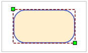  
 | 绘制平行四边形 |单击“矩形”按钮的下拉按钮，在弹出的下拉菜单中选择“平行四边形”，出现平行四边形光标；在创建平行四边形的地方单击鼠标左键，移动鼠标，一根蓝色直线的长度随鼠标移动而变化大小。到适合位置再次单击鼠标左边，确定平行四边形其中一边的方向及长度。此时可以看到临时平行四边形的形状及另一边的长度随着鼠标移动而变化。最后在适合位置单击鼠标左键，完成绘制平行四边形操作。| 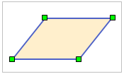  
 | 绘制椭圆 |单击“椭圆”按钮，出现椭圆光标；将光标移到创建椭圆的位置，单击鼠标左键，确定椭圆的位置。移动鼠标，可以看到蓝色的临时椭圆随着鼠标移动而变化大小。在确定椭圆弧的地方，再次单击鼠标左键完成椭圆的绘制。| 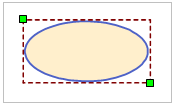  
 | 绘制斜椭圆 |单击“椭圆”按钮，在弹出的下拉菜单中选择“斜椭圆”，出现斜椭圆光标；将光标移至创建斜椭圆的位置，单击鼠标左键，确定斜椭圆长轴/短轴的一个端点。移动光标到斜椭圆长轴/短轴另一端点的位置，再次单击鼠标左键确定其长轴/短轴。这时移动光标可以看到一个临时斜椭圆的形状随着鼠标移动而变化。在可以确定斜椭圆另一轴长度的位置，再次点击鼠标左键，完成绘制斜椭圆操作| 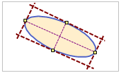  
 | 绘制扇形 | 单击“扇形”按钮，出现扇形光标；将光标移到创建扇形的位置（即扇形外接矩形的一个对角线位置），单击鼠可标左键确定扇形的位置；移动鼠标，可以看到蓝色的临时椭圆随着鼠标移动而变化大小，单击鼠标左键确定椭圆的大小；移动鼠标，可以看到一个绿色小方块随着鼠标移动而在临时椭圆上移动，在扇形的起始位置单击鼠标左键，确定扇形的起点；移动鼠标，在扇形的终止位置再次单击鼠标左键，确定扇形的形状与大小。| 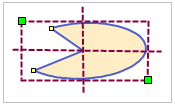  
  
**备注**

结束面对象绘制有以下两种方式：

* 在布局窗口中任意非面对象所在区域单击鼠标右键。
* 再次点击“ **对象操作** ”选项卡“ **对象绘制** ”组中对应面对象绘制的按钮。

### 文本

“ **对象操作** ”选项卡上的“ **文本** ”按钮，用来在布局窗口中绘制文本对象。

文本对象绘制  
 
  
按钮|说明|功能及操作方法|示意图
--|--|--|--  
 | 文本 |单击“文本”按钮，出现普通文本光标；在布局窗口中需要添加文本的位置单击鼠标左键，显示闪烁的光标；输入文本。输入文本时，文本在闪烁的光标处显示；单击 Enter 键可另起一行。 |   
 | 沿线标注 |  沿着某一条曲线创建文本。单击“文本”按钮的下拉按钮，在弹出的下拉菜单中选择“沿线标注”，出现沿线文本光标；在布局窗口中创建沿线文本的位置，单击鼠标左键，确定沿线文本的起始点，然后按照绘制曲线的方式绘制文本的沿线路径；沿线路径绘制完后，单击鼠标右键，弹出“沿线注记”对话框；在编辑框中输入沿线文本内容。单击“确定”按钮，完成绘制沿线文本操作。 |   
  
**备注**

结束文本绘制有以下两种方式：

* 在布局窗口中任意非文本框所在区域单击鼠标右键。
* 再次单击“ **对象操作** ”选项卡“ **文本** ”组对应文本对象绘制的按钮。

###  相关主题

[绘制点对象](../../DataProcessing/Objects/CreateObjects/Point.html)

[绘制直线](../../DataProcessing/Objects/CreateObjects/DrawStraightLine.html)

[绘制折线](../../DataProcessing/Objects/CreateObjects/DrawPolyLine.html)

[绘制圆弧](../../DataProcessing/Objects/CreateObjects/DrawArc.html)

[绘制曲线](../../DataProcessing/Objects/CreateObjects/DrawCurve.html)

[绘制多边形](../../DataProcessing/Objects/CreateObjects/DrawPolygon.html)

[绘制四边形](../../DataProcessing/Objects/CreateObjects/DrawQuadRangle.html)

[绘制圆](../../DataProcessing/Objects/CreateObjects/CreateCircle.html)

[绘制扇形](../../DataProcessing/Objects/CreateObjects/CreatePie.html)
