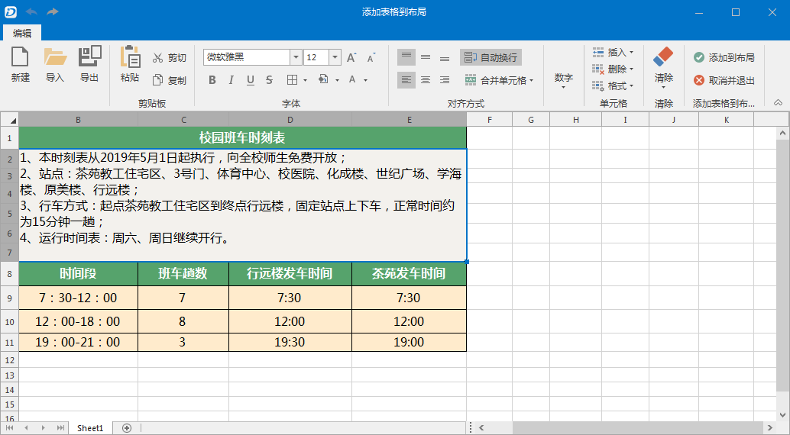
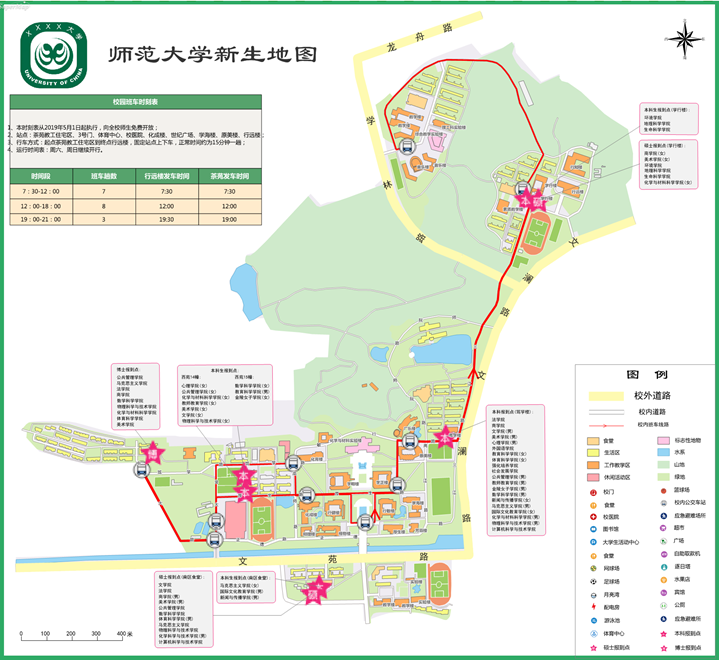

###  使用说明

在实际应用中，通过制作专题图可以在地图上可视化地展示一些统计信息，然而，对于更为复杂的数据统计分析，用表格的方式展现更为清晰，因此，布局中插入表格可以很好的弥补地图专题图的不足，使出版的地图更为专业，信息更丰富。

###  应用场景

* 在地籍图中，经常需要表格来表示地籍调查情况、界址标元素、界址点坐标等信息；
* 校园地图中可以通过表格，来注明教学楼、宿舍楼、办公楼的详细名称，校车的班次时间、途径站点等信息。 

###  功能入口

**布局窗口->对象操作->对象绘制->表格** 按钮。

###  操作说明

1. 在布局窗口中，单击 **对象操作** -> **对象绘制** -> **表格** 按钮，将鼠标移至布局中，绘制表格的插入范围。
2. 在弹出的表格编辑窗口中，输入或导入表格内容，表格内容可来源于以下几种方式： 
    * **输入** ：在表格编辑器中输入表格内容，其操作方式与 Microsoft Office Excel 的操作方式一致，支持设置字体风格、对齐方式、合并单元格、插入等操作。
    * **复制粘贴** ：支持可将其他表格或文本粘贴到表格编辑器中。
    * **导入** ：支持导入 *.xlsx、*.xls、*.xlsm、*.xltx、*.csv 等文件，可将表格或文本内容导入到文本编辑器中。
  

3. 编辑完表格内容及风格后，单击 **添加到布局** 按钮，即可将表格中的内容插入到布局中，布局中的表格显示样式与编制是保持一致。
  

4. **编辑表格** ：选中表格单击鼠标右键，选中 **编辑表格...** ，可在打开的表格编辑器中编辑表格内容、风格、格式等，编辑后单击 **添加到布局** 按钮，即可更新布局中的表格。
5. **调整表格位置与大小** ：选中表格后，可移动表格位置，调整表格高度和宽度。
6. **导出** ：支持将表格导出为Excel、TXT、CSV等文件，入口有以下两个： 
    * 在布局中选中表格，在右键菜单中选择 **导出到Excel** ，支持导出 *.xlsx、*.xls 格式的Excel文件。
    * 在表格编辑器的Ribbon中，单击 **导出** 按钮，可将当前表格导出为 *.xlsx、*.xls、*.xlsm、*.xltx、*.csv 等文件。

