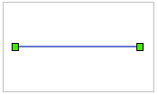
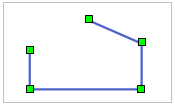
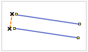
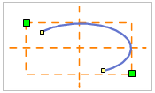
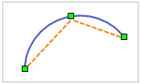
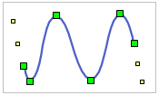
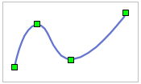

“ **对象操作** ”选项卡的“ **对象绘制** ”组中，组织了在布局窗口中绘制线对象的工具，应用程序提供了常用的几种可直接在布局窗口中绘制的线对象。

线对象绘制  
---  
  
按钮| 说明|功能及操作方法|示意图  
--|--|--|--
 | 绘制直线 | 单击“直线”按钮，出现直线光标；将直线光标移至布局窗口中创建直线的位置，单击鼠标左键，绘制直线的一个端点；移动光标到合适的位置再次单击鼠标左键，完成一条直线的绘制。 |  
 | 绘制折线 | 单击“折线”按钮，出现折线光标；将折线光标移至布局窗口中创建折线的位置，单击鼠标左键，绘制折线的第一个节点；继续移动光标到合适的位置再次单击鼠标左键，绘制折线的第一段边线；按同样方式继续绘制折线的各个节点，最后单击鼠标右键完成折线的绘制。|   
 | 绘制平行线 | 创建只有两个子对象的平行线。 单击“折线”按钮的下拉按钮，在弹出的下拉菜单中选择“平行线”，出现平行线光标；在创建平行线的位置单击鼠标左键，确定平行线的起始位置；移动鼠标，在可以确定平行线宽度的位置再次单击鼠标左键，确定平行线的宽度；移动鼠标，可以看到平行线的宽度已经确定，其长度随着鼠标指针的移动而变化，到合适的位置点击鼠标左键，确定平行线的长度。其后绘制平行线其他段的操作步骤与绘制折线类似。单击鼠标右键结束平行线的绘制。|   
 | 绘制椭圆弧 | 单击“圆弧”按钮，出现弧光标；将弧光标移到创建弧的位置（即弧外接矩形的一个对角线位置），单击鼠标左键确定弧的位置；移动鼠标，可以看到蓝色的临时椭圆随着鼠标移动而变化大小，在确定椭圆大小的地方，单击鼠标左键确定椭圆的大小；移动鼠标，可以看到一个绿色小方块随着鼠标移动而在临时椭圆上移动，在弧的起始位置单击鼠标左键，确定弧的起点；移动鼠标，在弧的终止位置再次单击鼠标左键，确定弧的形状与大小。 |   
 | 绘制三点弧 | 通过连续三点创建三点圆弧。 单击“圆弧”按钮的下拉按钮，在弹出的下拉菜单中选择“三点弧”，出现三点弧光标；在创建三点弧的位置，单击鼠标左键，确定弧的第一个点；在适当位置，再单击鼠标左键，确定弧的第二个点，移动鼠标，可以看到蓝色的临时圆随着鼠标移动而变化大小。在三点弧的终止位置再次单击鼠标左键，最终确定三点弧的形状与大小。 | 
 | 绘制 B 样条曲线 |通过确定曲线的首尾两个控制点，以及不在曲线上的各中间控制点绘制曲线，曲线的中间点都根据曲线上的中间控制点拟合而成。 单击“曲线”按钮的下拉按钮，在弹出的下拉菜单中选择“B样条曲线”，出现 B 样条曲线光标；在创建 B样条曲线的地方，单击鼠标左键，确定曲线的第一个控制点；在适当位置，再次单击鼠标左键，确定曲线的第二个控制点；移动鼠标，可以看到蓝色的临时曲线随着鼠标移动而变化平滑度；在合适的位置再次单击鼠标左键，确定曲线的其它控制点。 |  
 | 绘制贝兹曲线 |由不在曲线上的两个起始结点和两个终止结点控制曲线的走向，通过在曲线上的其他控制点拟合出曲线的各中间点。至少需要6个控制点完成一段贝兹曲线的绘制。 单击“曲线”按钮的下拉按钮，在弹出的下拉菜单中选择“贝兹曲线”，出现贝兹曲线光标；单击鼠标左键，确定曲线的第一个控制点；在适当位置，再次单击鼠标左键，确定曲线的第二个控制点，两点间形成一条蓝色虚线；在创建曲线的位置，持续单击鼠标左键，可看见从第三个控制点起在两个控制点间形成弧段，最终单击鼠标右键结束贝兹曲线的绘制。|   
 | 绘制 Cardinal 曲线 |通过确定曲线上的各控制点绘制曲线，曲线的中间点是根据所有控制点拟合而成。 单击“曲线”按钮的下拉按钮，在弹出的下拉菜单中选择“Cardinal曲线”，出现 Cardinal 曲线光标；单击鼠标左键，确定曲线的第一个控制点；在适当位置，再次单击鼠标左键，确定曲线的第二个控制点，可以看到两点间出现一条蓝色虚线；移动鼠标，可以看到从第二个控制点引出另一条蓝色虚线，并随着光标改变方向和长度；在合适的位置再次单击鼠标左键，确定曲线的第三个控制点，同时在三个控制点间创建出一段Cardinal曲线；移动鼠标，可以看到第二、三个控制点间的蓝色临时曲线随着鼠标移动而变化平滑度；在合适的位置再次单击鼠标左键，确定曲线的其它控制点。绘制完所有的控制点后，单击鼠标右键结束操作。|   
 | 绘制自由曲线 |单击“曲线”按钮的下拉按钮，在弹出的下拉菜单中选择“自由曲线”，出现自由曲线光标；将光标移至创建自由曲线的位置，单击鼠标左键，并按住鼠标左键不放，移动鼠标，可以在布局窗口中画出与光标移动轨迹一致的曲线；如果想绘制折线，可以松开鼠标左键，移动鼠标，在折线的下一节点处单击鼠标左键；完成绘制后，单击鼠标右键结束操作。 |   
  
### 备注

    1. 绘制线对象时，支持以快捷键 Ctrl+R 反向，绘制方向将自动跳转至线对象的另一端，继续该线对象的绘制。反向绘制功能，可随时调整绘制方向，提高较长线对象的绘制效率。
    2. 结束线对象绘制有以下两种方式： 
      * 在布局窗口中任意非线对象所在位置单击鼠标右键。
      * 再次点击“ **对象绘制** ”选项卡“ **几何对象** ”组中对应线对象绘制的按钮。

###  相关主题

[绘制直线](../../DataProcessing/Objects/CreateObjects/DrawStraightLine.htm)

[绘制折线](../../DataProcessing/Objects/CreateObjects/DrawPolyLine.htm)

[绘制圆弧](../../DataProcessing/Objects/CreateObjects/DrawArc.htm)

[绘制曲线](../../DataProcessing/Objects/CreateObjects/DrawCurve.htm)

