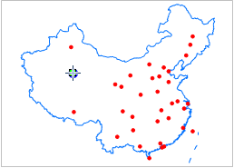

“ **对象操作** ”选项卡的“ **对象绘制** ”组中，组织了在布局窗口中绘制点对象的工具。

点对象绘制  

  
按钮|说明|功能及操作方法|示意图  
  --|--|--|--
 | 绘制点 |单击“点”按钮，出现点光标；在布局窗口中待绘制位置单击鼠标左键，绘制一个点对象。每次单击鼠标左键可创建一个点对象，单击鼠标右键可结束点对象绘制。 |   
  
### 备注

结束点对象绘制有以下两种方式：

    * 在布局窗口中任意非点对象所在位置单击鼠标右键。
    * 再次点击“ **对象操作** ”选项卡“ **对象绘制** ”组中点对象绘制的按钮。

###  相关主题

[绘制点对象](../../DataProcessing/Objects/CreateObjects/Point.htm)

