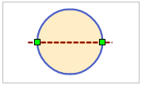
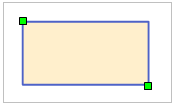
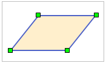
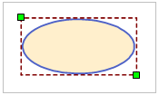
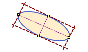

“ **对象操作** ”选项卡的“ **对象绘制** ”组中,组织了在布局窗口中绘制面对象的工具，应用程序提供了10种可直接在布局窗口中绘制的面对象。

面对象绘制  

  
按钮|说明|操作方法|操作步骤示意图  
--|--|--|--|
 | 绘制多边形 | 单击“多边形”按钮，出现多边形光标；将多边形光标移至想要创建多边形的位置。单击鼠标左键，绘制出多边形的第一个节点。移动光标到合适的位置再次单击鼠标左键，完成第一段边线的绘制。重复以上步骤；最后单击鼠标右键结束绘制多边形操作。系统会自动连接第一个节点和最后一个节点，绘制成最后一段边线。|   
 | 绘制圆心圆 | 通过圆心和半径创建圆。单击“圆”按钮，出现圆心圆光标；在创建圆的位置，单击鼠标左键，确定圆心。在确定圆形状大小的位置再次点击鼠标左键，完成圆的操作|   
 | 绘制两点圆 | 通过两点定义直径创建圆。单击“圆”按钮的下拉按钮，在弹出的下拉菜单中选择“两点圆”，出现斜椭圆光标；在创建圆的位置，单击鼠标左键，确定圆直径的一端点。在适当位置，再单击鼠标左键，确定圆直径的另一端点及圆直径的长度，从而创建圆对象。 |   
 | 绘制三点圆 | 通过三点定义圆周创建圆。单击“圆”按钮，在弹出的下拉菜单中选择“三点圆”，出现三点圆光标；在创建圆的位置，单击鼠标左键，确定圆内接三角形的第一个点。在适当位置，再单击鼠标左键，确定第二个点，从而确定内接三角形的一边。可以看到一个临时圆对象的大小随鼠标移动而变化。重复上一步骤，确定最后一个点，完成三点绘圆的操作。|   
| 绘制矩形 | 单击“矩形”按钮，出现矩形光标；将矩形光标移至创建矩形的位置。单击鼠标左键，并沿矩形对角线方向移动鼠标，可以看到一个蓝色矩形框随着鼠标的移动而变化大小和宽高比例。在合适位置再次单击鼠标左键，确定矩形的大小，完成绘制矩形操作。|   
 | 绘制圆角矩形 |单击“矩形”按钮的下拉按钮，在弹出的下拉菜单中选择“圆角矩形”，出现圆角矩形光标；将圆角矩形工具光标移至创建圆角矩形的位置，单击鼠标左键确定矩形框的第一个节点的位置。移动鼠标，可以看到一个蓝色矩形框随着鼠标的移动而变化大小和宽高比例。在合适的位置单击鼠标左键，确定圆角矩形的大小。此时上下移动光标，可以看到圆角矩形的四个角弧度随之变化。调整到合适弧度，单击鼠标左键，完成绘制圆角矩形操作。|   
 | 绘制平行四边形 |单击“矩形”按钮的下拉按钮，在弹出的下拉菜单中选择“平行四边形”，出现平行四边形光标；在创建平行四边形的地方单击鼠标左键，移动鼠标，一根蓝色直线的长度随鼠标移动而变化大小。到适合位置再次单击鼠标左边，确定平行四边形其中一边的方向及长度。此时可以看到临时平行四边形的形状及另一边的长度随着鼠标移动而变化。最后在适合位置单击鼠标左键，完成绘制平行四边形操作。|   
 | 绘制椭圆 |单击“椭圆”按钮，出现椭圆光标!；将光标移到创建椭圆的位置，单击鼠标左键，确定椭圆的位置。移动鼠标，可以看到蓝色的临时椭圆随着鼠标移动而变化大小。在确定椭圆弧的地方，再次单击鼠标左键完成椭圆的绘制。
|   
 | 绘制斜椭圆 |单击“椭圆”按钮，在弹出的下拉菜单中选择“斜椭圆”，出现斜椭圆光标；将光标移至创建斜椭圆的位置，单击鼠标左键，确定斜椭圆长轴/短轴的一个端点。移动光标到斜椭圆长轴/短轴另一端点的位置，再次单击鼠标左键确定其长轴/短轴。这时移动光标可以看到一个临时斜椭圆的形状随着鼠标移动而变化。在可以确定斜椭圆另一轴长度的位置，再次点击鼠标左键，完成绘制斜椭圆操作。|   
 | 绘制扇形 | 单击“扇形”按钮，出现扇形光标；将光标移到创建扇形的位置（即扇形外接矩形的一个对角线位置），单击鼠可标左键确定扇形的位置；移动鼠标，可以看到蓝色的临时椭圆随着鼠标移动而变化大小，单击鼠标左键确定椭圆的大小；移动鼠标，可以看到一个绿色小方块随着鼠标移动而在临时椭圆上移动，在扇形的起始位置单击鼠标左键，确定扇形的起点；移动鼠标，在扇形的终止位置再次单击鼠标左键，确定扇形的形状与大小。|   
  
### 备注

结束面对象绘制有以下两种方式：

    * 在布局窗口中任意非面对象所在区域单击鼠标右键。
    * 再次点击“ **对象操作** ”选项卡“ **对象绘制** ”组中对应面对象绘制的按钮。

###  相关主题

[绘制多边形](../../DataProcessing/Objects/CreateObjects/DrawPolygon.htm)

[绘制四边形](../../DataProcessing/Objects/CreateObjects/DrawQuadRangle.htm)

[绘制圆](../../DataProcessing/Objects/CreateObjects/CreateCircle.htm)

[绘制扇形](../../DataProcessing/Objects/CreateObjects/CreatePie.htm)

