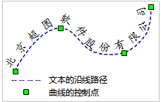

“ **对象操作** ”选项卡上的“ **文本** ”按钮，用来在布局窗口中绘制文本对象。

文本对象绘制  

  
按钮|说明|功能及操作方法|示意图  
--|--|--|--
 | 文本 |单击“文本”按钮，出现普通文本光标；在布局窗口中需要添加文本的位置单击鼠标左键，显示闪烁的光标；输入文本。输入文本时，文本在闪烁的光标处显示；单击
Enter 键可另起一行。 |   
 | 沿线标注 |  沿着某一条曲线创建文本。单击“文本”按钮的下拉按钮，在弹出的下拉菜单中选择“沿线标注”，出现沿线文本光标!；在布局窗口中创建沿线文本的位置，单击鼠标左键，确定沿线文本的起始点，然后按照绘制曲线的方式绘制文本的沿线路径；沿线路径绘制完后，单击鼠标右键，弹出“沿线注记”对话框；在编辑框中输入沿线文本内容。单击“确定”按钮，完成绘制沿线文本操作。 |   
  
### 备注

结束文本绘制有以下两种方式：

    * 在布局窗口中任意非文本框所在区域单击鼠标右键。
    * 再次单击“ **对象操作** ”选项卡“ **文本** ”组对应文本对象绘制的按钮。

