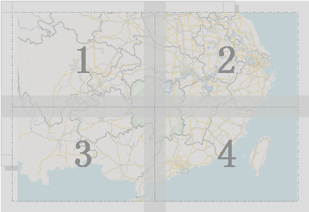

### 使用说明

支持将制作好的布局输出为通用的图片格式（诸如 JPG 文件、PNG 文件、位图文件以及 TIFF 影像数据等格式）以及 PDF 文件格式
输出，便于在其他环境中应用。

### 功能入口

* **布局** 选项卡-> **输出与打印** 组，根据用户的输出需求，点击相应的功能按钮。
* 在布局窗口，单击鼠标右键，在弹出的右键菜单中根据需求，点击相应的输出功能按钮。

###  输出为图片

1. 在当前布局窗口中，根据需要完成布局制作后，单击鼠标右键，选择“输出为图片...”选项， 弹出“输出为图片”对话框。 
2. 用户可在该对话框中对输出图片的属性进行设置，包括输出的图片的名称、图片类型、保存路径、DPI 以及是否分页输出等。 

**图片名：** 输出的图片要保存的名称。

**图片类型：** 图片输出的格式，可以是 JPG 文件、PNG 文件、位图文件以及 TIFF 影像数据。

**保存路径：** 点击右侧的浏览按钮，在弹出的对话框中选择图片要保存的位置即可。保存路径默认与前一次设置的路径一致。

**分辨率：** 用户可在“输出为图片”对话框的“分辨率”标签右侧的文本框中设置输出图片分辨率。默认：96，单位：DPI。

**分页出图：** 勾选分页选项，按照打印机设置的纸张大小分页出图，反之按设置的布局纸张大小出图。

打印机的纸张大小设置小于布局页面纸张大小，分页出图时，布局会按照打印机纸张大小被分为若干页面，按照顺时针方向依次编号，如下图所示，布局被分为4个固定大小的页面。输出图片的名称后面依次会加上页面相应的页码编号。

  
---  
   
3. 设置完成后，点击“输出为图片”对话框中的“确定”按钮即可。

###  输出为 PDF

支持将布局输出为PDF，布局输出为PDF，当前布局页面的所有内容都将输出，并将按照布局100%显示状态下的内容输出。该功能与“地图输出为PDF”内容相同，有关注意事项请参考[地图输出为PDF](../../Visualization/Basic/WinMap_OutputPDF)。

1. 单击“ **布局** ”选项卡中的“输出为 PDF”按钮，弹出“输出为 PDF 文件”对话框。
2. 在对话框中对“ **文件名称** ”和“ **DPI(即导出纸张的分辨率)** ”进行设置。

### 注意事项

1. 输出的图片范围是当前布局窗口中的所有内容，既包括布局页面中当前布局页面中绘制的地图、指北针等各种布局元素，也包括布局元素底部的纸张、布局窗口的填充等。
2. 用户可以在“页面设置”组和“布局属性”中设置相关参数，修改默认的纸张背景颜色和布局窗口的背景颜色，设置是否显示网格以及网格间隔等。
3. 如果地图设置了最大最小显示比例尺，当设置不同的 DPI 出图时，重新计算的地图显示范围可能会超出当前布局的图框范围，从而导致图层不显示。

### 相关主题

[设置布局窗口](../SettiongLayoutWin/SettingLayout)

 [设置布局页面](../SettingPage/PageSetup)

