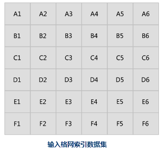
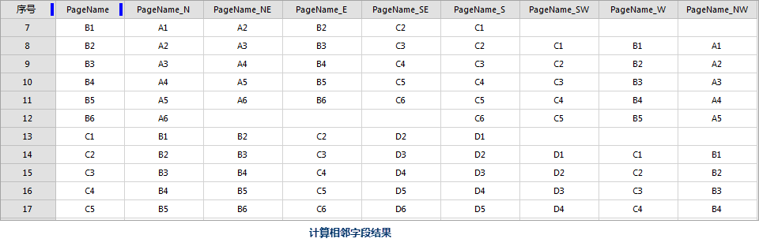

### 使用说明

创建字段并计算格网对象的相邻页面（面）的值。

通过此功能将向面数据集追加8个新字段，每个字段表示八个罗盘点中的一个：北、东北、东、东南、南、西南、西和西北，并针对其中的每个面对象计算各主方向上用于识别相邻（邻近）面的值。

  

**应用场景**

常用于填充地图册中相邻页面的标注字段。

**功能入口**

* 入口一：在地图窗口中： **地图** 选项卡-> **制图** -> **计算相邻字段** 。
* 入口二：在布局窗口中： **对象操作** 选项卡-> **地图序列** -> **计算相邻字段** 。

### 参数说明

* **数据源/数据集 *** ：选择输入数据集及所在的数据源，生成相邻字段的结果将追加到对应面格网索引对象中。
* **字段名*** ：选择其字段值用于填充相邻字段数据。
* **执行结果** ：执行成功后在输入数据集属性中会生成八个新字段，字段名为字段名称值与方向的组合。方向为缩写。例如，如果字段名称值为 GridTitle，则创建的新字段名称将为 GridTitle_N、GridTitle_NE、GridTitle_E、GridTitle_SE、GridTitle_S、GridTitle_SW、GridTitle_W 和 GridTitle_NW。

### 应用实例

将创建格网索引的结果数据集作为输入数据集，字段名称设置为PageName 得到新的字段名称为 PageName_N、PageName_NE、PageName_E、PageName_SE、PageName_S、PageName_SW、PageName_W
和 PageName_NW。

以B1 格网为例，其相邻面页面分别是北方向A1，东北方向A2，东方向B2，东南方向C2，南方向C1。

   

  

### 相关主题：

 [地图系列](MapSeries)

 [创建格网索引](CreateGridIndex)

 [启用地图系列](MapSerieSettings)

 [绘制地图定位器](MapLocator)

 [动态文本](DynamicText)

 [打印地图册](PrintingMapBooks)

  
  
---

