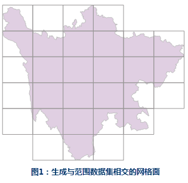
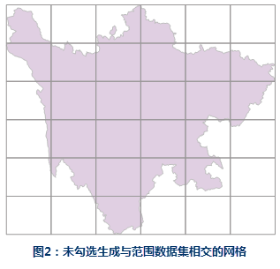

### 使用说明

创建一个可用作索引的矩形面数据集格网，以使用地图系列来指定索引页面。

**应用场景**

生成的格网面数据，可以用于地图系列中指定系列图幅的页面，同时基于该数据计算每个格网邻接的图幅名称。

**功能入口**

* 在地图窗口打开待建索引的地图： **地图** 选项卡-> **制图** -> **创建格网索引** 。
* 在布局窗口中打开待建索引的地图： **对象操作** 选项卡-> **地图序列** -> **创建格网索引** 。

### 参数说明

* **网格参数**
    * **坐标原点X** ：指定输出格网数据集左下角原点的坐标X值，若指定范围数据集，则默认值由这些要素范围的并集来确定。若不指定范围数据集，则默认值为当前地图左下角原点的坐标X值。
    * **坐标原点Y** ：指定输出格网数据集左下角原点的坐标Y值，若指定范围数据集，则默认值由这些要素范围的并集来确定。若不指定范围数据集，则默认值为当前地图左下角原点的坐标Y值。
* **宽度** ：单个格网索引面的宽度。程序会依据指定的行数，按照范围自动计算，也支持指定宽度。
* **高度** ：单个格网索引面的高度。程序会依据指定的列数，按照范围自动计算，也支持指定高度。
* **行数** ：指定沿原点的Y方向创建的行数。
* **列数** ：指定沿原点的X方向创建的列数。
* **起始页码** ：各格网索引要素将分配到连续的页面，从输出格网的左下角的面要素开始标注，支持指定起始页的页码，默认值为1。
* **范围数据集** ：用于定义将创建的面格网的范围，支持点、线、面数据集。
* **生成与范围数据集相交的网格面：** ：指将输出格网索引数据集限制到仅与输入范围数据集相交的区域。范围数据集已指定且该设置被勾选，范围数据集与地图的交集将用来生成格网索引。 

若未勾选该复选框输出的格网索引数据集，将按照指定的行/列数生成规整的格网。

下一步您可以对索引格网进行[计算相邻字段](CaculateAdjacentFieldhtm)操作。

### 应用实例

以四川省界作为范围数据集，行列号均设置为6，其他参数默认，若勾选 **生成与范围数据集相交的网格面** 复选框，得到如下图1所示的结果。

若不勾选 **生成与范围数据集相交的网格面** 复选框，生成结果为 6*6 规则网格，如下图2所示。

   
  

### 相关主题：

 [地图系列](MapSeries)

 [计算相邻字段](CaculateAdjacentFieldhtm)

 [启用地图系列](MapSerieSettings)

 [绘制地图定位器](MapLocator)

 [动态文本](DynamicText)

 [打印地图册](PrintingMapBooks)

  
  
---

