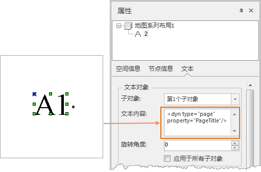
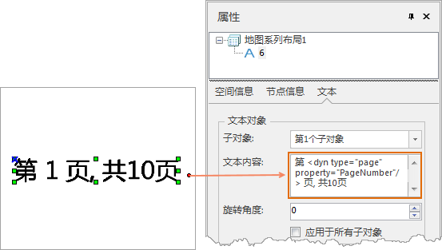
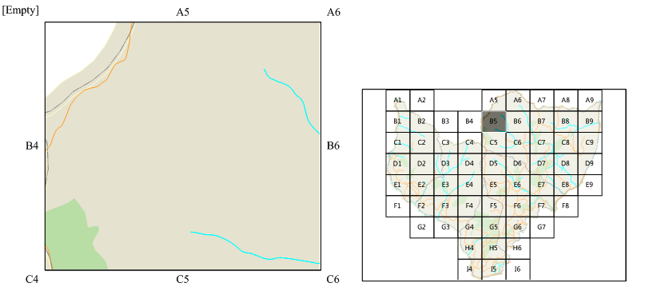

### 使用说明

动态文本指地图布局中随地图图层当前属性变化而变化的文本。当更新属性时，文本也将自动更新。

动态文本是创建地图系列的重要组成部分，通过使用动态文本，可以在从一个页面切换至另一个页面时，使页面布局的重要属性信息也随之发生动态的变化，例如可将页面标题、页码、页面标识属性等信息添加为动态文本。

### 实现原理

与 HTML 的工作原理类似，动态文本也使用标记。您可以通过编辑单个文本标签使其同时包含动态文本和静态文本。以下是动态文本的标签示例：

` <dyn type="page" property="PageName" >`

* 动态标签中(dyn type="page") 为动态文本类型；
* (property=" PageName)"为类型属性，PageName为页面标题名称字段，是在设置地图系列中为当前索引要素指定的名称字段值。用户可修改类型属性中的字段名称。

当您需要在文本中包含动态文本和静态文本时，可以编辑标签，以下是显示页码的动态文本标签示例：

“第<dyn type="page" property="PageNumber"/>页”

此文本由两部分构成：表明文本内容的静态文本 (第... 页) 和动态标签<dyn type="page" property="PageNumber"/>。

### 添加动态文本

添加动态文本的前提是，该布局窗口中的地图已启用地图系列，否则动态文本按钮不可用。

1. 单击 **对象操作** 选项卡 -> **对象绘制** 组-> **文本** -> **动态文本** 。
2. 在布局窗口中需要添加文本的位置单击鼠标左键，弹出 **动态文本** 对话框。
3. **字段名称** ：在右侧下拉菜单中显示的即为当前地图系列的索引图层中的所有字段。您需要选择一个字段作为动态文本的显示字段。 
4. 单击确定按钮，则文本将显示为当前页面所选字段的属性。

可为诸如以下属性添加动态文本：页面标题、页码、相邻页面标注和特定页面的属性值等。

* **页面标题** ：可将页面标题字段作为动态文本，则地图系列遍历索引图层中的要素，且每个页面均得到定义之后，会将所选名称字段的属性值用作页面名称。例如：此处选择页面标题字段 PageTitle 作为动态文本的显示字段，则布局页面处显示的文字即为当前页面的标题 “A1”，点击“A1”查看文本属性，则 **文本内容** 处显示的标签为<dyn type="page" property="PageTitle"/ >。
  
---  
动态文本及属性  
* **页面和总页数** ：可将页面字段作为动态文本添加至地图系列布局中。页码可基于索引图层的字段值，同时添加静态文本，使静态文本+动态文本共同组成，页面和总页数的显示内容。例如:添加“第 X 页，共 10 页”的文本显示内容，此处选择页面页码字段 PageNumber 作为动态文本的显示字段，则布局页面处显示的文字为当前页面的页码 “1”，点击“1"查看文本属性，在 **文本内容** 处显示的标签为< dyn type="page" property="PageNumber"/>，手动添加静态文本为：第 <dyn type="page" property="PageNumber"/> 页, 共10页。此时在布局的文本显示为“第1页，共10页”。
  
---  
动态文本及属性  
  
### 编辑动态文本

编辑现有文本元素以将动态文本标签包括在内可能是在地图布局上创建有用元素的一种简便方法。

1. 双击您要编辑的文本对象。
2. 在文本 **属性** 面板中 **文本** 选项卡中的 **文本内容** 框将动态文本标记的值更改为您要使用的文本（或标签）。 

注：修改标签中的类型属性只能是索引图层中的属性类型，否则标签显示为[ERROR]。

### 绘制八方向文本

绘制八方向文本，即标注当前页面的相邻八方向的页面索引字段值。标注的八方向文本为动态文本，当切换不同页面时，相邻八方向的文本标注也会随之发生改变。

绘制八方向文本前提是，已知当前索引字段八方向的属性值，您可以使用[计算相邻字段](CaculateAdjacentFieldhtm)来创建用于标注相邻页面的字段。

以下步骤假定创建标注所需的字段和值已经是地图系列索引图层的一部分。

单击绘制八方向文本按钮，则当前页面八个方位相邻页面的属性标注文本将显示在地图框四周。若某一方位不存在相邻页面，该标注将显示为 [Empty]
。注：当您打印输出当前地图系列为PDF时，方向为[Empty]的文本，将不作为文本输出。

  

  

### 相关主题：

 [地图系列](MapSeries)

 [创建格网索引](CreateGridIndex)

 [计算相邻字段](CaculateAdjacentFieldhtm)

 [启用地图系列](MapSerieSettings)

 [绘制地图定位器](MapLocator)

 [打印地图册](PrintingMapBooks)

