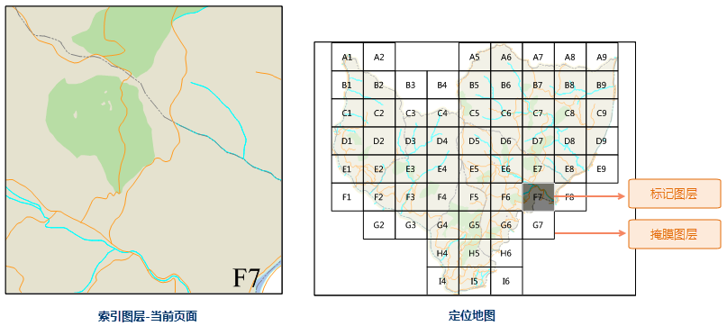
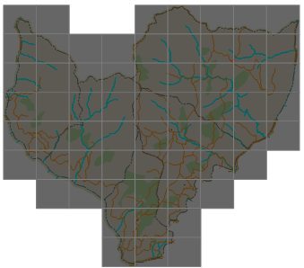
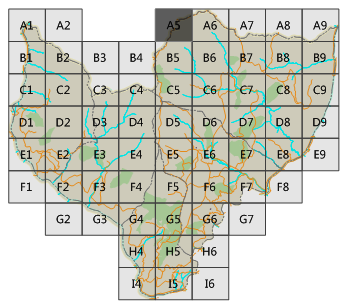

### 使用说明

通常情况地图表达小范围详细信息时，其空间位置很难确定，应用程序提供创建地图定位器为地图用户提供参考，即在某地图框内显示另一地图框范围的一种方法。定位地图显示的范围比主地图大，使地图浏览者能够在较大区域中快速定位和识别当前地图所在的空间位置。例如，定位地图可能显示省（主地图范围）在国家（定位地图范围）中的位置。

同时定位地图也是动态的。只要关联的主地图范围发生变化，定位地图就会自动更新。

创建地图定位的前提是，该布局窗口中已拥有至少两个地图框，其中一个地图框的范围要完全处于另一数据框范围内。范围较大的地图是定位地图，范围较小的地图是主地图。

定位地图有两种生成方式：基于当前主地图绘制地图定位器和自定义定位地图，下文对两种生成方式进行详细介绍。

### 基于当前主地图绘制地图定位器

基于当前主地图绘制地图定位器，前提是在当前布局中启用了地图系列，“ **绘制定位器** ”按钮为可用。

1. 单击 **对象操作** 选项卡-> **地图系列** -> **绘制定位器** 按钮，鼠标在当前布局窗口中的状态变为绘制地图的状态。
2. 在待绘制地图的位置，单击并拖拽鼠标，即可绘制一个基于当前索引地图生成的定位地图，同时在工作空间管理器中的地图结点新增一幅地图，定位地图的名称默认为【当前索引地图名称_Locator】。 
3. **定位地图** ：定位地图是基于索引地图，通过复制索引图层从而创建两个新图层，得到的一个新地图，对其进行创建编辑的两个图层分别是：掩膜图层和标记图层。
  * **标记图层** ：用于高亮显示位于当前地图页面中的定位地图中的要素。
  * **掩膜图层** ：用于使定位地图中不想高亮显示的地图要素变得暗淡。这些要素是不在当前页面中的要素。
  
---  
4. 在当前页面切换不同页码，查看不同页面时，定位地图将随之变化，以便高亮显示当前页面。

### 自定义定位地图

由用户预先配好定位地图，在布局中启动地图定位器即可。

**第一步：配制定位地图**

定位地图中需要包含两个图层：掩膜图层和标记图层。

1. 复制一份主地图作为定位地图。
2. 将复制后的定位地图中的索引图层复制两份，一份作为标记图层，一份作为掩膜图层。现在，需要对这两个图层做以下处理，以用于实现掩膜和高亮显示效果。
  * **编辑掩膜图层**

掩膜图层是将不想高亮显示的地图区域变暗，所以将该图层的风格中将填充颜色更改为灰色，并调整背景透明度为合适值，同时可调整线型风格。例如：将掩膜图层风格设置如下，前景颜色为灰色，背景透明度为90%，线型颜色为黑色，线宽度为0.1mm，得到如下图所示的掩膜图层。

  

  * **编辑标记图层**

标记图层是将当前选择的页面进行高亮显示，所以将该图层的风格调整为易于标识的样式，可将填充颜色更改为深色，并调整背景透明度为合适值，同时可调整线型风格。例如：将标记图层风格设置如下，前景颜色为黑色，背景透明度为60%，线宽度为0.1mm，得到如下图所示的标记图层。

  

  * 注意：掩膜图层和标记图层需要保留索引图层的属性，在启用地图系列后，定位地图才会根据指定的当前页面，将需要掩膜和高亮显示图层区域进行过滤显示。
3. 若用户需要在定位地图中显示索引字段标注，可基于索引图层制作统一标签专题图，对标签风格进行设置，得到如下图所示的结果。  

  

4. 通过以上操作，即可完成一幅完整的定位地图。

**第二步：启用地图定位器**

创建地图定位器的前提是，该布局窗口中已拥有至少两个地图框，其中一个地图框为地图系列的主地图，另一个地图框为用户自定义的定位地图。

1. 对主地图启用地图系列。
2. 在地图系列设置面板中做如下设置： 
  * 勾选地图定位器；
  * 在定位地图下拉菜单中选择自定义的定位地图。
  * 在标记图层和掩膜图层下拉菜单中分别设置配置好的对应图层。
3. 在当前页面切换不同页码，查看不同页面时，定位地图将随之变化，以便高亮显示当前页面。

现在，一组包含地图定位器的地图系列创建完毕。您可以定位并浏览各个布局页面，并为地图浏览者指示当前页面在较大的范围的位置信息。下一步可以为地图系列添加[动态文本](DynamicText)。

### 相关主题：

 [地图系列](MapSeries)

 [创建格网索引](CreateGridIndex)

 [计算相邻字段](CaculateAdjacentFieldhtm)

 [启用地图系列](MapSerieSettings)

 [动态文本](DynamicText)

 [打印地图册](PrintingMapBooks)

