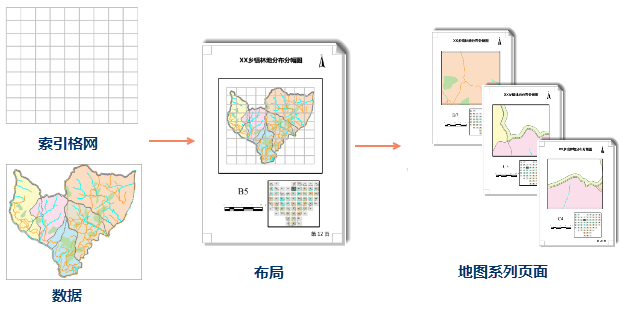
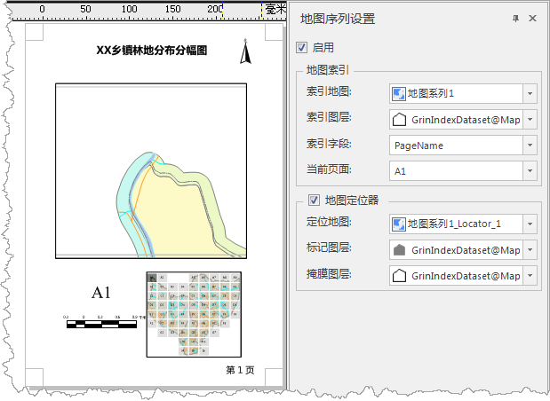

### 使用说明

地图系列是地图页面的集合，通过采用单一布局和遍历一组地图范围来生成一组输出页面。例如，地图系列可基于正多边形格网图层作为索引图层，轻松地创建一系列覆盖城镇区域且面积相等的页面，如下图所示：

  
---  

### 启用地图系列

启动地图系列前，需先在布局窗口中插入地图，地图框的布局大小定义了系列布局页面的地图的显示比例，地图系列中每个页面地图显示范围将以索引要素的中心居中，并保持恒定的地图比例。

若用户需要严格按照格网大小输出布局页面，请合理调整地图框布局大小。有关插入地图框选择填充地图，详细描述请参见[绘制地图](../DrawingMapElements/Map)。

  * **功能入口** : 
    * 入口一： **对象操作** 选项卡-> **地图系列** -> **地图系列设置** ；
    * 入口二：在布局窗口右键，右键菜单中选择“ **地图系列...** ”项；

通过以上操作，弹出“ **地图系列设置** ”面板，勾选 **启用** 复选框，地图系列随即启用。取消选中该复选框会禁用地图系列功能。

  
---  

### 参数说明

  * **索引地图** :要创建一个地图系列，您将需要从索引地图下拉菜单中选择一个地图。此下拉菜单将显示布局中的所有地图框。一次只能选择一个地图。地图框的地图范围会针对地图系列中的每个页面做出相应改变。这些地图范围由索引图层内要素的空间范围驱动。
  * **索引图层** :定义地图系列中各页面的地图框的地理范围。索引图层中的索引面对象用于控制或定义地图系列中的每个页面。 

[创建格网功能](CreateGridIndex)功能，可帮助您创建索引图层，默认选择的是地图中第一个图层，如果不希望使用此图层作为索引图层，可从下拉菜单中选择其他图层。

索引图层可以是格网数据，也可以是地图中其他的面图层。当选择某个面图层时，索引范围是基于对象的空间包络矩形。例如，您可以使用行政边界的面图层来创建“地图系列页面”，在此情况下，将为每一个行政区划创建一个相应页面。

  * **索引字段** ：地图系列会遍历索引图层中的面对象，且每个页面均得到定义之后，会将来自索引字段的属性值用作页面名称。页面名称接受空值和重复值，但为避免在处理地图系列页面时出现混淆，建议使用其中所有值均唯一的名称字段设置索引字段。 

此下拉菜单显示了索引图层中可用字段的列表。其中包括短整型、长整型和文本型字段。默认字段是字段名称中使用文本“name”的第一个字段。如果不存在字段名称中使用
“name”的字段，则系统将默认使用第一个可用的有效字段。您可以从下拉菜单中选择使用其他字段。

  * **当前页面** ：默认显示的是索引字段中第一个字段页面名称。可在下拉列表中选择显示页面，以导航至对应页面。

下一步您可以为地图系列布局添加[动态文本](DynamicText)和[绘制地图定位器](MapLocator)等操作。

  

### 相关主题：

 [地图系列](MapSeries)

 [创建格网索引](CreateGridIndex)

 [计算相邻字段](CaculateAdjacentFieldhtm)

 [绘制地图定位器](MapLocator)

 [动态文本](DynamicText)

 [打印地图册](PrintingMapBooks)

  
  
---

