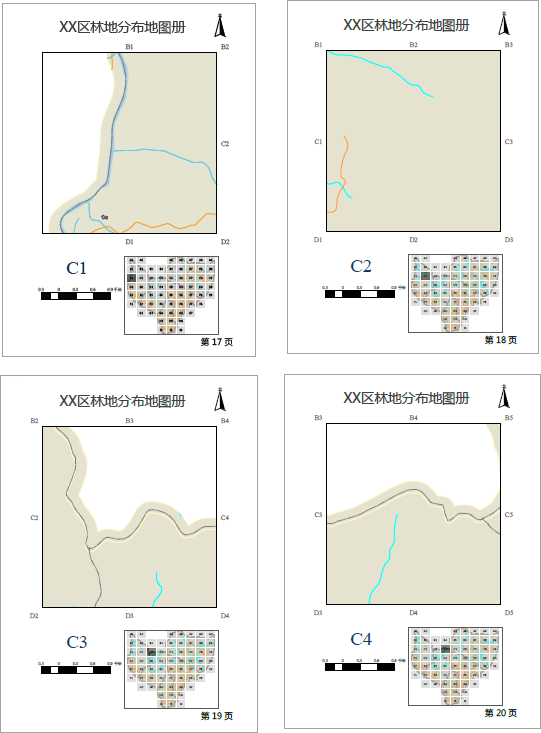
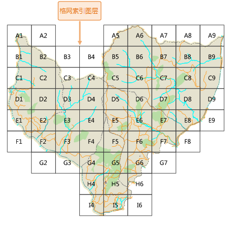

地图系列是地图页面的集合，是通过采用单一布局和遍历一组地图范围来生成一组输出页面。例如，创建一地图系列是包括某区域中不同宗地的单个地图页面。

使用户能够实现同时输出一组统一布局、统一整饰、同一地区不同显示内容的一系列成套地图。通过地图系列输出地图册具有成图快、质量高、风格统一等优点。

一般情况下，地图系列中的每个页面还包含其他布局元素（例如地图标题），这些布局元素会发生变化以反应特定页面中区域属性。如下图所示：

  

  
范围由图层中的要素定义，定义范围的图层称为索引图层。索引图层基于图层中的各个索引对象将地图分割为多个部分，然后为每个索引对象生成一个相应的页面。常见的索引图层为面格网，例如：用户可基于正多边形格网图层作为索引图层，轻松地创建一系列覆盖城镇区域且面积相等的页面。

  

  
[创建格网索引](CreateGridIndex)功能可帮助用户创建索引图层。还可通过[计算相邻字段](CaculateAdjacentFieldhtm)功能，为索引图层中创建一些字段，用来对地图系列中的相邻页面进行标注。

通常情况下，一个完整的地图系列中每个页面包含有标题、主地图、定位地图、文本、表格等组成部分。您可通过地图系列中一系列相关功能，为每个地图系列页面定义布局组成元素，布局元素可分为动态元素和静态元素。其中动态元素会随各页面内容的不同而发生变化，例如以动态文本的形式创建的页面标题及页码；以及添加定位地图使用户在较大区域中快速定位和识别当前地图所在的空间位置。定位地图也是动态的，只要关联的主地图范围发生变化，定位地图就会自动更新。

静态元素将保持不变，对布局中静态元素所做的任何更改都将反映在地图系列的各个页面上，例如布局和地图框的大小、地图比例尺及指北针等。

同时支持将制作的地图系列以地图册的形式统一打印或导出的一组页面。以上示例显示了XX区林地分布的地图册。使用“创建格网索引”、“计算相邻字段”、“启用地图系列”“绘制定位器”“绘制八方向文本”等功能轻松地创建此系列地图册。

### 相关主题：

 [创建格网索引](CreateGridIndex)

 [计算相邻字段](CaculateAdjacentFieldhtm)

 [启用地图系列](MapSerieSettings)

 [绘制地图定位器](MapLocator)

 [动态文本](DynamicText)

 [打印地图册](PrintingMapBooks)
