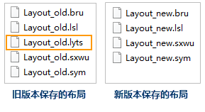
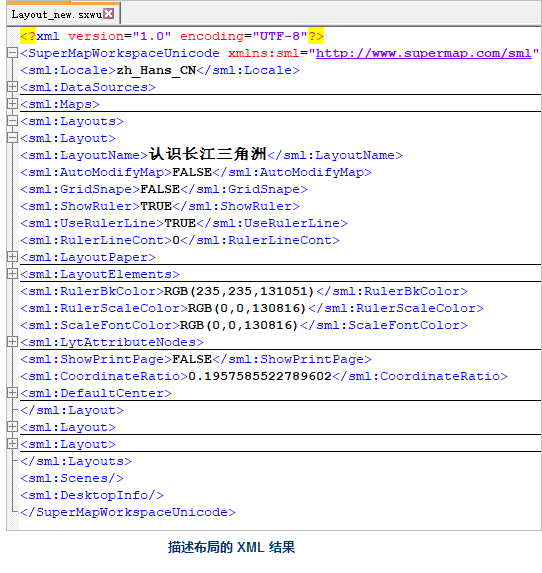

###  保存布局

“保存布局”功能，用来保存当前布局窗口中的布局，该操作只能将布局保存到工作空间中，只有进一步保存了工作空间，布局才能最终保存下来，当再次打开工作空间时，才能获取所保存的布局。

  1. 使当前布局窗口中没有选中的对象。
  2. 在布局窗口中右键单击鼠标，在弹出的右键菜单中选择“保存布局”项。

###  另存布局

“布局另存为”功能，用来将该布局另存为一个新的布局。

  1. 鼠标右键单击工作空间管理器中的布局结点，在弹出右键菜单中单击“布局另存为”项。
  2. 在弹出的“布局另存为”对话框，输入新的布局的名称，单击“确定”按钮，在工作空间管理器中的布局集合结点下新增一个布局结点，该结点对应刚刚另存的布局。 

### 布局存储升级

版本对布局的存储做了优化和调整，解决了历史版本中布局存储易导致数据损坏的问题。用户需注意由存储升级带来的以下影响：

  1. 新版本采用 XML 结构将布局存储在工作空间中，解决了旧版本中保存布局会发生文件损坏的问题。
  2. 新版本兼容旧版本保存在工作空间中的布局，但是旧版本无法打开新版本保存在工作空间中的布局。 

**注意**
：旧版本工作空间经过新版本保存后，布局将按照升级后的方式存储，所以其中的布局在旧版本中将无法再次打开。不过，在新版本中，可以将布局导出为布局模板，然后，在旧版本中加载布局模板，就可实现在旧版本中打开新版本保存后的布局。

  3. 新版本布局存储位置发生变化。若将工作空间存储为 sxwu 格式，旧版本会将布局单独存储在.lyts 文件里；但新版本直接将布局存储在 sxwu 工作空间文件中，且以调整后的XML结构描述布局，包括布局元素、布局设置等。  

  

  4. 在新版本中，插入布局中的图片将存储在工作空间同级目录下的“工作空间文件名_images”文件夹，布局只存储图片属性信息。旧版本工作空间经过新版本保存后，其中的布局将按照升级后的方式存储，所以布局中插入的图片会调整到上述专门的文件夹中存储。  
  
  
---  

### 相关主题：

 [布局基本操作](Basic)

