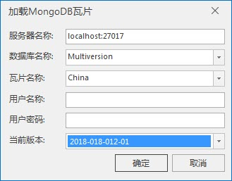
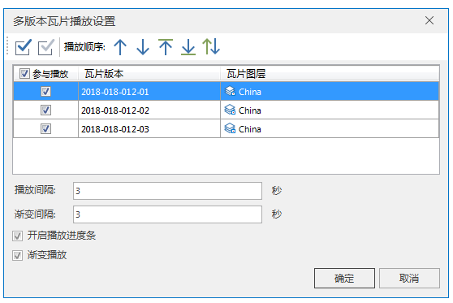
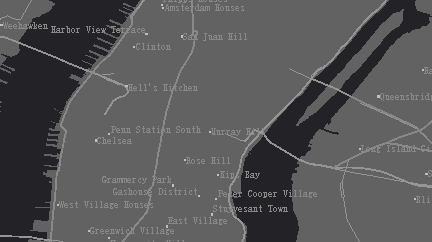

在地图窗口可添加存储类型为 MongoDB
型的地图瓦片。当存在多个版本的地图瓦片时，支持以动画的形式播放多版本瓦片中的若干瓦片，可动态呈现数据所发生的变化。

**注意** ：使用该功能前，需先启动 MongoDB 服务，请参看“[MongDB
使用说明](../../tutorial/TechDocument/MongoDBDatabaseGuide)”启动服务。

### 操作步骤

  1. 新建一幅地图窗口。
  2. 在“ **地图** ”选项卡“ **数据** ”组，点击“ **MongoDB 瓦片** ”按钮。弹出“加载MongoDB瓦片”对话框，设置瓦片的相关参数。
      * **服务器名称** ：用于输入存储地图瓦片的 MongoDB 服务器的地址。
      * **数据库名称** ：用于输入存储地图瓦片的数据库名称。 
      * **瓦片名称** ：用于输入地图瓦片的名称，即瓦片根目录的名称。 
      * **用户名称/密码** ：若数据库设置了用户名和密码，则需输入该数据库对应的用户名称和密码；。 
      * **当前版本** ：用于设置需要加载的瓦片版本名称。  

  

  3. 设置完瓦片版本的参数后，点击“ **完成** ”按钮，加载MongoDB型的地图瓦片成功，在地图窗口左上角出现地图瓦片播放条，如下图：  

  

  4. 当存在多个版本的地图瓦片时，可单击播放条右侧的“播放设置"按钮，弹出”多版本瓦片播放设置“对话框，对多版本瓦片进行播放设置 。 
      * **选择播放版本** ：在版本列表框勾选参与播放的瓦片版本；
      * **播放间隔** ：设置相邻版本瓦片切换的时间间隔；
      * **渐变间隔** ：设置存在渐变播放效果时，切换渐变效果时的时间间隔。一般渐变间隔比播放间隔设置的时间段。
      * **开启播放进度条** ：设置播放动画时，是否显示播放进度条，勾选“开启播放进度条”表示显示；否则不显示。
      * **渐变播放** ：设置相邻版本瓦片切换时的效果，勾选“渐变播放”，表示切换具有渐变的效果，而不是突然显示下一个要显示的瓦片；不勾选“渐变播放”，表示切换没有任何效果，直接显示下一个要显示的瓦片。  

  

  5. 单击播放条右侧的"播放"按钮，播放多版本瓦片数据。随时可点击停止按钮，停止播放。  

  

### 注意事项

如若当前地图窗口中的瓦片图层在其他图层下方，被遮挡了不可见，播放时瓦片图层会自动置顶显示.

### 相关主题

 [地图瓦片](MapTiles)

 [续传瓦片](RecoverTiles)

 [更新瓦片](UpdateTiles)

 [瓦片检查](CheckTlies)

 [瓦片管理](MongoDBTilesManger)

