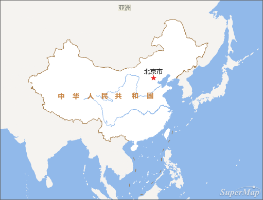
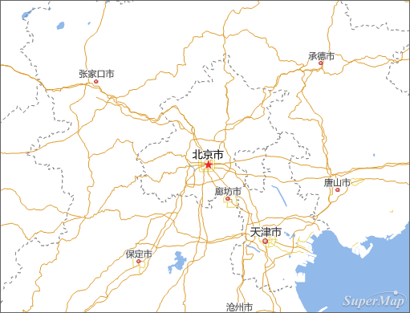
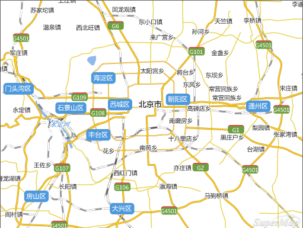
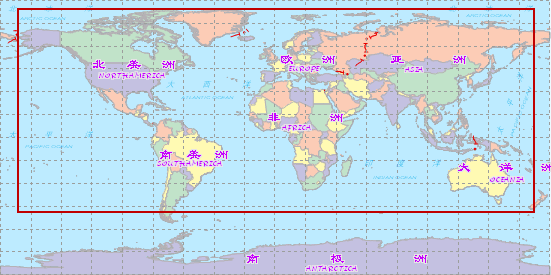
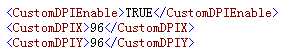

为了更高效的生成地图瓦片，可以从以下几个方面考虑：

**1.选择合适的比例尺系列**

为了充分利用瓦片数据，同时实现多级缩放，可以对地图设置多个比例尺。多设置一些比例尺级别，可以在浏览过程中比较顺畅，不会出现比较大的跳跃。在地图制作的过程中要考虑要素在不同的比例尺下是否需要显示。比如在1:100000的比例尺下，河流是线状的，在1:10000的比例尺下，可能需要讲河流显示为面状的。在小比例尺下，一些注记不需要显示，但随着比例尺的扩大，注记可能需要显示。这种情况下，需要考虑合适的比例尺级别了。

  

  
 
  
 
**2.瓦片路径设置**

如果生成的瓦片要在 SuperMap iServer Java 6R 服务端发布，可以直接将  桌面瓦片路径设置为 SueprMap iServer
Java 6R 的出图路径下，即 %SuperMap iServer
Java_HOME%\webapps\iserver\output\cache，否则瓦片切片拷贝可能会花费比较长的时间。

**3.适当的制作地图**

制作地图的过程中，可以考虑对线型或者文本对象使用反走样，对过小的对象进行过滤。

* 对地图中的过小对象使用过滤条件进行过滤，可以在不影响地图所承载的信息量的情况下，将提升地图浏览速度。
* 进行反走样后矢量地图中的线型和文本看起来更光滑，提高视觉感受，但会造成性能下降。因此在使用反走样时，需要浏览速度和性能之间寻找一种平衡，既要达到浏览效果最佳，也要保证浏览速度。
* 对比较复杂的地图，要避免对象节点过多，可以考虑进行光滑处理或者重采样。

**4.保持工作空间一致**

工作空间中的地图参数决定了 SuperMap iServer Java 使用的瓦片文件中瓦片图片的命名，因此需要保证用于制作瓦片的工作空间中的地图和用于 SuperMap iServer Java 发布的工作空间中的地图一致。影响参数包括地图的风格、数据的连接情况、图层顺序、默认比例尺、地图范围等。因此制作完成瓦片后，尽量不要对工作空间的地图进行修改，以保证发布的地图与用于制作瓦片的地图一致。

同时需要保持地图中所有地图可用，所有图层对应的数据集合数据源在工作空间中都存在，不能有无对应数据源和数据集的空连接图层。对数据集中对象的编辑，如添加、删除、更新等，不会影响编辑区域以外的瓦片图片（如果需要的话，只需更通过 SuperMap iServer 更新这部分区域的瓦片即可）。

**5.合理设置地图瓦片范围和索引范围**
* 可以为频繁访问的地图区域生成瓦片，以降低生成和存储瓦片的成本。例如，在访问世界地图时，对于广大的无人区，可以不生成瓦片。

  

* 用  生成地图瓦片时建议将索引范围设置为发布地图的整幅地图范围，以便与 SuperMap iServer Java 瓦片索引范围保持一致。在根据需求修改地图瓦片的范围信息时，也需要保持索引范围是整幅地图范围。

**6.瓦片图片与出图设备无关的特性**

利用桌面制作地图瓦片时，如果所在的计算机与 SuperMap iServer Java 所在的计算机不是同一台机器，有可能由于设备显示地图分辨率不同，从而不同设备上的瓦片不能很好地一起使用，例如拼接出现问题等。 桌面
支持配置地图瓦片与设备显示分辨率无关。具体的操作方法如下：

* 修改  桌面安装路径下的 bin 目录下配置 SuperMap.xml 文件中的 CustomDPIEnable 属性为 true。

  
  
* 修改相应的 SuperMap iServer Java 安装目录\support\objectsjava 的 bin 目录下 SuperMap.xml 文件中的 CustomDPIEnable 属性也要设为 true。
* 保持桌面和服务器中两个 SuperMap.xml 文件的 CustomDPIX 和 CustomDPIY 的取值相同。
7.在桌面端生成的地图瓦片，如需在 SueprMap iServer Java 服务端发布，需要注意，生成紧凑型地图瓦片时，不要对瓦片进行加密，即不要设置密码，否则在服务端发布会有问题。

### 相关主题

  [地图瓦片](MapTiles)

  [地图瓦片类型](TilesType)

  [地图瓦片存储类型](MapCacheType)

  [地图瓦片目录结构](MapCacheFolder)

  [使用地图瓦片的建议](AdviceAboutMapCache)
