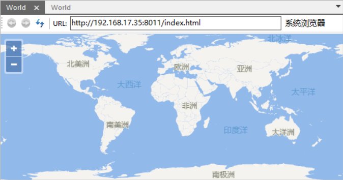
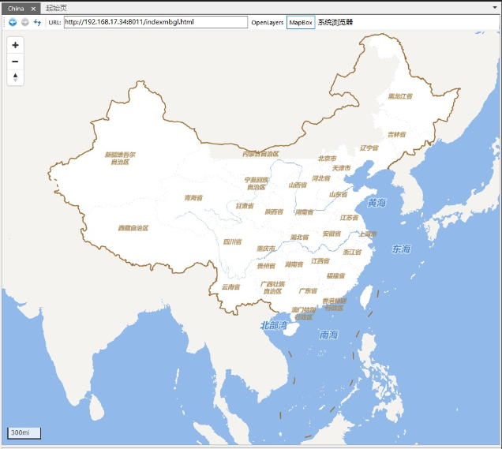

在  中可以直接显示矢量瓦片，并且支持 MapBox GL 和 OpenLayers 两种渲染显示效果。其中，OpenLayers
支持多种投影的矢量瓦片渲染显示，而 MapBox GL 只支持渲染显示 EPSG3857投影的矢量瓦片。

在  中，以 **打开文件型数据源** 的方式，打开矢量瓦片目录中的*.sci 文件；然后，双击打开加载进来的矢量瓦片即可显示矢量瓦片。

* 如下图所示，矢量瓦片的坐标系为 WGS1984，因此，当前默认使用 OpenLayers 渲染显示矢量瓦片，不支持切换渲染方式。
  

* 如果矢量瓦片的坐标系为 EPSG3857 投影，可以通过两种方式渲染显示 MapBox GL 和 OpenLayers，如下图所示，界面提供了 OpenLayers 和 MapBox 两个按钮，供用户选择具体的矢量瓦片渲染方式，下图为以MapBox GL渲染显示EPSG3857投影的矢量瓦片。  
  
 
* 用户还可通过地图窗口的“系统浏览器”按钮，通过本地浏览器查看矢量瓦片，同时也可将地图窗口内的 URL 矢量瓦片浏览地址粘贴处理在其他浏览器浏览，目前发现火狐的浏览效果最佳。
