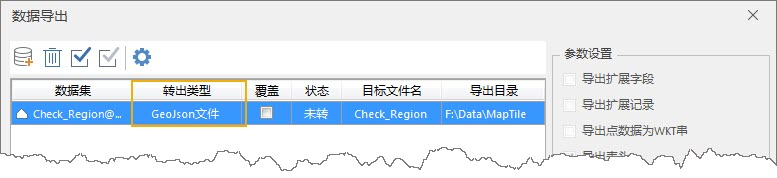
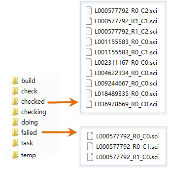

### 使用说明

支持瓦片检查功能，通过读取 Geojson
格式的检查范围线，检查该范围内的瓦片是否存在白块、白线、瓦片丢失、瓦片损块等问题，并可以进行瓦片补切。方便用户及时检查、发现生成的瓦片的错误数据，及时进行修正和补切。目前只支持检查紧凑型和
MongoDB 瓦片。

###  操作步骤

1. 在“ **地图** ”选项卡的“ **制图** ”组中，单击“ **瓦片检查** ”按钮，在“瓦片结果检查”对话框，设置瓦片检查结果的参数。
2. **工作目录** ：即新建任务时设置的生成瓦片的共享工作目录文件的路径。
3. **检查范围** ：使用 GeoJson 文件描述范围多边形，用以确定检查范围，检查时只检查该范围内的瓦片内容。用户可通过桌面软件绘制检查范围，通过“数据导出”功能，将绘制的范围导出为 GeoJson 文件。  
    

4. 用户根据需求指定检查项目 
* **保存错误数据** ：勾选该项检查的错误结果将记录到工作目录文件中的 check 目录下的 check.udb 数据源中。
* **检查纯色瓦片** ：勾选该项纯色瓦片也被检查，否则，不检查纯色瓦片。
* **检查白线** ：如果瓦片中存在白色像素，并且连续的白色像素超过了横/纵100个像素的范围，是否认定为白色错误瓦片，如果该项被勾选，将认定为白色错误瓦片。
* **补切错误瓦片** :勾选该项检查完之后若存在错误，将自动启动补切，此时会在failed文件夹中获取存在错误的子任务（*.sci），补切错误瓦片，其他参数设置可参见多任务切图。若未勾选该选项，可通过“[续切瓦片](RecoverTiles.htm)”功能，重切 failed 文件夹的错误瓦片。
5. 瓦片结果检查后，正确的*.sci子任务会存放到 checked 文件夹中，有问题的*.sci子任务会存放到 failed 文件夹中，下图为检查瓦片文件目录。 
  

6. 在 check 文件夹中的 check.udb 中记录了错误信息。数据源中将建立一些面数据集，每个数据集名称都是基于切图有问题的比例尺分母命名，其中记录了该比例尺下有问题的缓存瓦片的边界。 
* missing：没有此瓦片数据。
* error：读取此瓦片数据错误。
* white：此瓦片为非纯色瓦片，但是全白图。
* lost：对于紧凑缓存，未找到紧凑缓存cf文件。
* failure：对于紧凑缓存，打开紧凑缓存cf文件失败。

