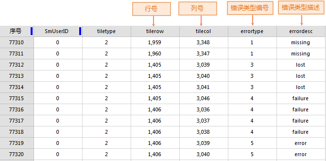

### 使用说明

SuperMap 桌面支持瓦片检查功能，通过读取 Geojson 格式的检查范围线，检查该范围内的瓦片是否存在白块、白线、瓦片丢失、瓦片损块等问题，并可以进行瓦片补切。方便用户及时检查、发现瓦片中的错误数据，及时进行修正和补切。

  * 仅支持检查紧凑型和 MongoDB 型瓦片。
  * 瓦片检查只支持栅格瓦片，不支持矢量瓦片。
  * 仅支持多任务切图生成的瓦片。

### 功能入口

  * 单击“ **地图** ”选项卡->“ **制图** ”组->“ **瓦片检查** ”按钮。
  * 在地图窗口右键选择“ **瓦片检查** ”项。

### 操作说明

在“瓦片结果检查”对话框中，设置如下瓦片检查结果的参数：

1. **工作目录** ：即生成瓦片时设置的工作目录，需指定至工作目录中以瓦片名称命名的文件夹。
2. **检查范围** ：使用 GeoJson 文件描述范围多边形，用以确定检查范围，检查时只检查该范围内的瓦片内容。用户可通过桌面软件绘制检查范围，通过“数据导出”功能，将绘制的范围导出为 GeoJson 文件。   
3. 用户根据需求指定检查项目： 
  * **保存错误数据** ：勾选该项检查的错误结果将记录到工作目录文件中的 check 目录下的 check.udb 数据源中。
  * **检查纯色瓦片** ：勾选该项纯色瓦片也被检查，否则，不检查纯色瓦片。
  * **检查白线** ：如果瓦片中存在白色像素，并且连续的白色像素超过了横/纵100个像素的范围，是否认定为白色错误瓦片，如果该项被勾选，将认定为白色错误瓦片。
  * **补切错误瓦片** :勾选该项检查完之后若存在错误，将自动启动补切，此时会在failed文件夹中获取存在错误的子任务（*.sci），补切错误瓦片，其他参数设置可参见多任务切图。若未勾选该选项，可通过“[更新瓦片](UpdateTiles)”功能，重切 failed 文件夹的错误瓦片。
4. 瓦片结果检查后，正确的*.sci子任务会存放到 checked 文件夹中，有问题的*.sci子任务会存放到 failed 文件夹中，其中temp文件夹为检查时中间临时文件夹。   
5. 在 check 文件夹中的 check.udb 中记录了错误信息。数据源中将建立若干面数据集，每个数据集名称都是基于切图有问题的比例尺分母命名，其中记录了该比例尺下有问题的缓存瓦片的边界，打开面数据集属性表中包含如下图所示的属性字段：   

错误类型包含五类，分别是：

错误类型编号(errortype) | 错误类型描述(errordesc) | 说明  
---|---|---  
1  | **missing** | 没有此瓦片数据  
2 | **white** | 此瓦片为非纯色瓦片，但是全白图。  
3 | **lost** | 对于紧凑缓存，未找到紧凑缓存cf文件。  
4 | **failure** | 对于紧凑缓存，打开紧凑缓存cf文件失败。  
5 | **error** | 检查的瓦片内容打开失败。  

### 相关主题

  [地图瓦片](MapTiles)

  [续传瓦片](RecoverTiles)

  [更新瓦片](UpdateTiles)

  [瓦片管理](MongoDBTilesManger)

  [加载 MongoDB 瓦片](AddMongoDBTiles)

