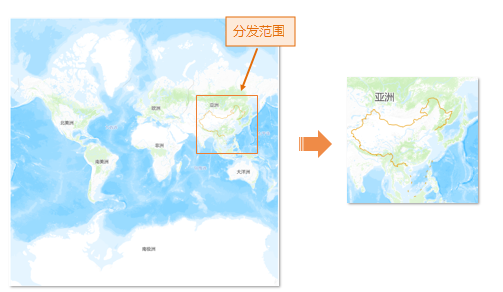

### 使用说明

SuperMap 桌面产品支持瓦片分发功能，通过指定特定比例尺及自定义分发范围，实现瓦片数据的分发管理。

可应用于大范围瓦片数据的分发，可指定分发区域及瓦片比例尺，免去用户常规裁剪、分发等繁琐的操作过程。例如，当某省需要将高清影像数据分发给各区市县，只需要将区市县的行政边界作为分发范围，即可将瓦片分发至对应区域。同时还可指定分发比例尺，当精度过高的数据，在分发时需要限制数据精度级别，则可通过选择比例尺，无需重复切图，即可便捷快速的分发数据。

###  功能入口

**数据** 选项卡-> **数据管理** -> **瓦片管理** 按钮，弹出 **瓦片管理** 窗口。

###  操作说明

1. **添加待分发瓦片** ：添加 MongoDB 瓦片或本地瓦片，详细操作可查看[加载瓦片](MongoDBTilesManger)。
2. **分发瓦片** ： 单击工具条中的“分发”按钮，弹出“ **分发瓦片** ”对话框，在对话框内设置如下参数： 
  * **瓦片名称** ：通过下拉选项，选择待分发瓦片，默认显示为瓦片管理列表框内的第一条记录。
  * **比例尺** ：比例尺列表框中显示当前地图瓦片的比例尺，勾选复选框，确定分发比例尺。
  * **分发范围** ：对分发瓦片范围进行设置。应用程序提供四种设置方式：整幅地图、当前窗口、自定义范围以及复制粘贴范围，范围设置的详细描述可参看[生成地图瓦片--瓦片范围](MapTilesSingle) 。 当使用“选择对象”设置范围时，需先将范围面图层添加至当前瓦片管理窗口，才可使用“选择对象”选项，程序将按照选择对象的外接矩形作为分发范围。
  * **结果设置** ：设置存储分发数据的MongoDB数据库，包含服务器名称、数据库名称、瓦片名称等参数信息。
3. 完成上述参数设置，即可执行分发瓦片的操作。

###  应用实例

现有全球晕眩图的瓦片数据，需要分发中国区域的瓦片数据，比例尺选择原始瓦片比例尺，瓦片范围可使用“选择对象”选择中国国界范围面，也可通过“绘制矩形”操作，设定具体范围，最后得到如下图所示结果。

  

###  相关主题

  [瓦片管理](MongoDBTilesManger)

  [瓦片合并](TilesMerge)

  [地图瓦片](MapTiles)
