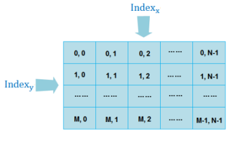

地图瓦片根据瓦片版本的不同，生成的瓦片目录的层次结构有所不同。 桌面应用程序目前支持六种不同版本的地图瓦片。

  * 2.0版本对应 IS .NET 瓦片策略，适合 SuperMap IS .NET 6.0 正式版及以上版本的产品使用。
  * 2.1版本对应使用新的瓦片方案的 IS .NET 瓦片策略，适合 SuperMap IS .NET 6 Service Pack 2 及以上版本的产品使用。 
  * 3.0版本对应 iServer 2.0 瓦片策略，适合 SuperMap iServer Java 2008 正式版及以上版本的产品使用。
  * 3.1版本对应使用新的瓦片方案的 iServer 2.0 瓦片策略，适合 SuperMap iServer Java 2008 Service Pack 2 及以上版本的产品使用。
  * 4.0版本对应 iServer 6R 瓦片策略，适合 iServer Java 6R 正式版及以上版本的产品使用。
  * 5.0版本对应新的 iServer 6R 瓦片策略，适合 SuperMap iServer Java 6R(2012) Service Pack 1 版本的产品使用。只有5.0版本的地图瓦片可以使用剖分方式生成瓦片。

地图瓦片的目录结构主要采用 iServer 6R，iServer 2.0和 IS .NET 三种瓦片策略，按照不同比例尺级别进行分层，都是从指定范围的左上角为起点进行分块。其中2.0,2.1版本的地图瓦片均采用 IS .NET 瓦片策略，3.0,3.1版本的地图瓦片均采用 iServer 2.0 瓦片策略，4.0和5.0版本的瓦片采用 iServer 6R 瓦片策略。

下面就这三种瓦片版本的目录结构做详细的介绍。

###  iServer 6R 瓦片目录结构说明

iServer 6R 是针对 UGC（Universal GIS Class）系列产品的瓦片策略。UGC 系列产品包括桌面产品 ，组件式二次开发平台 SuperMap Objects Java/.NET 6R 以及服务器产品 SuperMap iServer 6R 系列产品。

iServer 6R 瓦片策略生成的地图瓦片目录共分为六个层次，如下图所示：

  
 
iServer 6R 瓦片目录结构说明  
  * 第一层：瓦片根目录，用来保存不同瓦片文件。瓦片根目录名称可以为任意名称。在生成瓦片时，通过输入瓦片名称来指定。
  * 第二层：地图瓦片目录。默认名称格式为：MapName_Width×Height。其中 MapName 是地图名称，Width 和 Height 是16进制的图片宽高，例如，目录为世界地图_Day_100×100，表示地图瓦片的图片大小为256像素×256像素。
  * 第三层：不同比例尺级别瓦片目录。分层目录名称为设置的比例尺大小。如15625000文件夹下保存的是比例尺为15625000时的所有地图切片文件。
  * 第四层：不同空间区域行号瓦片目录。目录名称以空间区域（瓦片范围）行号命名。所谓空间区域指的是将地图按照网格分块算法将一幅地图分为多个块，每一个分块表示一个空间区域。每个空间区域的宽高都是瓦片块的整数倍。区域内至少有一张图片，行号就是空间区域在指定范围内的行数，行号从上到下逐渐增大，用十进制表示。范围扩大时行号可以是负值。
  * 第五层：不同空间区域列号瓦片目录。目录名称以空间区域（瓦片范围）列号命名。列号就是空间区域在指定范围内的列数，列号从左到右逐渐增大，用十进制表示。范围扩大时列号可以是负值。
  * 第六层：瓦片图片文件名称。其格式为：RowxCol_MapHashCode.postfix。其中 Row 表示瓦片图片按瓦片块划分的行号索引，Col 表示瓦片图片按瓦片分块划分的列号索引，Row 和 Col 都可以是负数。 MapHashCode 表示当前比例尺下地图的16位 HashCode 值，postfix 是瓦片图片文件的扩展名。如上图中的名称为 **0000×0001_108F8B08FIX.png** 的图片，0000为行号，0001为列号，108F8B08FIX 为16位的 HashCode，png 为图片的扩展名。

###  IS .NET 瓦片目录结构说明

IS .NET 瓦片策略是 SuperMap 最早使用的瓦片策略，也是通过分层分块生成切片文件（影像）的思路进行瓦片构建，并且从坐标系、地图、图层风格以及数据范围等方面考虑了瓦片更新问题。它主要是 SFC（SuperMap Foundation Class）系列产品采用的瓦片策略。

IS .NET 瓦片策略生成的二维地图瓦片目录共分为五个层次，如下图所示：

  
 
IS .NET 瓦片目录结构说明  
  * 第一层：瓦片根目录，用来保存不同瓦片文件。瓦片根目录名称可以为任意名称。在生成瓦片时，通过输入瓦片名称指定。
  * 第二层：地图瓦片目录。默认名称格式为：MapName_Width×Height。其中 MapName 是地图名称，Width 和 Height 是16进制的图片宽高，例如，目录为世界地图_Day_100×100，表示地图瓦片的图片大小为256像素×256像素。
  * 第三层：不同比例尺级别瓦片目录。分层目录名称为设置的比例尺大小。如15625000文件夹下保存的是比例尺为15625000时的地图切片文件。
  * 第四层：图片索引目录。按照网格分块算法将某一比例尺下的地图切割成多个图幅，每一个图幅在整个地图中都有一个索引值对应，形为：X×Y。X，Y 分别表示图幅在地图分块队列中的列号和行号。
  * 第五层：瓦片图片文件名称。其格式为：centerIndex_MapHashCode.postfix，其中 centerIndex 表示瓦片图片的中心点索引，MapHashCode 表示当前比例尺下地图的 HashCode 值，postfix 是瓦片图片文件的扩展名。如上图所示，名称为 **332×7361_108F8BFIX.png** 的图片，（332，7361）表示图片中心点的索引值，108F8BFIX 为当前比例尺下地图的 HashCode 值，png 为图片的后缀名。

###  iServer 2.0 瓦片目录结构说明

iServer 2.0 瓦片策略与 IS .NET 瓦片策略相似，是 SuperMap iServer 2.0 产品的瓦片策略。iServer 2.0
瓦片策略生成的二维地图瓦片目录共分为五个层次，如下图所示：

  
  
iServer 2.0 瓦片目录结构说明  
  * 第一层：瓦片根目录，用来保存不同瓦片文件。瓦片根目录名称可以为任意名称。在生成瓦片时，通过输入瓦片名称指定。
  * 第二层：地图瓦片目录，文件夹名称格式为：MapName_Width×Height，其中 Width×Height 按照10进制计算，即目录名称为：地图名称_图片的实际宽×高。
  * 第三层：不同比例尺级别瓦片目录。分层目录名称为设置的比例尺大小。如15625000文件夹下保存的是比例尺为15625000时的地图切片文件。
  * 第四层：瓦片图片索引目录（{Index_x}）。将地图分块之后，对每一个图片分别建立索引号。对每一副地图，按照要生成的瓦片图片大小生成 M×N 个图片，每一列为 Index_x，x 的值从 0 到 N-1，每一行为 Index_y，y 的值从 0 到 M-1。在这一层，目录名为每一列的索引名，即 Index_x，表示每一列图片瓦片的目录。    
---  
  * 第五层：瓦片图片文件名称。其格式为：Index_y.postfix 的值。如上图中选中的文件夹，文件夹5表示 X 索引号（Index_x）为5 ，图片名称15表示 Y 索引号(Index_y)为15，则此图片位于地图目录的第5行第15列。

### 相关主题

  [地图瓦片](MapTiles)

  [地图瓦片类型](TilesType)

  [地图瓦片存储类型](MapCacheType)

  [使用地图瓦片的建议](AdviceAboutMapCache)
