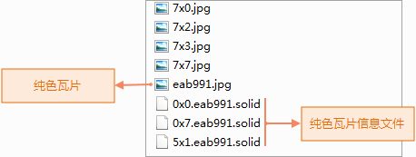
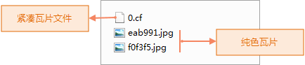

SuperMap iDesktop 在生成地图瓦片时，提供三种瓦片存储类型，分别是原始型、紧凑型、MongoDB
型；三种存储类型各有不同的特点，选择不同的存储类型会对瓦片大小，生成时间等造成一定影响，以下将对三种类型进行详细描述，您可根据数据情况选择适合的瓦片存储类型。

###  原始型

当瓦片储存类型为原始型，切片文件以单独的图片文件格式存放在磁盘上，不对数据进行压缩，能够直接读取。切片结果包括两个部分：索引文件（\*.sci）和瓦片数据。瓦片数据直观地表现为多个文件夹下的瓦片图片，若当前比例尺中存在纯色瓦片，文件下会生成纯色瓦片信息文件（\*.solid）。

如下图所示，地图中某比例尺下的瓦片结果：JPG为瓦片文件，（\*.solid）为当前比例尺下的纯色瓦片信息文件，0×0.eab991.solid文件中，0×0为瓦片的位置信息，eab991代表颜色值；同时JPG文件有对应颜色值eab991的纯色瓦片，所以在读取瓦片时程序会去找对应颜色值名字的纯色图片。因此，纯色瓦片只需要存储一次，其余通过纯色瓦片信息文件进去读取，减少了数据冗余。

  
  
原始型存储方式具有以下特点：

  * 可直接读取，比较直观。
  * 占用磁盘空间大，不太易于管理，拷贝和迁移不太方便。
  * 不支持对数据进行加密。

###  紧凑型

当瓦片储存类型为紧凑型时，对原始的切片文件采用一定的压缩和加密机制，在结构上采用一组文件替代原始的图片格式的瓦片机制。此时，不同比例尺文件夹下的瓦片数据将表现为一组文件，该组文件包括两个部分：索引文件（\*.sci）和瓦片数据。其中瓦片数据在结构上采用一组文件替代原始的图片格式，不同比例尺文件夹下的瓦片数据将存储在（\*.cf）紧凑文件中，若当前比例尺中存在纯色瓦片，文件下会生成纯色瓦片。

  
  
与原始型相比，紧凑型存储方式具有以下优势：

  * 减少文件数量，有利于大量瓦片数据的传输与拷贝。
  * 缩短瓦片创建的时间耗费。
  * 数据支持加密。

###  MongoDB

当瓦片储存类型为 MongoDB 型时，生成的瓦片切片文件，以分布式格式存储在服务器的数据库中，而本地会生成一个索引文件（*.sci）。MongoDB
类型的分布式切图服务，只支持5.0版本的瓦片。若选择 MongoDB 类型，需先启动 MongoDB 服务，请参看“[MongDB
使用说明](../../../tutorial/TechDocument/MongoDBDatabaseGuide)”启动服务。有关连接信息的参数说明如下：

  1. 服务器名称：用于设置 MongoDB 服务器地址，例如：192.168.120.42。
  2. 数据库名称：用于设置数据库名称。若服务器是以非用户验证方式启动 MongoDB，则可单击下拉按钮选择服务器中已存在的数据库，或直接输入新数据库名称创建一个数据库；若服务器以用户验证方式启动 MongoDB，则不支持新建数据库，也不能读取到已有的数据库名称，只能在文本框中输入已存在数据库名称。同时在用户验证模式下启动数据库服务，可以在"用户名"和"密码"中输入管理员用户名和密码，这样数据库名称下拉项中就可以看到库中已存在的数据库名称。
  3. 用户名称/密码：若数据库已存在，则需输入该数据库对应的用户名称和密码；若为新建的数据库，则需用户设置数据库用户名称和密码。

与其他类型相比，MongoDB 型存储方式有以下优势：

  * 切片存储于服务器中，地图切片的存取速度较快。
  * 以分布式格式进行存储，便于数据分享与发布。
  * MongoDB 中存储的瓦片数据支持直接进行拷贝分发，可将数据从一个 MongoDB 服务器拷贝到另一个 MongoDB 服务器，有利于数据传输与备份。

### 相关主题

  [地图瓦片](MapTiles)

  [地图瓦片类型](TilesType)

  [地图瓦片目录结构](MapCacheFolder)

  [使用地图瓦片的建议](AdviceAboutMapCache)