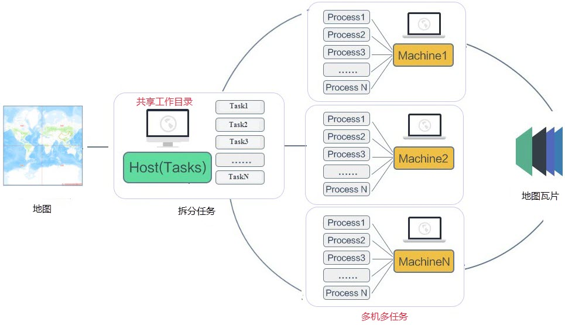

随着缓存技术的发展，SuperMap iDesktop
对于瓦片的生成也在不断地发展和完善，同时地图瓦片的生成效率也在不断地提高，目前支持单任务切图和多任务切图，其中多任务切图又分为单机多任务和多机多任务。

###  [单任务切图](MapTilesSingle)

单任务切图，也称为单机单进程切图，是指在一台计算机中启动单个进程执行切片任务，进程一次调取一个切图任务，结束当前任务之后再依次调取后续任务执行切图。

作为传统的切图技术，单任务切图方式对计算机资源的利用率较低，适用于地图数据量小、切图比例尺少的切图需求。随着地图数据量的增大切图时间随之变长，要提升工作效率，可使用多任务切图。

  

###  [多任务切图](MultiTaskStep)

随着技术的进步，地图数据量已经迈进海量数据的时代，而单机切图的效率实在不能满足需求。例如，在普通的工作机上，对中国范围、几十个图层的地图生成数十级比例尺的瓦片，可能耗费十几天。

为了提高用户的切图效率，合理利用计算机系统资源，SuperMap iDesktop
提供了多任务切图功能，多任务切图又可分为“单机多任务”和“多机多任务”两种切图方式。

多任务切图原理是根据地图的比例尺和地理范围等预先将切图任务拆分成多个子任务，然后将拆分后的任务部署在共享目录中，以实现多个进程、多台机器同时在共享目录中获取子任务，从而实现多任务并行切图。多任务切图方式能充分利用机器的硬件资源，综合利用多个节点并行切图，极大提升切图的效率。

多任务的切图效率受计算器性能、瓦片存储类型、切图数据大小和瓦片的存储位置（本地或共享）等多种因素影响，您可参考[多任务切图效率比对](MultiTaskSuggest)给出的建议，选择适合您的多任务切图方式。

**单机多任务切图**

单机多任务即在一台计算机开启多个进程执行切图任务。

  
  
**多机多任务切图**

多机多任务切图是指多台计算器同时开启多个进程实现多台机器并行高效切图。

  
  
###  相关主题

  [单任务切图](MapTilesSingle)

  [多任务切图](MultiTaskStep)

  [多任务切图效率比对](MultiTaskSuggest)

  [生成多版本瓦片](MultiversionTile)