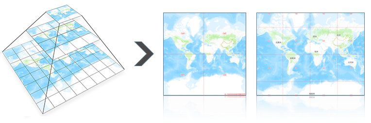

地图瓦片是包含了一系列比例尺、一定地图范围内的地图切片文件。地图瓦片按照金字塔结构组织，每张瓦片都可通过级别、行列号唯一标记。在平移、缩放地图时，浏览器根据金字塔规则，计算出所需的瓦片，从瓦片服务器获取并拼接，下图为地图瓦片金字塔结构示意。

  

地图瓦片是为改善用户体验，提高运行效率，节省工作时间而出现的一门技术，是目前主流地理信息系统中普遍采用的一种图形显示技术手段。该技术的出现，大大缩短了用户的等待时间，同时提高了工作效率，使图形数据的浏览过程变得高效流畅。简而言之，是一种用空间来换取时间的存储方式。

桌面产品支持从制图、切图、更新/追加瓦片、检查瓦片、发布瓦片全流程的地图瓦片技术。使用户掌握地图瓦片生产与使用全流程，帮助您简单快捷地通过缓存机制提升地图服务的效率。

### 内容提要：

 [单任务生成地图瓦片](MapTilesSingle.htm)

 [续传瓦片](RecoverTiles.htm)

 [更新瓦片](UpdateTiles.htm)

 [多任务生成地图瓦片](MultiTaskStep.htm)

 [矢量瓦片](VectorTiles.htm)

 [发布瓦片](PublishTiles.htm)

 [瓦片管理](MongoDBTilesManger.htm)

 [加载 MongoDB 瓦片](AddMongoDBTiles.htm)

 [生成多版本瓦片](MultiversionTile.htm)

* * *

  
  
---

